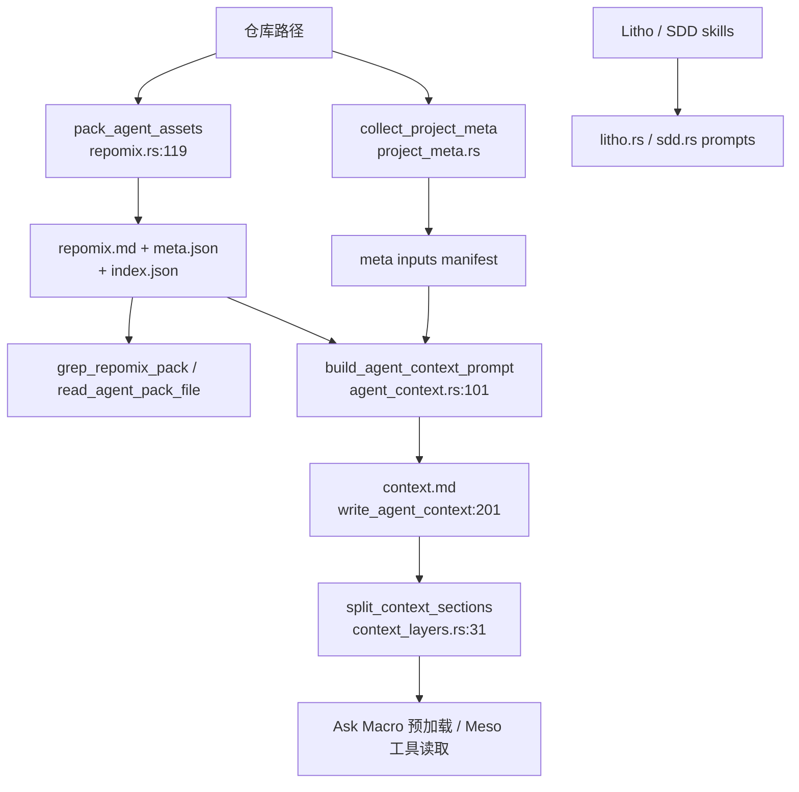

# 知识资产管理领域

**模块路径**：`crates/terrain-core/src/assets/`  
**生成日期**：2026-07-15

---

## 这个模块在做什么

知识资产管理模块是 Terrain 知识库的「中台」——它不负责 UI，也不直接调 LLM，而是提供一整套**可组合的资产能力**：Repomix 源码包、Agent 架构上下文、Litho/SDD 工作流契约、项目元数据注入、知识 grep 检索、以及 AI 工程环境集成。

其他模块（Chat、项目初始化、CLI tools）都通过 `assets/mod.rs` 的 `pub use` 清单消费这些能力。理解这个目录，等于理解 Terrain 如何把「磁盘上的 Markdown/JSON」变成 Agent 可调用的结构化知识。

---

## 核心功能点

1. **Repomix Agent Pack**——`pack_agent_assets`（`repomix.rs:119-205`）用 `architecture-context` 策略打包源码，产出 `repomix.md` + `meta.json` + 文件索引。

2. **Pack 读取与 Grep**——`read_pack_text_cached`（`pack_read.rs:34-66`）进程内缓存 pack 全文；`grep_repomix_pack`（`query.rs:58-119`）在 pack 内搜索并还原 `file_path` 与 `file_line`。

3. **Agent 上下文契约**——`agent_context.rs` 定义就绪启发式、freshness 判定、生成 prompt 与持久化。

4. **上下文分层**——`context_layers.rs` 把 `context.md` 拆成 Macro 概览（≤4500 字符）与 Meso 分段读取（≤3500 字符），持久化硬限 16 KiB。

5. **工作流资产**——`litho.rs` 与 `sdd.rs` 分别服务 Litho 文档生成与 SDD 四阶段，提供 plan、prompt、完成度检查等纯函数 API。

6. **环境集成**——`env/` 子模块从 `env-catalog` 加载集成清单，检测/规划/应用 skill、工具链与 `AGENTS.md` 补丁。

---

## 关键组件

| 组件/类型 | 文件路径 | 核心职责 |
|---------|---------|---------|
| `assets/mod.rs` | `crates/terrain-core/src/assets/mod.rs:1-76` | 模块入口与 `build_generation_plan` |
| `pack_agent_assets` | `crates/terrain-core/src/assets/repomix.rs:119-205` | Repomix 打包与 meta 写入 |
| `agent_pack_fresh` | `crates/terrain-core/src/assets/repomix.rs:71-89` | Git HEAD + 工作区洁净度判定 |
| `grep_repomix_pack` | `crates/terrain-core/src/assets/query.rs:58-119` | Pack 内正则搜索带源文件行号 |
| `build_agent_context_prompt` | `crates/terrain-core/src/assets/agent_context.rs:101-192` | Agent 上下文生成提示词 |
| `split_context_sections` | `crates/terrain-core/src/assets/context_layers.rs:31-66` | 按 `##` 拆分 context.md |
| `collect_project_meta` | `crates/terrain-core/src/assets/project_meta.rs` | 收集 terrain-meta.json 输入 |
| `plan_litho_generation` | `crates/terrain-core/src/assets/litho.rs:17-31` | Litho 路径与 skill 规划 |
| `apply_env_integration` | `crates/terrain-core/src/assets/env/apply.rs:37-120` | 应用环境集成到仓库 |

---

## 内部数据流

---

## 关键接口与扩展点

- **Pack 策略**：`AGENT_PACK_STRATEGY` 与 `architecture_ignore_patterns` 可调整打包范围。
- **Preset Skills**：`resolve_litho_skill_dir` / `resolve_sdd_skill_dir` 解耦 skill 内容与 Rust 代码。
- **terrain-meta.json**：仓库可声明 `module_roots`、文件/glob 输入，无需改 Terrain 即可影响上下文结构。

---

## 与其他模块的交互

| 交互模块 | 方向 | 接口/协议 | 说明 |
|---------|------|---------|------|
| Chat引擎 | 被依赖 | `grep_repomix_pack`、`read_agent_context` | Micro/Meso 层工具实现 |
| Litho文档生成 | 被依赖 | `plan_litho_generation` | Litho 计划与 prompt 契约 |
| SDD工作流 | 被依赖 | `plan_sdd_workflow` | SDD 会话路径规划 |
| 源码扫描 | 被依赖 | `maybe_pack_agent_assets` | 扫描期条件触发 repomix |
| CLI接口 | 被依赖 | `terrain tools grep-pack` 等 | ACP JSON 工具底层 |

---

## 跨模块协作场景

**在 DeepWiki 问答中**：Chat 引擎通过本模块的 grep/read 工具实现 Micro 层检索；`read_pack_text_cached` 的进程内缓存避免重复读盘。

**在 Agent 上下文生成中**：`build_agent_context_prompt` 聚合 repomix 目录树、人类 `1.概述.md` 摘要与 `terrain-meta.json` 收集结果，硬性要求 ≤14000 字符产出。

---

## 性能考量

- **Pack 文本缓存**：`PACK_TEXT_CACHE` 以 path+mtime+len 为键，重复 grep/read 不反复读盘。
- **增量打包**：`maybe_pack_agent_assets` 在 Git 干净且 HEAD 未变时跳过。
- **上下文体积硬限**：`AGENT_CONTEXT_SAVE_MAX_CHARS = 16KiB`，防止 macro 层撑爆 LLM 窗口。
- **Grep 限量**：`grep_repomix_pack` 接受 `limit` 参数，工具调用不会返回无界结果集。

---

## 实现亮点

`context_layers.rs` 的三层体积控制（生成 14KiB、保存 16KiB、Ask 预载 4.5KiB）是双轨知识分离的量化实现——同一份 `context.md` 在不同消费场景下被截取不同粒度，最大化 LLM 上下文窗口的利用效率。
