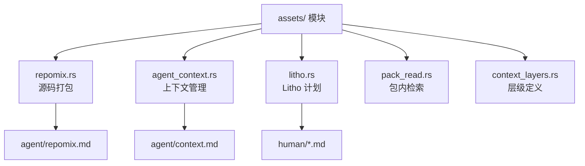

# 知识资产管理

**模块路径**：`crates/terrain-core/src/assets/`  
**生成日期**：2026-07-22

---

## 这个模块在做什么

知识资产管理是 Terrain 的"仓库管理系统"——它负责 `.terrain/` 目录下所有知识资产的创建、更新、检测和打包。从 repomix 源码包到 Litho 人类文档，从 Agent 上下文到 SDD 产物，所有资产的读写操作都通过这个模块统一管理。

## 核心功能点

1. **Repomix 打包**——`pack_agent_assets` / `maybe_pack_agent_assets`（`assets/repomix.rs`）调用 repomix-core 生成源码索引包。
2. **Agent 上下文管理**——`agent_context_ready` / `agent_context_exists`（`assets/agent_context.rs`）检测 context.md 状态。
3. **Litho 资产管理**——`plan_litho_generation`、`litho_human_complete_with_research`（`assets/litho.rs`）管理 Litho 生成计划与完整性。
4. **上下文层级**——`context_layers.rs` 定义 Macro/Meso/Micro 三层检索模型和字符限制。
5. **Pack 读取**——`pack_read.rs` 提供 repomix 包内的 grep 和文件切片读取。
6. **项目元数据**——`project_meta.rs` 管理 agent/meta.json 等元数据文件。

## 关键组件

| 组件/类型 | 文件路径 | 核心职责 |
|---------|---------|---------|
| `pack_agent_assets` | `assets/repomix.rs` | repomix 打包 |
| `agent_pack_ready` | `assets/repomix.rs` | 包就绪检测 |
| `plan_litho_generation` | `assets/litho.rs` | Litho 计划 |
| `grep_pack` | `assets/pack_read.rs` | 包内 grep |
| `read_pack_file` | `assets/pack_read.rs` | 包内文件读取 |
| `context_layers` | `assets/context_layers.rs` | 三层检索定义 |
| `ensure_agent_assets` | `terrain-agent/agent_assets.rs` | Ask 前资产准备 |

## 内部数据流

## 与其他模块的交互

| 交互模块 | 方向 | 接口/协议 | 说明 |
|---------|------|---------|------|
| ingest | 被调用 | `maybe_pack_agent_assets` | 扫描时打包 |
| litho | 依赖 | `plan_litho_generation` | 生成计划 |
| chat | 依赖 | `grep_pack`, `context_layers` | Ask 检索 |
| terrain-cli/tools | 被调用 | pack_read 函数 | ACP 工具 |

## 跨模块协作场景

**在 Ask 准备中**：`prepare_agent_assets_for_ask`（`agent_assets.rs`）确保 repomix 包和 context 就绪后才开始问答。

## 性能考量

- repomix 打包有跳过逻辑（`agent_pack_ready`）
- grep_pack 在包内搜索，比活仓库 grep 更快更可控
- context 字符限制防止 token 膨胀

## 实现亮点

三层检索模型（Macro/Meso/Micro）的精确定义，是 Terrain 知识消费架构的核心抽象。
