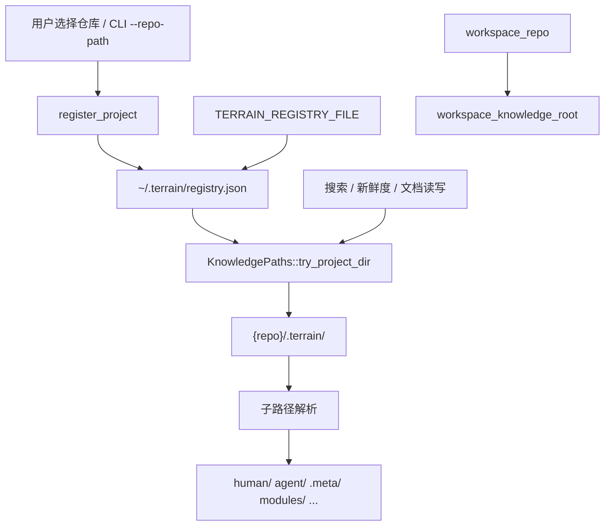

# 路径布局领域

**模块路径**：`crates/terrain-core/src/paths.rs` + `registry.rs`  
**生成日期**：2026-07-15

---

## 这个模块在做什么

路径布局模块由 `paths.rs` 与 `registry.rs` 共同构成 Terrain 的**空间坐标系**。`registry` 在 `~/.terrain/registry.json` 维护 project slug → 仓库绝对路径的映射；`KnowledgePaths` 在此基础上解析每个仓库内的 `.terrain/` 知识根，以及 human、agent、.meta、.litho-agent、SDD 本地会话等子路径。

设计原则是「知识随代码走」：知识文件版本化在 Git 仓库内，全局注册表仅存指针，使桌面应用能发现多仓库项目而不引入中心数据库。

---

## 核心功能点

1. **注册表 CRUD** — `register_project` / `unregister_project` / `load_registry`（`registry.rs:72-161`）。

2. **注册表缓存** — `REGISTRY_CACHE` 按文件 mtime 失效，避免重复读盘（`registry.rs:16-103`）。

3. **indexed 项目发现** — `indexed_project_roots` 仅返回存在 `index.md` 的注册项目（`registry.rs:204-213`）。

4. **workspace 解析** — `resolve_workspace_repo` 读 `TERRAIN_REPO_PATH` 或向上查找 Git 根（`paths.rs:42-58`）。

5. **项目布局初始化** — `ensure_project_layout` 创建 modules/interfaces/routes/events/human/agent 等标准目录（`paths.rs:213-226`）。

6. **路径助手** — `doc_path`、`agent_pack_main`、`freshness_meta_path`、`sdd_workspace_dir` 等消除魔法字符串（`paths.rs:93-177`）。

7. **知识产出判定** — `is_knowledge_output_path` 供新鲜度 dirty 检测排除 `.terrain/` 变更（`paths.rs:231-242`）。

8. **可移植 repo 路径** — 与 `path_portable::stored_repo_path` 配合，支持相对路径存储（`freshness.rs:544` 引用）。

---

## 关键组件

| 组件/类型 | 文件路径 | 核心职责 |
|---------|---------|---------|
| `RegistryEntry` | `crates/terrain-core/src/registry.rs:38-42` | slug + repo_path 条目 |
| `load_registry` | `crates/terrain-core/src/registry.rs:72-103` | 读 registry.json + 缓存 |
| `register_project` | `crates/terrain-core/src/registry.rs:127-147` | 注册或更新项目 |
| `indexed_project_roots` | `crates/terrain-core/src/registry.rs:204-213` | 有效项目根映射 |
| `KnowledgePaths` | `crates/terrain-core/src/paths.rs:10-227` | 知识路径解析器 |
| `ensure_project_layout` | `crates/terrain-core/src/paths.rs:213-226` | 标准目录脚手架 |
| `is_knowledge_output_path` | `crates/terrain-core/src/paths.rs:231-242` | 漂移检测排除规则 |
| `knowledge_root_for_repo` | `crates/terrain-core/src/registry.rs:68-70` | `{repo}/.terrain` |

---

## 内部数据流

---

## 关键接口与扩展点

- **新子目录类型** — 在 `KnowledgePaths` 增加方法并在 `ensure_project_layout` 创建；同步更新 `is_knowledge_output_path` 若该目录为生成物。
- **多 workspace** — 当前 `workspace_repo` 为单 Option；可扩展为最近项目栈或 monorepo 子包映射。
- **注册表迁移** — `RegistryFile` 可加 version 字段；`TERRAIN_REGISTRY_FILE` 已支持测试隔离（`registry.rs:54-58`）。
- **Stale 检测** — `list_stale_registry_projects`（`registry.rs:184-201`）可驱动 UI「重新扫描」提示。

---

## 与其他模块的交互

| 交互模块 | 方向 | 接口/协议 | 说明 |
|---------|------|---------|------|
| 源码扫描 | 被依赖 | `ensure_project_layout`、`register_project` | 扫描前注册与建目录 |
| 全文搜索 | 被依赖 | `indexed_project_roots` | 多项目遍历根 |
| 新鲜度追踪 | 被依赖 | `is_knowledge_output_path` | dirty 检测排除知识产出 |
| CLI接口 | 被依赖 | `KnowledgePaths` | 所有命令的路径基础 |
| 桌面UI | 被依赖 | `list_projects`、项目选择 | 多仓库发现 |

---

## 跨模块协作场景

**在项目初始化中**：`scan_repo` 首先 `register_project` 并 `ensure_project_layout`，为后续 Litho、context、repomix 写入建立标准目录结构。

**在全文搜索中**：`indexed_project_roots` 提供所有已注册且已扫描项目的知识根，搜索遍历不依赖用户当前选中的单个项目。

**在新鲜度追踪中**：`is_knowledge_output_path` 使 `.terrain/` 内的知识生成变更不计入「工作区脏」，避免 Litho 产出反而降低信任分。

---

## 性能考量

- **registry 缓存** — 单次进程内多次 `indexed_project_roots` 命中内存缓存，mtime 不变则无磁盘 IO。
- **canonicalize** — `is_sdd_local_path`、`sanitize_relative`（human.rs）调用 `canonicalize`，网络盘或权限异常时可能较慢。
- **HashMap 克隆** — `indexed_project_roots` 每次返回新 HashMap；搜索遍历时尚可，极高频调用可改为迭代器 API。
- **panic vs Result** — `project_dir` 在 slug 未注册时 panic（`paths.rs:70-73`）；生产路径应优先 `try_project_dir`。

---

## 实现亮点

「知识随代码走 + 全局注册表仅存指针」的设计使 Terrain 无需维护中心数据库，却能在桌面应用中管理数十个仓库——每个仓库的 `.terrain/` 可独立 commit、review 和随分支演进。
