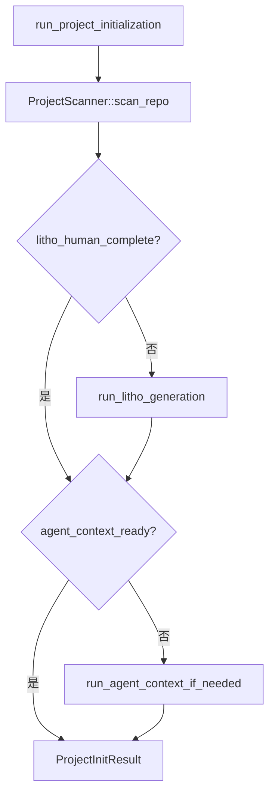

# 项目初始化

**模块路径**：`crates/terrain-agent/src/workflows/init.rs`  
**生成日期**：2026-07-22

---

## 这个模块在做什么

项目初始化是 Terrain 的"一键 onboarding"——从新注册的 Git 仓库到完整可用的知识资产目录，一次调用完成扫描、文档生成和上下文压缩。如果把 Terrain 比作一座知识工厂，项目初始化就是"开机启动"按钮：按下后，工厂自动完成原材料入库（扫描）、产品加工（Litho）、包装贴标（context 生成）全套流程。

这个模块的核心价值在于**编排**——它本身不实现扫描或文档生成的细节，而是按正确顺序调用 `ProjectScanner`、`run_litho_generation` 和 `run_agent_context_generation`，并在每步失败时优雅降级（记录 notes 而非 abort）。

## 核心功能点

1. **完整初始化编排**——`run_project_initialization`（`init.rs:62`）串联扫描→Litho→context 三阶段。
2. **条件跳过**——已存在完整 human 文档时跳过 Litho；已存在 context.md 时跳过上下文生成。
3. **Agent 上下文条件生成**——`run_agent_context_if_needed`（`init.rs:14`）检测 LLM/ACP 可用性后决定是否生成。
4. **进度回调**——通过 `ProgressEvent::project_init` 和 `LithoProgress` 向 UI 报告进度。
5. **结果汇总**——返回 `ProjectInitResult` 包含扫描报告、文档计数和 notes。

## 关键组件

| 组件/类型 | 文件路径 | 核心职责 |
|---------|---------|---------|
| `run_project_initialization` | `workflows/init.rs:62` | 初始化主入口 |
| `run_agent_context_if_needed` | `workflows/init.rs:14` | 条件性 context 生成 |
| `ProjectScanner` | `ingest/mod.rs:39` | 仓库扫描 |
| `ProjectInitResult` | `terrain-core/ipc/workflows.rs` | 初始化结果 |
| `ProgressEvent` | `terrain-core/progress.rs` | 进度事件 |

## 内部数据流

## 与其他模块的交互

| 交互模块 | 方向 | 接口/协议 | 说明 |
|---------|------|---------|------|
| ingest | 依赖 | `ProjectScanner::scan_repo` | 第一阶段扫描 |
| litho | 依赖 | `run_litho_generation` | 第二阶段文档 |
| agent_context | 依赖 | `run_agent_context_generation` | 第三阶段上下文 |
| Tauri | 被调用 | `initialize_project_cmd` | 桌面触发 |

## 跨模块协作场景

**CLI 入口**：`terrain init` → `crates/terrain-cli/src/commands/init.rs`  
**桌面入口**：`initialize_project_cmd` → `src-tauri/src/commands/project.rs`

## 性能考量

- 三阶段串行执行，总耗时取决于 Litho ACP 会话（可达 45 分钟）
- 条件跳过避免重复生成已有资产
- LLM/ACP 不可用时跳过 context 生成并记录 notes

## 实现亮点

优雅降级策略——Litho 或 context 失败不阻断整个初始化，notes 数组记录所有跳过的步骤及原因。
