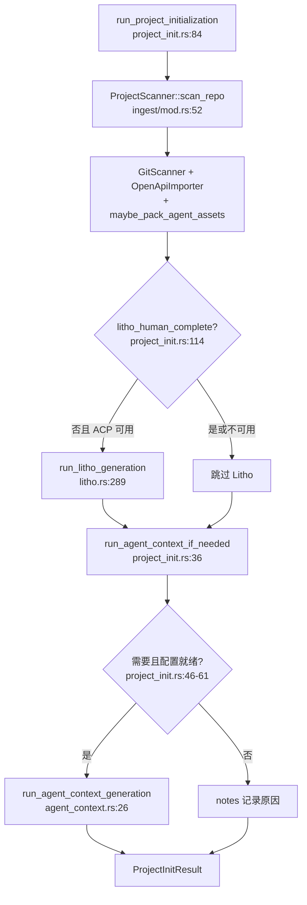

# 项目初始化领域

**模块路径**：`crates/terrain-agent/src/project_init.rs`  
**生成日期**：2026-07-15

---

## 这个模块在做什么

项目初始化模块是用户把一个新仓库「接入 Terrain」时的**一键 onboarding 流水线**。它按固定顺序串联三件事：源码扫描与索引建立、人类友好 Litho 文档生成、以及 Agent 面向的架构上下文（`context.md`）生成。每一步都有清晰的跳过条件——已有完整产出就不重复跑，缺少 ACP/LLM 配置则优雅降级并在 `notes` 里告知用户。

可以把 `run_project_initialization` 理解成 Terrain 的「开机自检 + 首次体检」。

---

## 核心功能点

1. **仓库扫描入口**——`ProjectScanner::scan_repo`（`crates/terrain-core/src/ingest/mod.rs:52-111`）注册项目、跑 Git/OpenAPI 采集器、可选 repomix 打包。

2. **人类文档按需生成**——`litho_human_complete_with_research` 判断 Litho 是否已完成；未完成且 ACP 可用时调用 `run_litho_generation`。

3. **Agent 上下文条件生成**——`run_agent_context_if_needed` 在 `agent_context_ready` 为假或 Litho 刚跑完时触发。

4. **配置缺失降级**——无 ACP 时在 `notes` 追加提示；hybrid 模式下无 LLM 时跳过 Agent 上下文，不阻断扫描。

5. **进度回调**——`ProjectInitProgress` 与 `LithoProgress` 双通道回调，让 UI 分阶段展示进度。

---

## 关键组件

| 组件/类型 | 文件路径 | 核心职责 |
|---------|---------|---------|
| `run_project_initialization` | `crates/terrain-agent/src/project_init.rs:84-172` | 一键初始化主入口 |
| `run_agent_context_if_needed` | `crates/terrain-agent/src/project_init.rs:36-81` | 条件触发 Agent 上下文生成 |
| `ProjectInitResult` | `crates/terrain-agent/src/project_init.rs:24-34` | 初始化结果摘要（供 UI 展示） |
| `ProjectScanner` | `crates/terrain-core/src/ingest/mod.rs:39-111` | 编排 Git/OpenAPI/repomix 采集 |
| `run_litho_generation` | `crates/terrain-agent/src/litho.rs:289-402` | Litho 文档生成（初始化子步骤） |
| `run_agent_context_generation` | `crates/terrain-agent/src/agent_context.rs:26-66` | Agent 上下文生成（初始化子步骤） |
| `execution_uses_native_llm` | `crates/terrain-agent/src/acp.rs:77-79` | 决定初始化时是否构建 ChatEngine |

---

## 内部数据流

---

## 关键接口与扩展点

- **可选 project_slug**：`scan_repo` 接受 `Option<&str>`，未提供时从路径末段 slugify。
- **独立重跑子步骤**：初始化逻辑复用 `run_litho_generation` 与 `run_agent_context_generation`，UI 可单独触发。
- **notes 数组**：非致命失败以字符串收集，便于前端展示「部分完成」状态。

---

## 与其他模块的交互

| 交互模块 | 方向 | 接口/协议 | 说明 |
|---------|------|---------|------|
| 源码扫描 | 依赖 | `ProjectScanner::scan_repo` | 初始化第一步 |
| Litho文档生成 | 依赖 | `run_litho_generation` | 按需生成人类文档 |
| Agent上下文 | 依赖 | `run_agent_context_generation` | 按需生成 context.md |
| ACP协议 | 依赖 | `acp_available` | Litho 前置条件检查 |
| 桌面UI | 被依赖 | `ProjectInitProgress` 回调 | 进度事件推送 |

---

## 跨模块协作场景

**在首次接入仓库时**：扫描先行确保 `ensure_project_layout` 并注册 slug，为后续所有资产路径奠基。Litho 与上下文严格串行，因为上下文 prompt 依赖人类文档摘要与 pack 元数据。

**在 Litho 与上下文联动中**：`litho_ran` 为真时 `force_refresh` Agent 上下文，确保新 Litho 文档反映到 `context.md`。

---

## 性能考量

- **跳过已完成 Litho**：`litho_human_complete_with_research` 为真时不启动 ACP 长任务，二次打开项目几乎零等待。
- **Agent pack 懒打包**：扫描期 `maybe_pack_agent_assets` 仅在缺失或 Git 漂移时重打。
- **顺序而非并行**：扫描 → Litho → 上下文严格串行，避免竞态与重复 LLM 调用。

---

## 实现亮点

初始化模块的「优雅降级」设计体现了 Terrain 的实用主义——Litho 失败不阻断 repomix 扫描，无 LLM 配置时跳过上下文生成但记录原因，让用户始终能得到部分可用的知识资产。
