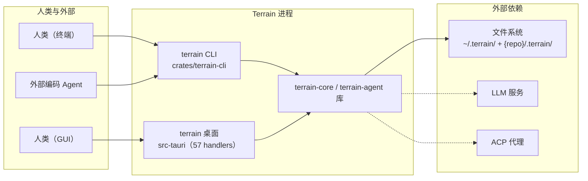

# 软件边界（接口/边界）文档：Terrain

**版本：** 1.0
**分类：** 接口与边界
**生成日期：** 2026-09-21

---

## 1. 总体边界视角

Terrain 的进程边界非常克制：**没有独立服务端、没有业务数据库**——CLI 与 Tauri 桌面应用共享同一套 `terrain-core` / `terrain-agent` 库，唯一的外部状态落在文件系统（`~/.terrain/` 全局状态 + 每仓库 `.terrain/` 知识资产）。因此"边界"不是网络端口，而是**两种形态的门**（终端 CLI 与 GUI invoke）以及 15 个 CLI 一级命令 + 57 个 IPC handler 构成的接口面。

边界对称性是关键工程事实：`terrain knowledge::scan` 与 GUI `scan_project` 都调用 `ProjectScanner::scan_repo`（`commands/knowledge.rs:22-24` ↔ `src-tauri/src/commands/project.rs:35-38`）。**同一份代码、两个操控入口，产物天然一致**——CI 里跑出来的刷新结果与人在 GUI 里点出来的结果没有偏差。

总体拓扑（进程视图）：



`terrain-cli/src/main.rs:10-19` 的入口先做四项初始化：`load_dotenv()`、`ensure_bundled_tools_initialized()`、`ensure_env_catalog_initialized()`、`ensure_preset_skills_initialized()`，再后台线程部署 env catalog 到 home——**CLI 自带工具链自足启动**。

---

## 2. CLI 接口

一级命令共 **15 个**（`crates/terrain-cli/src/cli.rs`），下面先给全貌再分域详解。

| # | 命令 | 一句话用途 | 定义位置 |
|---|------|-----------|---------|
| 1 | `list` | 列出已索引项目 | cli.rs:27-28 |
| 2 | `scan` | 扫描 Git 仓库 → Markdown 知识文档 | cli.rs:30-34 |
| 3 | `init` | 完整初始化（scan + Litho C4 文档 + Agent 上下文） | cli.rs:36-40 |
| 4 | `refresh` | 快速刷新（scan + repack + 可选上下文，跳过 Litho） | cli.rs:42-46 |
| 5 | `search` | 知识库全文检索 | cli.rs:48-54 |
| 6 | `read` | 按路径读一篇文档 | cli.rs:56 |
| 7 | `project` | 项目登记表与总览（5 个子命令） | cli.rs:58-61 |
| 8 | `settings` | LLM / ACP / 语言设置（5 个子命令） | cli.rs:63-66 |
| 9 | `ask` | DeepWiki 式知识问答（2 个子命令） | cli.rs:68-71 |
| 10 | `sdd` | SDD 标准开发工作流（2 个子命令） | cli.rs:73-76 |
| 11 | `usage` | Token 用量监控（2 个子命令） | cli.rs:78-81 |
| 12 | `source` | 读活仓库源码切片（1 个子命令） | cli.rs:83-86 |
| 13 | `tools` | 面向外部 Agent ACP 模式的 JSON API（9 个子命令） | cli.rs:88-91 |
| 14 | `assets` | 知识资产生成（10 个子命令） | cli.rs:93-96 |
| 15 | `env` | AI 工程环境集成（3 个子命令） | cli.rs:98-101 |

除少数命令外，绝大多数输出 **pretty JSON**（`crates/terrain-cli/src/util.rs:48-50` 的 `print_json`）——这是"可脚本化、面向流水线"的设计核心。

### 2.1 全局参数

| 参数 | 类型 | 默认 | 含义 |
|------|------|------|------|
| `--repo-path <PATH>` | `Option<PathBuf>` | 当前 Git 工作区或 `TERRAIN_REPO_PATH` | 把"目标仓库"显式固定，脱离 cwd 使用 |

路径解析优先级（`paths.rs:42-61` + `util.rs:20-25`）：显式 `--repo-path` > 全局 `--repo-path` > `TERRAIN_REPO_PATH` env > 当前目录向上找 `.git` 根。

### 2.2 核心知识命令

| 命令 | 参数 | 行为 |
|------|------|------|
| `terrain list` | （无） | `KnowledgeSearch::list_projects`（commands/knowledge.rs:10-13），列出可问项目 |
| `terrain scan [<REPO_PATH>] [--slug]` | REPO 可省 | 只扫描生成 `index.md` + `modules/interfaces/routes/events`（`ProjectScanner::scan_repo`，commands/knowledge.rs:15-26），**不**做 Litho / 上下文 / 登记表 |
| `terrain init [<REPO_PATH>] [--slug]` | 同上 | 流水线版"一键初始化"：`run_project_initialization`，进度打到 stderr（`[stage] msg` / `[litho:stage] msg`），返回 `ProjectInitResult` JSON（commands/init.rs:12-36） |
| `terrain refresh [<REPO_PATH>] [--slug]` | 同上 | 低成本刷新：`run_quick_refresh`，受 `KnowledgeSettings.incremental_refresh` 控制，设计意图"合入 commit 后在 CI 里跑，分钟内完成" |
| `terrain search <QUERY> [--project] [--limit N=20]` | QUERY 必须 | 全文检索返回 `SearchHit[]`（commands/knowledge.rs:28-44） |
| `terrain read <PATH>` | PATH 必须 | 返回单篇 `KnowledgeDoc`（frontmatter + body），如 `terrain read agent/context.md` |

```bash
terrain init ./my-repo --slug my-repo
terrain refresh .
terrain search "鉴权流程" --project my-repo
terrain read agent/context.md
```

### 2.3 项目登记表与总览（`terrain project …`）

定义 `cli.rs:105-129`，实现 `commands/project.rs`。

| 子命令 | 参数 | 含义 |
|--------|------|------|
| `project overview --project <SLUG>` | `--project` 必须 | `ProjectOverview`：新鲜度评分、文档计数、路径、资产健康、Litho/上下文状态、注记（来自 `.terrain/project-note.md`） |
| `project remark --project <SLUG> <REMARK>` | 必须 + 位置 | 保存给人看的备注到 `.terrain/project-note.md`（随仓库版本化），返回更新后的 overview |
| `project remove --project <SLUG>` | 必须 | 只移本地登记表 `~/.terrain/registry.json`，**不删** `.terrain/`，输出 `{"removed": slug}`（registry.rs:147-159） |
| `project list` | — | 列出全部已登记项目 + 就绪度（ready/partial/stale）与缺失资产（list_all_registry_projects，registry.rs:202-223） |
| `project freshness-cached --project <SLUG>` | 必须 | **只读** freshness ledger JSON，不重算 git——给概览页即时展示，避免多分钟等待（read_freshness_ledger，freshness/ledger.rs:23-28） |

### 2.4 设置（`terrain settings …`）

定义 `cli.rs:132-149`，实现 `commands/settings.rs`。底层配置存 `~/.terrain/settings.json`（settings.rs:152-154）。

| 子命令 | 参数 | 含义 |
|--------|------|------|
| `settings get` | — | 输出生效 `ModelSettings`（读文件；无文件则从默认合成） |
| `settings set <FILE>` | FILE 位置必须 | 从 JSON 文件写入设置，输出保存路径 + LLM 连通状态 |
| `settings language [VALUE]` | VALUE 可选 | 查询/设置语言（`system \| zh-CN \| en`） |
| `settings check-llm` | — | 静态检查 `llm_status`（provider/model/base_url 齐备性），**不做**真实请求 |
| `settings check-acp` | — | 外部代理（默认 `opencode acp`）可用性 → `{available, spawn_command}` |

```bash
terrain settings get
terrain settings language zh-CN
terrain settings check-llm
```

### 2.5 问答（`terrain ask …`）

定义 `cli.rs:152-167`，实现 `commands/ask.rs`。

| 命令 | 参数 | 行为 |
|------|------|------|
| `ask query <QUERY> [--project] [--stream]` | QUERY 必须 | 非流式输出 `ChatReply` JSON（answer + citations + tool_calls + usage + completed_at，ipc/chat.rs:65-75）；`--stream` 开 **NDJSON 事件流**（chunk / thinking_chunk / tool_calls / phase / usage / done，每行一个 `AskStreamEvent`，ipc/chat.rs:78-87） |
| `ask sessions-list --project <SLUG>` | 必须 | 列出 `~/.terrain/ask/{slug}/sessions/` 会话元数据（list_ask_sessions，assets/ask.rs:70-102），对齐 GUI/流水线会话 |

CLI 会话 id 用 `format!("cli-ask-{}", query.len())` 长度拼出，不持久化 CLI 会话（commands/ask.rs:33）。

```bash
terrain ask query "这个项目的鉴权流程是怎样的？" --project my-repo
terrain ask query "列出主要模块" --project my-repo --stream
```

### 2.6 SDD 工作流（`terrain sdd …`）

定义 `cli.rs:170-208`，实现 `commands/sdd.rs`。

| 命令 | 参数 | 行为 |
|------|------|------|
| `sdd status --project <SLUG>` | 必须 | 返回 `SddStatus`：skill 就绪、工作区/输出目录、四 phase 产出就绪度、当前 phase、会话列表（get_sdd_status，assets/sdd.rs:224-280） |
| `sdd run --project <SLUG> [--repo-path] --phase <PHASE> [--session-id] [--input]` | `--phase` 必须 | 执行阶段，返回 `SddPhaseResult`（phase / output_path / response_excerpt）。phase 转换 `SddPhaseArg→SddPhase`（cli.rs:191-208），文件命名 `1.requirements.md…4.code-review.md`（schema/sdd.rs:37-44） |

引擎选择（commands/sdd.rs:38-42）：纯 ACP 模式或 CodeGen phase 用外部 Agent（`engine=None`），否则原生 LLM ChatEngine。产出落 `~/.terrain/sdd/{slug}/sessions/{id}/outputs/`。

```bash
terrain sdd run --project my-repo --phase requirements --input "目标是给 CLI 加 search 缓存"
terrain sdd run --project my-repo --phase code-gen --session-id marketing-20260901
```

### 2.7 Token 用量（`terrain usage …`）

定义 `cli.rs:211-221`，实现 `commands/usage.rs`。底层调用本地 `ccusage`（bundled / `bunx ccusage` / `npx -y ccusage`），离线只读本地 Agent 日志。

| 子命令 | 参数 | 含义 |
|--------|------|------|
| `usage probe` | — | 只探文件系统：ccusage 可用性 + 探测到哪些本地日志源 → `UsageProbeResult`（不跑子进程） |
| `usage snapshot [--detail summary\|full] [--force]` | `--detail` 默认 summary；`--force` 跳过 120s 内存缓存 | 汇总/全量快照 → `UsageSnapshot`（today/week/month/daily/monthly/sessions） |

### 2.8 源码切片（`terrain source read …`）

定义 `cli.rs:224-236`，实现 `commands/source.rs`。

| 参数 | 类型 | 必须 | 含义 |
|------|------|------|------|
| `--file <F>` | String | 是 | 仓库相对路径 |
| `--start-line` / `--end-line` | u32 | 是 | 切片行区间 |

读取**活仓库**源码片段（区别于 `tools read-pack-file` 读打包后的 repomix 索引），返回 `SourceSlice`（schema/citation.rs:49-58）。

```bash
terrain source read --file src/lib.rs --start-line 10 --end-line 40
```

### 2.9 面向外部 Agent 的 JSON API（`terrain tools …`）

定义 `cli.rs:239-293`，实现 `commands/tools.rs`。设计意图：**让 Claude Code / Codex / OpenCode / Cursor 通过同一契约读 `.terrain/` 知识**（README_zh.md:80-81），所有子命令输出 JSON。

| 子命令 | 参数 | 含义 |
|--------|------|------|
| `tools list-projects` | — | 列出可查询项目（同 `list`） |
| `tools pack-meta --project <S>` | 必须 | `AgentPackMeta`：repomix pack 元信息（token 数、生成器、baseline HEAD） |
| `tools grep-pack --project <S> --pattern <P> [--context N=2] [--limit N=20]` | — | 对 `agent/repomix.md` 做带上下文正则检索 |
| `tools read-pack-file --project <S> --file <F> [--start-line] [--end-line]` | — | 从 repomix pack 读文件内容切片（read_agent_pack_file） |
| `tools read-context --project <S> [--section <Q>]` | — | 读 `agent/context.md`；section＝指定小节，缺省＝宏观概览（受 `AGENT_CONTEXT_TOOL_SECTION_MAX_CHARS` 截断） |
| `tools search --query <Q> [--project] [--limit=10]` | — | 全文检索（默认 limit=10，比顶层 `search` 保守） |
| `tools read-doc --project <S> --path <P>` | — | 项目内读文档 |
| `tools freshness --project <S>` | — | **强制重算** freshness（git diff 基线）→ `FreshnessSummary` |
| `tools codegraph-drift --project <S>` | — | 独立的、基于 git 的 CodeGraph 索引过期检测 → `CodegraphDriftReport`（`.codegraph/codegraph.db` mtime vs `git log --since`，freshness/codegraph.rs:11-60）。**因 `<cg> status` 可能误报最新** |

```bash
terrain tools list-projects
terrain tools read-context --project my-repo
terrain tools grep-pack --project my-repo --pattern "authenticate"
terrain tools freshness --project my-repo
```

### 2.10 知识资产生成（`terrain assets …`）

定义 `cli.rs:296-355`，实现 `commands/assets.rs`。一线"流水线内部命令"（README_zh.md:232）。**注意"规划类命令不执行"** 的设计——`plan-litho`/`prepare-litho`/`plan` 都只输出计划，绝不跑生成。

| 子命令 | 参数 | 含义 |
|--------|------|------|
| `assets register <REPO_PATH> [--slug]` | REPO 必须 | 写 `~/.terrain/registry.json` + 建 layout，输出 `{slug, repo_path, knowledge_root}` |
| `assets pack-agent <REPO_PATH> [--slug]` | 同上 | 生成 repomix pack → `agent/repomix.md` + `agent/meta.json` |
| `assets plan-litho <REPO_PATH> [--slug]` | 同上 | 输出 `LithoPlan`（skill 目录、输出目录、就绪标志），**不执行** |
| `assets prepare-litho <REPO_PATH> [--slug]` | 同上 | 产出 `LithoGenerationJob`（含将注入 ACP 的 env），**不执行** |
| `assets plan <REPO_PATH> [--slug]` | 同上 | `AssetGenerationPlan`：看全量生成会写哪些文件 |
| `assets run-litho <REPO_PATH> [--slug] [--force]` | `--force` 重生成 | 真跑 Litho（ACP 或原生 LLM 生成 `human/` C4 文档），返回 `LithoGenerationResult` |
| `assets list-human --project <S>` | — | 列出 `human/` 与 `agent/` 下人类消费文档清单 |
| `assets grep-pack --project <S> <PATTERN> [--context] [--limit]` | — | 同 `tools grep-pack`（历史对称） |
| `assets agent-context <REPO_PATH> [--slug] [--force]` | — | 注册 + 生成 `agent/context.md`（`--force` 先删旧文档再重建） |
| `assets repair-context --slug <S> [--repo-path]` | — | 用 `~/.terrain/debug/last-agent-context-raw.md`（上次原始输出）重写 context.md——诊断/纠错用 |

```bash
terrain assets register ./my-repo --slug my-repo
terrain assets plan-litho ./my-repo
terrain assets run-litho ./my-repo
```

### 2.11 环境集成（`terrain env …`）

定义 `cli.rs:358-376`，实现 `commands/env.rs`。把 Terrain 的"AI 工程环境"装进目标仓库：Skills（复制到 `.agents/skills` 与 `.claude/skills`）、内置工具（RTK/CodeGraph 部署到 `~/.terrain/bin/`）、`AGENTS.md` 托管片段、`.terrain/.gitignore/.gitattributes`。

| 子命令 | 参数 | 含义 |
|--------|------|------|
| `env status [<REPO_PATH>]` | REPO 可省 | `EnvStatus`：每个集成项（skill/tool/agents_md/terrain_ignore/gitignore）的集成状态与依赖 |
| `env plan [<REPO_PATH>] [--ids a,b] [--reinstall a,b]` | `--ids` 逗号选择；不传＝默认选中"未集成或 locked"项 | 预览 `EnvPlan`（每步 action 文案），不写盘 |
| `env apply [<REPO_PATH>] [--ids] [--reinstall]` | 同上 | 按依赖顺序执行，进度打 stderr `[id] msg`；写 `.terrain/env/manifest.json` 记录 applied/skipped/errors |

默认选中逻辑 `util.rs:38-46`：`locked || !integrated` 的项。集成类别来自 `env-catalog/catalog.json`（`skill-*` / `tool-bun` / `tool-codegraph` / `tool-rtk` / `agents-md` / `terrain-git-policy`），apply 实现见 `crates/terrain-core/src/assets/env/apply.rs:33-129`。

```bash
terrain env status .
terrain env plan . --ids skill-terrain-knowledge,skill-repomix,skill-codegraph
terrain env apply .
```

---

## 3. Tauri IPC 命令（GUI 侧）

注册于 `src-tauri/src/lib.rs:56-114`（`invoke_handler` 共 **57 个 handler**）。`AppState` 持有一个共享 `Runtime` → `KnowledgePaths` / `ModelConfig`（lib.rs:10-32）。

### 3.1 按业务分组

| 分组 | 命令 | 用途 |
|------|------|------|
| **引导 & 就绪** | `bootstrap_app` | 启动一次性拉取：模型设置 + 登记项目 + LLM 状态 + ACP 可用性（commands/settings.rs:12-26） |
| **知识资产** | `get_knowledge_root` `list_projects` `scan_project` `search_knowledge` `read_document` `list_human_docs_cmd` | 项目列表、扫描、全文检索、读文档 |
| **源码引用** | `read_source_slice_cmd` `resolve_source_citation_cmd` `open_repo_folder_cmd` | 读活仓库切片、引用→可跳转片段、文件管理器打开仓库 |
| **项目生命周期** | `list_registry_projects_cmd` `initialize_project_cmd` `remove_project_cmd` `get_project_overview_cmd` `save_project_remark_cmd` | 登记/完整初始化/移除/总览/备注；初始化经 `project-init-progress` / `litho-progress` 事件流式推进（commands/project.rs:62-131） |
| **新鲜度** | `compute_freshness_cmd` `read_project_freshness_cached_cmd` `run_quick_refresh_cmd` | 强制重算 / 缓存直读 / 快速刷新，刷新复用 `litho-progress` 通道避免 UI 静默等待（project.rs:197-208） |
| **资产生成（工作流）** | `pack_agent_assets_cmd` `plan_litho_cmd` `plan_assets_cmd` `generate_human_docs_cmd` `run_litho_generation_cmd` `run_agent_context_generation_cmd` | 打包 / 规划（不执行）/ 准备 / 执行 Litho 与上下文生成；进度 `litho-progress`、结束 `litho-done`（commands/assets.rs） |
| **Ask 问答** | `ask_knowledge_cmd` | 流式问答：`on_stream: Channel<AskStreamEvent>` 逐条推 chunk/phase/tool_calls/usage/done（commands/workflows.rs:12-43） |
| **Ask 会话** | `list_ask_sessions_cmd` `load_ask_messages_cmd` `save_ask_messages_cmd` `create_ask_session_cmd` `set_active_ask_session_cmd` `delete_ask_session_cmd` `discard_ask_session_cmd` `clear_active_ask_session_cmd` `get_active_ask_session_cmd` | 会话 CRUD + active 指针（commands/sessions.rs） |
| **SDD** | `get_sdd_status_cmd` `create_sdd_session_cmd` `set_active_sdd_session_cmd` `delete_sdd_session_cmd` `save_sdd_output_cmd` `run_sdd_phase_cmd` | 会话管理与分阶段执行；进度 `sdd-progress`、结束 `sdd-done`（commands/workflows.rs:45-111） |
| **模型/LLM 设置** | `get_model_settings` `save_model_settings_cmd` `check_llm` `test_llm_cmd` `list_provider_models_cmd` | 读写 `~/.terrain/settings.json`；`test_llm` 发 1-token 真实探测（settings.rs:64-82）；`list_provider_models` 枚举端点实际模型（settings.rs:84-104） |
| **ACP 代理** | `check_acp` `check_opencode`（旧别名） `acp_spawn_command_cmd` | 外部 Agent 可用性探测 |
| **环境集成** | `get_env_status_cmd` `plan_env_integration_cmd` `run_env_integration_cmd` | env status/plan/apply 的 GUI 版，进度 `env-opt-progress`、结束 `env-opt-done`（commands/env.rs） |
| **用量** | `usage_probe_cmd` `usage_snapshot_cmd` | ccusage 探测/快照；快照走 `spawn_blocking` 避免阻塞 UI（commands/usage.rs:8-17） |
| **系统/剪贴板** | `copy_image_to_clipboard` `copy_text_to_clipboard` `save_png_files` `open_local_path_cmd` | Ask 回答导出分享、文件管理器打开本地路径 |

TS 类型由 `terrain-ts-export` 自动生成（Rust 唯一真源）；导出根类型清单见 `crates/terrain-ts-export/src/main.rs:49-77`（对应 `bun run gen:types`）。

---

## 4. 配置结构

### 4.1 ModelSettings（`crates/terrain-core/src/settings.rs:134-150`）

| 字段 | 类型 | 含义 |
|------|------|------|
| `provider` | `Option<String>` | 激活 provider id（`openai` / `lmstudio` / `ollama` / `ollama-cloud`），默认 `openai` |
| `model` / `api_key` / `base_url` / `ollama_host` | `Option<…>` | 激活 provider 扁平字段（保存时从 profile 回填，`sync_active_flat_fields`） |
| `profiles` | `HashMap<String, ProviderProfile>` | 每个 provider 一套完整画像 |
| `acp` | `AcpSettings` | 外部 Agent 执行配置 |
| `knowledge` | `KnowledgeSettings` | 知识资产刷新策略 |
| `language` | `LanguageSetting` | UI/知识资产/Agent 回答语言（`system`/`zh-CN`/`en`），默认跟随系统 |

存储位置 `~/.terrain/settings.json`（settings.rs:152-154）。解析优先级："有 settings 文件 → 文件优先；env 只作 openai 的 API key 兜底"（model.rs:62-84）。loader 归一化：自动补齐四个 provider 默认 profile、把旧扁平字段合并进 profile、修正 `incremental_max_changed_files==0`（settings.rs:226-260）。

### 4.2 ProviderProfile（settings.rs:117-130）

| 字段 | 类型 | 含义 |
|------|------|------|
| `model` / `api_key` / `base_url` / `ollama_host` | `Option<String>` | 该 provider 连接参数 |
| `api_mode` | `OpenAiApiMode` | OpenAI 兼容 API 路由：`chat_completions`（默认）或 `responses`（部分新模型/Copilot 代理需要，settings.rs:25-32） |

提供者解析映射见 `model.rs:45-52`（`ollama`/`lmstudio`/`openai`/`openai-compatible`/`nvidia` → OpenAI 兼容客户端）。OpenAI 兼容提供者统一走 `GET {base_url}/models`，本地 Ollama 走 `GET {host}/api/tags`（model.rs:277-328）。

### 4.3 默认值常量

| 常量 | 值 |
|------|-----|
| `DEFAULT_ACP_BINARY` / `DEFAULT_ACP_ARGS` | `opencode` / `acp`（settings.rs:9-10） |
| `DEFAULT_OPENAI_BASE_URL` | `https://integrate.api.nvidia.com/v1`（settings.rs:15） |
| `DEFAULT_OPENAI_MODEL` | `stepfun-ai/step-3.7-flash`（settings.rs:16） |
| `DEFAULT_LMSTUDIO_BASE_URL` / 模型 / key | `http://localhost:1234/v1` / `qwen/qwen3.5-9b` / `lm-studio`（settings.rs:17-19） |
| `DEFAULT_OLLAMA_HOST` / 模型 | `http://localhost:11434` / `qwen3.5:9b`（settings.rs:11-12） |
| `DEFAULT_OLLAMA_CLOUD_BASE_URL` / 模型 | `https://ollama.com/v1` / `gpt-oss:120b-cloud`（settings.rs:13-14） |
| `DEFAULT_INCREMENTAL_MAX_CHANGED_FILES` | `60`（超过则放弃 diff、全量重生成，settings.rs:78） |
| freshness 阈值 | `FRESH=80` / `VERIFY=70` / `MACRO_PRELOAD=50`（freshness/mod.rs:19-26） |

`default_profile_for(provider)`（settings.rs:178-211）给每个 provider 填充上述默认值。

### 4.4 AcpSettings（settings.rs:50-74）

| 字段 | 类型 | 默认 | 含义 |
|------|------|------|------|
| `binary` / `args` | `Option<String>` | 解析为 `opencode acp` | ACP 进程二元组 |
| `command` | `Option<String>` | 无 | 完整 spawn 命令行（优先级最高，acp.rs:33-46）；按 `command > env > binary+args` 解析（acp.rs:106-140） |
| `agent_execution` | `AgentExecution` | `acp` | `acp`＝纯外部代理；`acp_native`＝原生 LLM 混合模式（Litho 回退等），兼容旧 `native` 反序列化（settings.rs:38-43, 300-307） |
| `auto_approve` | `Option<bool>` | `true` | 自动批准代理操作 |

### 4.5 KnowledgeSettings（settings.rs:84-105）

| 字段 | 默认 | 含义 |
|------|------|------|
| `incremental_refresh` | `true` | 资产落后时用 `git diff` 增量更新而非整篇重生成 |
| `incremental_max_changed_files` | `60` | 变更文件超阈值回退全量 |
| `incremental_human_docs` | `false` | quick refresh 是否顺带更新 Litho 人类文档（默认关——Litho 最慢） |

### 4.6 环境变量清单

`$HOME/.env`（仓库根，gitignored）经 `load_dotenv()` 载入（model.rs:273-275）。代码实际读取的 `TERRAIN_*` 变量：

| 变量 | 作用 | 出处 |
|------|------|------|
| `TERRAIN_REPO_PATH` | 工作区仓库兜底（CLI/GUI 共用） | paths.rs:44；builder.rs:240 |
| `TERRAIN_KNOWLEDGE_ROOT` | 知识根目录覆盖 | builder.rs:243 |
| `TERRAIN_REGISTRY_FILE` | 覆盖登记表 JSON 路径（测试也用） | registry.rs:55 |
| `TERRAIN_LLM_PROVIDER` / `TERRAIN_MODEL` / `TERRAIN_OPENAI_API_MODE` | 无 settings 文件时的 LLM 覆盖 | model.rs:87-101 |
| `OPENAI_BASE_URL` / `OLLAMA_HOST` | base url / ollama 主机覆盖 | model.rs:93-97 |
| `OPENAI_API_KEY` / `TERRAIN_API_KEY` | OpenAI 兼容端点密钥 | model.rs:54-60 |
| `TERRAIN_OLLAMA_CTX` | Ollama num_ctx 覆盖 | model.rs:140-143 |
| `TERRAIN_LLM_COOLDOWN_MS` | LLM 调用节流冷却 | throttle.rs:21 |
| `TERRAIN_ACP_BINARY` / `TERRAIN_ACP_ARGS` / `TERRAIN_ACP_COMMAND` | ACP 进程解析覆盖 | acp.rs:21-45 |
| `TERRAIN_LITHO_TIMEOUT_SECS` | Litho ACP 超时 | litho.rs:155 |
| `TERRAIN_ENV_CATALOG` | env catalog 根目录覆盖 | assets/env/catalog.rs:39 |
| `TERRAIN_PRESET_SKILLS` / `TERRAIN_LITHO_SKILL` / `TERRAIN_SDD_SKILL` / `TERRAIN_AGENT_ARCH_SKILL` / `TERRAIN_ASK_SKILL` | preset skill 目录解析覆盖 | preset_skills.rs:32-112 |
| `TERRAIN_LITHO_WORKSPACE` / `TERRAIN_HUMAN_OUTPUT_DIR` / `TERRAIN_PROJECT_SLUG` / `TERRAIN_AGENT_CONTEXT_OUTPUT` | **注入子进程 env**（ACP/Litho/context 生成时） | litho.rs:1024-1030；agent_context.rs:343-386 |
| `CLAUDE_CONFIG_DIR` / `OPENCODE_DATA_DIR` | 用量探测日志目录覆盖 | usage.rs:506-527 |
| 构建期：`TERRAIN_SKIP_CODEGRAPH_DOWNLOAD` / `TERRAIN_SKIP_SIDECAR_DOWNLOAD` | 离线构建跳过 sidecar 下载 | src-tauri/build.rs:223-232 |

注意：`.env.example` 里旧名 `MIND_MESH_*` 仅注释参考，代码实际读取 `TERRAIN_*`。

---

## 5. 集成建议

### 5.1 CI / CD（post-merge / nightly）

```bash
terrain assets register . --slug repo          # 仅首次
terrain refresh .                               # 扫描+repack+上下文，跳过 Litho（分钟级）
terrain project freshness-cached --project repo # 落 freshness 摘要到构建日志
```

- `refresh` 专为"合并后低成本重生成"设计（README_zh.md:187-196）；`assets run-litho` 单独登记文档流水线（C4 文档集更贵、更慢）。
- 所有命令输出 JSON：可直接 `jq` 断言 freshness 阈值（例如 `freshness.overall_score >= 80`），失败则 PR 上提示重新生成知识。
- 双入口对称：CI 用 CLI、人类用 GUI（同一库），产物一致。

### 5.2 Agent 流程（插桩提问 / 代码理解）

外部编码 Agent 通过 `terrain tools` 拿契约化知识：

```bash
terrain tools list-projects
terrain tools read-context --project repo            # macro 概览（大模型预加载）
terrain tools search  --query "<symbol>" --project repo
terrain tools grep-pack --project repo --pattern "<p>" --context 3
terrain tools read-pack-file --project repo --file src/lib.rs --start-line 10 --end-line 60
terrain tools freshness --project repo               # 落在 VERIFY(<70) 时转去 source read 交叉验证
terrain tools codegraph-drift --project repo         # 索引过期独立检测
terrain source read --file <f> --start-line <a> --end-line <b>  # 活源码切片兜底
```

- **Ask 级问答**：`terrain ask query "<Q>" --project repo --stream` 每行 NDJSON `{type: chunk|thinking_chunk|tool_calls|phase|usage|done}`（ipc/chat.rs:78-87），Agent 可逐事件管道进自身消息循环。
- **SDD 流水线**：`sdd run --phase requirements|tech-design|code-gen|code-review --session-id … --input …`，产出落 `~/.terrain/sdd/{slug}/sessions/`；`--input` 用于把 reviewer 反馈打回当前 draft（assets/sdd.rs:311-402）。
- 刷新前先 `settings check-llm` / `check-acp` 确认后端就绪；失败时读 `env apply` 安装工具链或用 `bunx @terrain-ai/cli` 兜底（agent_tools_deploy.rs:178-188 的 manifest fallback）。

---

## 6. 边界清单总结

| 边界维度 | 数量/形态 | 说明 |
|---------|----------|------|
| CLI 一级命令 | 15 个 | 输出 JSON 为主，可脚本化 |
| CLI 子命令 | ~50 个 | project(5) / settings(5) / ask(2) / sdd(2) / usage(2) / tools(9) / assets(10) / env(3) 等 |
| Tauri IPC handler | 57 个 | `src-tauri/src/lib.rs:56-114`，`AppState` 共享 Runtime |
| 配置存储 | `~/.terrain/settings.json` | ModelSettings / AcpSettings / KnowledgeSettings |
| 登记表 | `~/.terrain/registry.json` | 只记 id + 路径，不存知识正文 |
| 环境变量 | ~25 个 `TERRAIN_*` | 覆盖路径/模型/ACP/超时/bit 解析 |
| 时间戳 | 无网络监听端口 | 唯一服务端形态是 ACP/LLM 子进程与 HTTP 客户端 |