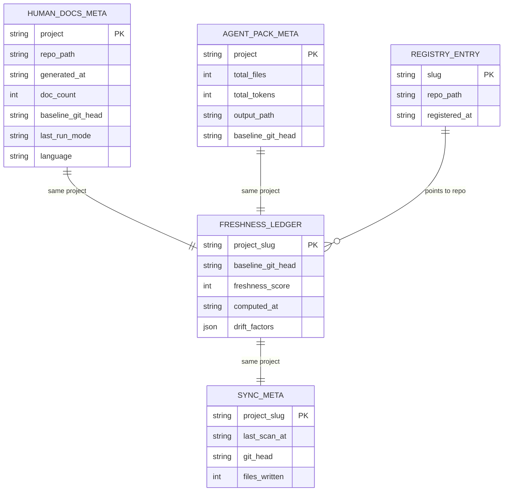

# Database Overview

Terrain does not use a traditional application database. This is a deliberate architectural choice, not an oversight — the platform stores all knowledge as files in the Git repository's `.terrain/` directory so that documentation and agent context travel with code branches. Understanding how Terrain persists data without a database schema is essential for anyone expecting ORM models or migration files.

## Why No Database?

Most documentation tools either ignore persistence (generate and forget) or rely on a remote wiki server. Terrain chose a third path: **filesystem-as-database**. Every knowledge asset is a Markdown or JSON file under `.terrain/`, versioned alongside source code. This means:

- Knowledge diffs appear in `git log` alongside code changes
- Branching creates parallel knowledge states automatically
- No sync server, no connection strings, no migration scripts
- Agents read files directly — no query language needed

The trade-off is clear: Terrain cannot do cross-repo analytics or centralized search without aggregating Git repos. For its target use case (per-repo agent readiness), filesystem persistence is the right fit.

## Persistence Stores

Although there is no application database, Terrain uses several persistent stores with well-defined schemas:

| Store | Location | Format | Versioned? | Purpose |
|-------|----------|--------|------------|---------|
| Knowledge assets | `{repo}/.terrain/` | Markdown + JSON | Yes (in Git) | Human docs, agent context, repomix pack |
| Project registry | `~/.terrain/registry.json` | JSON | No (local) | Slug → repo path pointers |
| SDD sessions | `~/.terrain/sdd/{project}/sessions/` | Markdown | No (local) | Phase outputs per session |
| Ask sessions | `~/.terrain/ask/{project}/` | JSON | No (local) | Chat history per session |
| Freshness ledger | `{repo}/.terrain/.meta/freshness.json` | JSON | Yes | Asset drift scores and baselines |
| Sync metadata | `{repo}/.terrain/.meta/sync.json` | JSON | Yes | Last scan timestamp and HEAD |
| Human docs meta | `{repo}/.terrain/.meta/human.json` | JSON | Yes | Litho doc-set baseline HEAD |
| Agent pack meta | `{repo}/.terrain/agent/meta.json` | JSON | Yes | Repomix pack baseline HEAD |
| Model settings | Platform settings path | JSON | No (local) | LLM/ACP configuration |
| CodeGraph index | `{repo}/.codegraph/` | SQLite | Optional | Symbol graph (external tool) |

## CodeGraph SQLite (External)

The only SQLite usage in the Terrain ecosystem comes from **CodeGraph**, an optional bundled tool deployed via `terrain env apply`. CodeGraph builds a local symbol index under `.codegraph/` for caller/callee/impact queries. Terrain reads drift reports from this index via `codegraph_drift` in `crates/terrain-core/src/freshness/codegraph.rs` but does not own or manage the schema.

This diagram shows the JSON sidecar relationships — not SQL tables, but the logical data model Terrain maintains across its filesystem stores.

## Key JSON Schemas

Terrain's structured metadata is defined as Rust structs in `crates/terrain-core/src/schema/` and serialized to JSON:

| Struct | File | Key Fields |
|--------|------|------------|
| `FreshnessSummary` | `schema/freshness.rs` | `score`, `drift_factors`, `baseline_head` |
| `SyncMeta` | `schema/mod.rs` | `last_scan_at`, `git_head` |
| `HumanDocsMeta` | `schema/mod.rs` | `doc_count`, `baseline_git_head`, `language` |
| `AgentPackMeta` | `schema/mod.rs` | `total_files`, `total_tokens`, `baseline_git_head` |
| `ProjectRegistryEntry` | `registry.rs` | `slug`, `repo_path` |

## Summary

| Type | Count |
|------|-------|
| Application database tables | 0 |
| Filesystem JSON sidecars | 5 per project |
| External SQLite (CodeGraph) | 1 (optional) |
| Session stores (local) | 2 (SDD + Ask) |

Terrain's data model is files all the way down. If you need to query knowledge, use `terrain search` or `terrain tools search` — not SQL.
