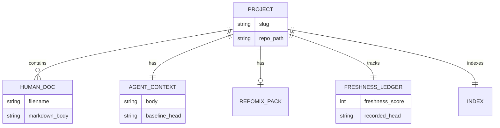

# Database Overview

Terrain does not use a relational or document database. This is a deliberate architectural choice: engineering knowledge must travel with Git branches and pull requests, not live in a separate store that drifts out of sync.

## How Persistence Works Instead

Think of Terrain's storage model as a **filing cabinet inside each repository** plus a **global address book** on the developer's machine. Every piece of state has a clear file-system home:

| Store | Location | Contents | Versioned in Git? |
|-------|----------|----------|-------------------|
| Per-repo knowledge | `{repo}/.terrain/` | Human docs, agent context, index, freshness, sync meta | Partially (human/, agent/context.md; repomix often gitignored) |
| Global registry | `~/.terrain/registry.json` | Project slug → repo path pointers | No (local machine) |
| Global settings | `~/.terrain/settings.json` | LLM/ACP configuration | No |
| Agent binaries | `~/.terrain/bin/` | Deployed terrain, RTK, CodeGraph wrappers | No |
| Preset skills | `~/.terrain/skills/` or app bundle | LLM workflow instructions | No |
| SDD sessions | `~/.terrain/sdd/{project}/sessions/` | Workflow phase outputs | No (local scratch) |
| Litho workspace | `{repo}/.terrain/.litho-agent/` | Research artifacts (transient) | Optional |

Path resolution is centralized in `KnowledgePaths` (`crates/terrain-core/src/paths.rs:8-78`), which maps project slugs to `{repo}/.terrain/` subdirectories.

## Data Relationships (Conceptual)

Although there is no SQL schema, the knowledge assets form a logical graph:

## Why No Database?

| Decision | Chose | Abandoned | Why |
|----------|-------|-----------|-----|
| Knowledge storage | File-based `.terrain/` in-repo | Central database | Knowledge must travel with Git branches; PRs carry updated docs |
| Project registry | `~/.terrain/registry.json` | DB-backed registry | Simple slug→path mapping; no query needs |
| Session state | Local filesystem | Server sessions | SDD and Ask sessions are developer-local scratch space |

## Trigger Assessment

No database artifacts were detected:
- No `.sql` files or `migrations/` directory
- No ORM dependencies in `Cargo.toml` (diesel, sqlx, prisma)
- No database configuration files

For schema-level detail on typed metadata (freshness, SDD, doc frontmatter), see `crates/terrain-core/src/schema/`.
