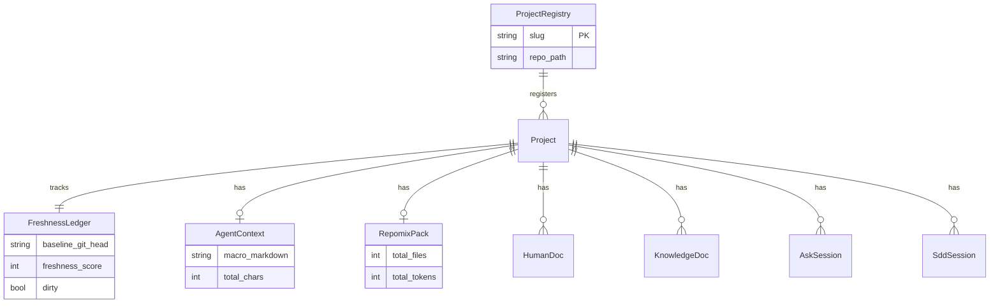

# 数据库概览

## 为什么没有传统数据库

Terrain 是一个**知识资产管理平台**，其核心数据是 Markdown 文档和 JSON 元数据，而非关系型业务数据。经过全面扫描，本项目未检测到以下任何数据库相关特征：

- 无 `.sql` 文件或 `.sqlproj` 项目
- 无 `migrations/`、`sql/`、`db/`、`database/` 目录
- 无 ORM 依赖（diesel、sqlx、prisma、typeorm 等）
- 无数据库配置文件（`database.yml`、`dbconfig.json` 等）

这一设计是有意为之的：Terrain 的知识资产需要随 Git 分支流转，Markdown 文件天然适合版本控制，而中心化数据库会引入额外的同步复杂性和单点故障。

## 文件系统即数据库

Terrain 的"数据持久化"完全基于文件系统，可以把它理解为一个精心设计的目录结构替代了传统数据库的表：

| 逻辑实体 | 存储路径 | 格式 | 类比 |
|---------|---------|------|------|
| 项目注册表 | `~/.terrain/registry.json` | JSON | 项目目录索引 |
| 新鲜度账本 | `.terrain/.meta/freshness.json` | JSON | 数据质量监控表 |
| Agent 宏观上下文 | `.terrain/agent/context.md` | Markdown | 压缩索引视图 |
| 源码快照包 | `.terrain/agent/repomix.md` | Markdown | 全文检索源 |
| 人类 C4 文档 | `.terrain/human/*.md` | Markdown | 叙述性文档库 |
| 领域术语表 | `.terrain/knowledge/*.md` | Markdown | 业务词典 |
| Ask 会话 | sessions 目录 | JSON | 对话历史 |
| SDD 产物 | `~/.terrain/sdd/{project}/sessions/` | Markdown | 工作流输出 |
| 模型设置 | `~/.terrain/settings.json` | JSON | 用户偏好 |

## 实体关系（逻辑视图）

虽然没有 SQL 表，但 Terrain 的数据实体之间存在清晰的引用关系：

## 统计摘要

| 类型 | 数量 |
|------|------|
| 数据表 | 0 |
| 逻辑实体（文件级） | 9 |
| 视图 | 0 |
| 存储过程 | 0 |
