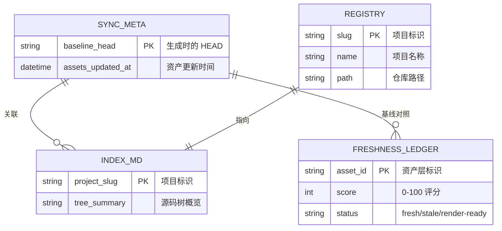

# 数据库概览

---

## 统计摘要

| 类型 | 数量 |
|------|------|
| 业务数据表 | 0 |
| 视图 | 0 |
| 存储过程 | 0 |

**本项目未使用业务数据库。** 全仓无 `.sql` 文件、无 migrations 目录、无 ORM（sqlx/diesel/sea_orm/sqlite）依赖。这不是一个疏忽，而是 Terrain 的刻意设计选择——它选择了"Git 原生"的持久化策略，而非中心化数据库。

---

## 为什么没有数据库

Terrain 的核心设计哲学是"**知识随 Git 流转**"。如果把知识资产放在一个中心化数据库里，就会面临两个问题：一是知识无法跟随 Git 分支流转（feature 分支上的文档修改会影响 main 分支），二是多人协作时需要额外的并发控制和权限管理。Terrain 选择把知识存在 `.terrain/` 目录里，随 Git 仓库一起 version control，这样增量 diff 天然可用、分支隔离天然实现。

---

## 持久化载体

Terrain 的持久化由以下三类载体完成，各有不同的定位与一致性规则：

### 1. 仓库内 `.terrain/`（版本化知识资产）

这是知识的事实来源，随 Git 流转：

| 载体 | 路径 | 用途 | Git 处理 |
|------|------|------|---------|
| 项目索引 | `.terrain/index.md` | 项目结构概览 | 入库，`-merge` 策略 |
| 人类文档 | `.terrain/human/` | C4 架构文档 | 入库，`-merge` 策略 |
| Agent 上下文 | `.terrain/agent/context.md` | 结构化摘要 | 入库，`-merge` 策略 |
| 源码索引 | `.terrain/agent/repomix.md` | repomix 打包 | 不入库 |
| 私域知识 | `.terrain/knowledge/` | 人为维护的文档 | 入库，正常合并 |
| Sync 元数据 | `.terrain/.meta/sync.json` | baseline HEAD + 更新时间 | 入库 |
| 保鲜台账 | `.terrain/.meta/freshness.json` | 新鲜度评分快照 | 入库 |
| Git 策略 | `.terrain/.gitignore` + `.gitattributes` | 生成资产 `-merge` | 入库 |

**一致性规则**：Git HEAD 是保鲜基线。`sync.json` 记录了生成资产对应的 HEAD commit，freshness 系统以此判断漂移。

### 2. `~/.terrain/`（本机配置与指针）

本地配置，不随 Git 流转：

| 载体 | 路径 | 用途 |
|------|------|------|
| 项目登记 | `~/.terrain/registry.json` | 已登记项目：名称、路径、slug |
| 模型设置 | `~/.terrain/settings.json` | ModelSettings/AcpSettings/KnowledgeSettings |
| 工具二进制 | `~/.terrain/bin/` | rtk/codegraph/terrain |
| Ask 会话 | `~/.terrain/ask/` | 会话持久化 |
| SDD 产物 | `~/.terrain/sdd/{slug}/sessions/{id}/outputs/` | SDD 阶段产物 |
| 环境目录 | `~/.terrain/env/catalog/` | 工具能力定义 |
| CodeGraph | `~/.terrain/codegraph/` | 符号图索引 |
| Skills 清单 | `~/.terrain/skills.json` | 已启用 Skills |

### 3. 外部本地索引（工具专属）

| 载体 | 路径 | 用途 |
|------|------|------|
| CodeGraph 数据库 | `.codegraph/codegraph.db`（SQLite） | 符号图、调用链分析 |

这是一个独立工具的索引文件，非 Terrain 业务数据。CodeGraph 用 SQLite 做符号图存储，但 Terrain 不直接操作这个数据库——它通过 `codegraph` 二进制的 CLI 接口交互。

---

## 实体关系图

由于本项目无业务数据库，以下展示的是 `.terrain/` 目录内关键文件之间的逻辑关系：

---

## 存储策略总结

| 设计选择 | 放弃了什么 | 为什么 |
|---------|---------|------|
| `.terrain/` 随 Git 流转 | 中心化数据库的便利 | 知识随分支流转、增量 diff 天然可用、无服务端运维 |
| `~/.terrain/` 本机配置 | 多机同步 | 配置因机器而异（LLM 端点、API key），不应跨机共享 |
| CodeGraph SQLite 独立 | 统一存储 | 符号图是工具专属数据，无需与知识资产混存 |
| Git HEAD 为保鲜基线 | 实时监控 | Git 提交是开发者已确认的"变更信号"，比文件系统 watch 更可靠 |

---

## 一致性规则

1. **Git HEAD 是唯一基线**：`sync.json` 的 `baseline_head` 和 `freshness.json` 的评分都基于当前 HEAD
2. **生成资产 `-merge`**：`.gitattributes` 禁用自动合并，冲突时重新生成而非手工合并
3. **本机衍生物不入库**：`repomix.md`、`meta.json`、`env/` 等由 scan 本地重建，不提交到 Git
4. **配置环境变量优先**：`settings.json` 是持久配置，环境变量是临时覆盖
