# 数据库与持久化概览：Terrain

**版本：** 1.0
**分类：** 数据 / 持久化
**生成日期：** 2026-09-21

---

## 1. 核心结论：没有业务数据库

Terrain 自身**没有任何业务数据库**——没有 SQLite、没有 PostgreSQL、没有嵌入式 KV。它的全部持久化都落在**文件系统上的结构化文件**（JSON / Markdown / 小体积 sidecar）。

工作区 `crates/*/Cargo.toml` 与根 `Cargo.toml` 中 grep 不到 `rusqlite` / `sqlx` / `sled` / `redb` / `rocksdb` 等任何数据库依赖。本仓库里唯一与数据库沾边的 SQLite 出现在 **vendored 的 CodeGraph 侧车**中（`packages/codegraph/darwin-arm64/lib/dist/db/schema.sql`），而 Terrain 对它的使用仅是"读取 `.codegraph/codegraph.db` 的 mtime 做过期检测"（`crates/terrain-core/src/freshness/codegraph.rs:25`），**从不写入**——那是外部工具自带的能力，不属于 Terrain 的代码。

这个结论对应的数据分布可以画成一张全景图：

```mermaid
flowchart LR
    subgraph 机器级全局态 ["~/.terrain/（本机，不入库）"]
        R1["registry.json<br/>项目登记表（只存指针）"]
        R2["settings.json<br/>ModelSettings"]
        R3["ask/{slug}/sessions/*/<br/>会话 meta + messages"]
        R4["sdd/{slug}/sessions/*/<br/>outputs/1..4 阶段文件"]
        R5["bin/ + tools/ + env-catalog/ + preset-skills/<br/>环境集成物料"]
        R6["debug/<br/>模型原始输出临时暂存"]
    end
    subgraph 仓库级知识资产 ["{repo}/.terrain/（随 Git 流转）"]
        K1["index.md + modules/interfaces/routes/events"]
        K2["human/*.md（Litho C4 文档）"]
        K3["agent/repomix.md + meta.json（Agent 打包索引）"]
        K4["agent/context.md + context-meta.json"]
        K5[".meta/sync.json + freshness.json + human.json"]
        K6["project-note.md + env/manifest.json + .gitignore/.gitattributes"]
    end
    subgraph 子进程工作区 ["ACP / Litho / SDD 临时工作区"]
        W1["TERRAIN_* 注入变量<br/>litho.rs:1024-1030"]
    end
    机器级全局态 --> 仓库级知识资产
    仓库级知识资产 -.-> 子进程工作区
```



---

## 2. 数据到底放在哪：三张"表"

### 2.1 `~/.terrain/` —— 机器级全局态

| 路径 | 内容 | 说明 |
|------|------|------|
| `~/.terrain/registry.json` | 项目登记表：`{"projects":[{slug, repo_path}]}` | 只存"指针"不存知识正文（`crates/terrain-core/src/registry.rs:29,44-59`），带 mtime 判定的进程内内存缓存（registry.rs:72-101）。设计意图原文：*"registry 只保存指针，让桌面应用可以发现被索引的仓库；知识文件放在 `{repo}/.terrain/` 并随仓库版本化"*（registry.rs:1-5） |
| `~/.terrain/settings.json` | `ModelSettings`（provider、profiles、acp、knowledge、language） | `crates/terrain-core/src/settings.rs:152-176` |
| `~/.terrain/ask/{slug}/sessions/{session-id}/` | Ask 会话历史：`meta.json` + `messages.json` | 纯 JSON 文件（`crates/terrain-core/src/assets/ask.rs:21-27,259-298`），另有 `active.json` 记录当前激活会话 |
| `~/.terrain/sdd/{slug}/sessions/{session-id}/` | SDD 工作流：`outputs/1.requirements.md … 4.code-review.md` + `meta.json` | phase 命名即文件命名（`assets/sdd.rs:220-222`），`active.json` 同 Ask。写入受路径约束：`save_sdd_output` 只允许落在 `~/.terrain/sdd/` 下（sdd.rs:180-191）——一个"目录即权限域"的数据库式约束 |
| `~/.terrain/env-catalog/`、`preset-skills/`、`bin/`、`tools/` | 环境集成物料与部署产物 | 内置 CLI / RTK / CodeGraph 的部署（`agent_tools_deploy.rs:59-69`） |
| `~/.terrain/agent-tools.json` | 全局工具路径清单（`~/` 相对化） | `agent_tools_deploy.rs:193-202`；另有仓库级副本 `.terrain/env/agent-tools.json`（不入库） |
| `~/.terrain/debug/` | 模型原始输出的调试暂存（如 `last-agent-context-raw.md`） | `paths.rs:80-91`；`assets repair-context` 靠它恢复上文 |

### 2.2 `{repo}/.terrain/` —— 随 Git 流转的知识资产

| 路径 | 内容 |
|------|------|
| `index.md` + `modules/` `interfaces/` `routes/` `events/` | 扫描生成的知识文档（每篇带 YAML frontmatter：`type/project/refs/deps/…`，schema/doc.rs:49-67） |
| `human/*.md` | Litho 生成的人类友好 C4 文档 |
| `agent/repomix.md` + `agent/meta.json` | Agent 打包索引 + `AgentPackMeta`（token 统计、baseline git HEAD） |
| `agent/context.md` + `agent/context-meta.json` | Agent 架构叙述 + 元数据 |
| `.meta/sync.json`、`.meta/freshness.json`、`.meta/human.json` | 同步元数据、freshness ledger、human 文档基线 |
| `project-note.md` | 人类可编辑的项目备注 |
| `.terrain/env/manifest.json`、`.terrain/.gitignore` / `.gitattributes` | 环境集成结果与 Git 跟随策略 |

目录布局由 `KnowledgePaths::ensure_project_layout` 统一建立（`paths.rs:234-250`）；`.gitignore` / `.gitattributes` 由 `git_policy::ensure_git_policy` 生成，把"本机衍生物不入库、生成文档禁用自动合并（冲突时重生成）"固化成策略。

### 2.3 一个 JSON 账本充当"数据库表"

最有代表性的例子是 **freshness ledger**。每次 freshness 重算把它写进 `.meta/freshness.json`：

```json
{ "version": 1, "project": "...", "baseline": {"git_head": "...", "dirty": false},
  "assets": {...}, "drift": {...}, "summary": {...}, "last_computed_at": "..." }
```

类型见 `crates/terrain-core/src/schema/freshness.rs:96-105`（`FreshnessLedger`）。"查询"就是 `read_freshness_ledger` 读文件（freshness/ledger.rs:23-28）；"缓存失效"就是 `freshness_ledger_still_valid` 用三条廉价规则验证：**git HEAD 没变、工作树没脏、没有任何资产 meta 比账本更新**（ledger.rs:44-100）。它把"缓存是否可信"建立在 Git 对象而不是数据库时间戳上——这是无数据库架构里"版本化缓存"的典型替代物。SDD / Ask 的 `active.json`（一个 `{"session_id":"..."}` 的单字段文件）同理充当"当前指针"。

---

## 3. 为什么这样设计：四个动因

### 3.1 单二进制、零运维的"工具"而非"服务"

Terrain 是一个本地桌面应用 + CLI，不是需要部署的服务器。它没有运行时常驻进程去持有连接池、没有 schema migration、没有备份策略——所有状态都是进程短生命周期的文件读写。为这种形态引入数据库引擎，等于为一个"扫描仓库→写 Markdown→起分支问问题"的单机工具背上 daemon 与链路复杂度。**文件与 JSON 就是它的"进程间契约"**：CLI、Tauri GUI、以及被 ACP 派生的子进程（拿到 `TERRAIN_*` 注入变量，litho.rs:1024-1030）通过读写同一批文件协作，天然免序列化协议设计。

### 3.2 离线优先与可审计性

`usage` 调用本地 `ccusage` 时显式带 `--offline`（`crates/terrain-core/src/usage.rs:20,427-451`）——统计读取的是 Claude Code / OpenCode / Codex 的本地日志，不依赖任何云服务。文件形式天然满足"离线可用 + 人可读可审计"：一个 `.md` / `.json` 随手 `cat` 就能检查，不需要像查 DB 那样连一把。

### 3.3 知识必须是"可版本化、可随 Git 流转"的一等公民

这是最核心的动因。Terrain 的产品设定是：**知识资产（`.terrain/`）内嵌在仓库里、随分支流转**（README_zh.md:263）。`registry.json` 的模块注释写得很直白：知识文件放在仓库内、登记表只存"指针"（registry.rs:1-5）。如果知识放进某种二进制/服务端数据库，就等于剥夺了它"提交→评审→合并→PR 对比→他人 clone 即得"的生命周期。把资产做成 Markdown + JSON 文件，`git diff` 一眼能看出这次初始化/刷新改了哪些知识点；`AGENTS.md` 里也明令"生成文档冲突时不要手工合并，重生成即可"——因为知识文档是按代码重新生成的，**regenerate 就是最高级的"迁移"**。

### 3.4 规模决定数据模型，"表"在这里没有意义

Terrain 的高频数据基数是：几十上百个项目 × 每项目几十上百篇文档 × 每会话几十 K 消息。这个量级对 `registry.json` 的 O(n) 线性读（带 mtime 缓存）和目录遍历式会话列表已经绰绰有余。真正需要复杂查询的能力（全文检索）走的是对 **Markdown 文件**做匹配的 `KnowledgeSearch`，而不是 SQL——因为检索对象本身就是文件。SDD 的 phase 状态干脆由"输出文件是否存在于 `outputs/`"推导（`build_phase_infos`，sdd.rs:282-309）：**文件系统的存在性即状态**，连状态机都省了。

---

## 4. 这一选择带来的权衡（诚实评估）

### 4.1 收益

| 收益 | 说明 |
|------|------|
| 零迁移、零连接、零 daemon | `cargo run` 即可用；每次 CRUD 只是 `fs::read`/`fs::write` |
| 可移植可协作 | 知识资产随 Git 流转、可 review、可重建；机器状态（registry/settings/sessions）在 HOME 下与仓库解耦 |
| 人可读可 repair | `repair-context`、`project remark`、`settings set <json>` 都是在文件层面直接修补故障 |
| 无并发热点 | 单机单用户，文件写冲突几乎不存在（`SNAPSHOT_CACHE` 120s 内存 TTL、registry mtime 缓存，usage.rs:19,22-29；registry.rs:84-100） |

### 4.2 代价

| 代价 | 说明 |
|------|------|
| 无事务、无原子性保证 | `std::fs::write` 非原子写；对少量路径用"临时文件+rename"或朴素的半新半旧策略 |
| 无 schema 强制 | 错误或旧版本的 JSON 需要 Rust 侧 `Default`/`unwrap_or` 兜底（如 ask 会话缺 meta 时退回 id 当标题，ask.rs:90-98） |
| 查询能力受限 | 全靠全量扫描 + 进程内缓存；跨项目"哪些文档 refs 了这个符号"的关系查询需要额外索引——这正是 CodeGraph 这个 SQLite sidecar 存在的原因（免费符号索引，作为**外部工具**与文件资产互补） |
| 并发写靠默契 | 由"单用户直觉"保证，多进程同时跑 `terrain refresh` 时靠 git workspace 隔离，不提供行级锁 |

---

## 5. 结论

`~/.terrain/registry.json` 是路由表，`{repo}/.terrain/` 是随 Git 流转的内容库，`.meta/freshness.json` 是版本化缓存账本，`~/.terrain/ask` / `~/.terrain/sdd` 是本地会话库，`settings.json` 是配置——它们加在一起构成的"**文件系统即数据库**"，与 Terrain"单二进制、离线优先、知识随仓库走"的产品约束是同构的。引入数据库（哪怕 SQLite）反而会引入迁移、连接、以及"知识无法随 Git 区分"的根本性矛盾。仓库里唯一的 SQLite 文件属于 vendored CodeGraph 工具本身，Terrain 只读它的时间戳做 staleness 判断，未参与任何业务持久化。