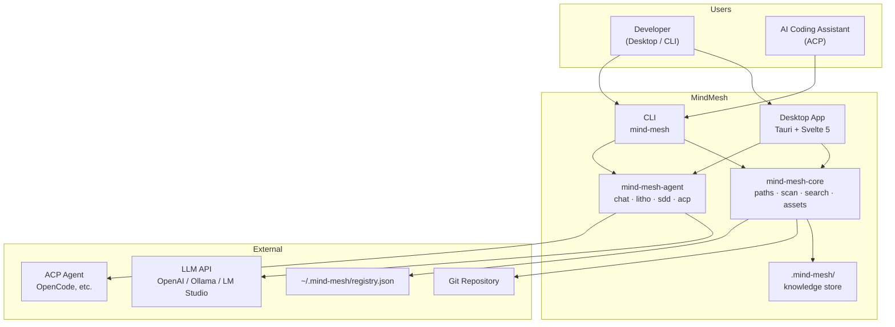
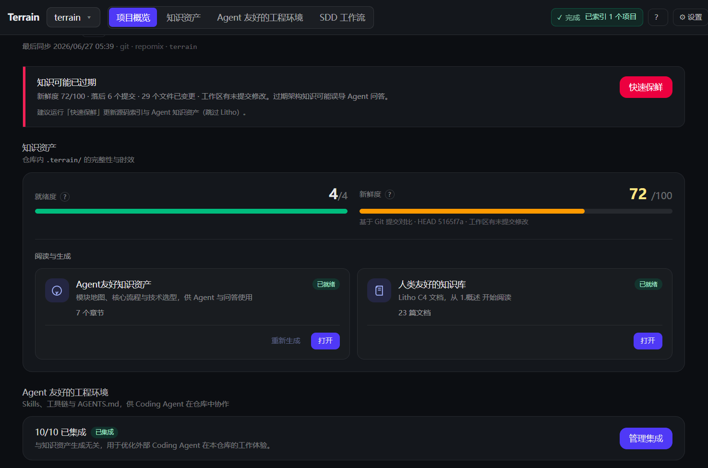
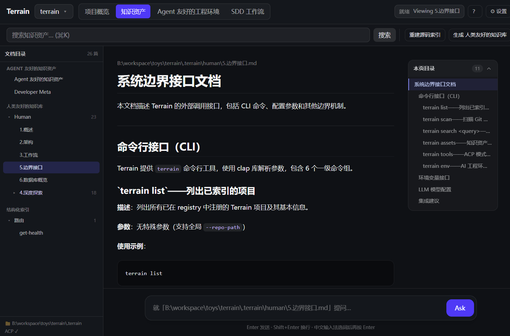
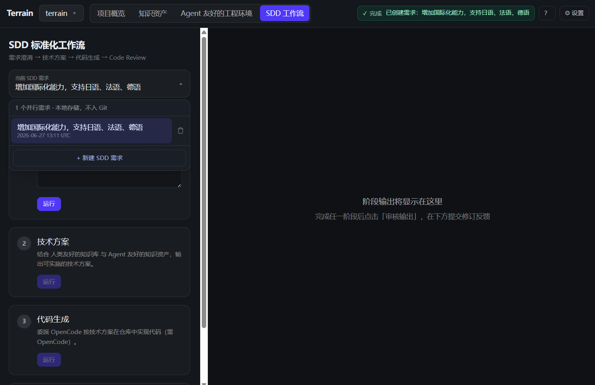
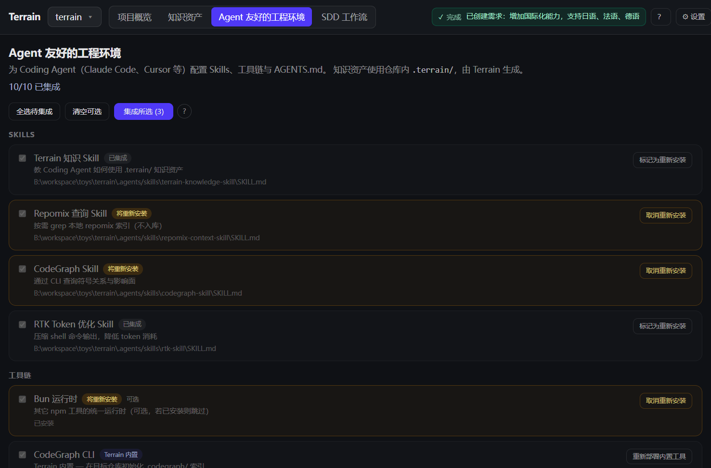

<div align="center">

# MindMesh

**Engineering environment management for human developers and AI coding assistants**

[](LICENSE)

Scan any Git repository, generate C4 architecture docs, maintain structured knowledge assets in-repo, and let AI assistants query your project through a single CLI.

</div>

---

## What is MindMesh?

MindMesh is an **engineering environment management platform** built for the age of AI-assisted development. Point it at a Git repository and it will:

- **Scan** the codebase and index project structure
- **Generate** human-readable C4 architecture documentation (Litho)
- **Maintain** AI-friendly structured knowledge assets under `.mind-mesh/`
- **Answer** architecture questions via DeepWiki (RAG over your knowledge base)
- **Run** standardized development workflows (SDD: requirements → design → codegen → review)
- **Integrate** Skills, tools, and `AGENTS.md` guidance for external coding agents

Knowledge lives **in the repository** — not in a central database. Every branch carries its own docs. Human developers use the **Tauri desktop app** or **CLI**; external AI coding assistants (OpenCode, Cursor, etc.) call `mind-mesh tools` over ACP to read the same knowledge layers.

### Dual-track knowledge

| Audience | Path | Format |
|----------|------|--------|
| **Humans** | `.mind-mesh/human/` | Narrative C4 docs with Mermaid diagrams |
| **AI agents** | `.mind-mesh/agent/context.md` | Structured architecture overview (≤ 14 KiB) |
| **Source index** | `.mind-mesh/agent/repomix.md` | Repomix pack — grep/read on demand, not preloaded |
| **Domain terms** | `.mind-mesh/knowledge/` | Business glossary and internal conventions |

### Knowledge factory

```
Git repository (input)
        │
        ▼
┌───────────────────────────────────────────┐
│  MindMesh Core + Agent                    │
│  scan → register → pack → context → litho │
└───────────────────────────────────────────┘
        │
        ▼
.mind-mesh/  (output — versioned with your code)
```

---

## Why MindMesh?

Onboarding to a new codebase usually means days of reading source and stale wiki pages. MindMesh compresses that to minutes: register a repo, run initialization, and get a full C4 doc set plus an agent-ready context pack.

| Without MindMesh | With MindMesh |
|------------------|---------------|
| Architecture knowledge scattered across wikis, Slack, and senior engineers | C4 docs and agent context generated from the actual codebase |
| AI assistants grep the live repo blindly | Agents read `context.md` first, then targeted repomix slices |
| Docs drift from code on every refactor | Freshness tracking flags stale assets; knowledge travels with Git branches |
| Every team reinvents "how to onboard an AI to our repo" | Env integration installs Skills, CodeGraph, RTK, and `AGENTS.md` snippets |

**Built for:**

- **Developers** exploring or documenting a codebase
- **Tech leads** who want architecture docs that stay close to the code
- **Teams** adopting AI coding assistants and need a shared knowledge contract
- **CI/CD** pipelines that regenerate knowledge assets on merge
- **ACP integrators** wiring `mind-mesh tools` into OpenCode or compatible agents

---

## Features & Capabilities

### Litho — C4 architecture documentation

Automated four-phase pipeline (research → composition) produces six standard human docs:

1. Overview
2. Architecture
3. Workflows
4. Deep module exploration
5. Boundary interfaces
6. Database overview

Intermediate research artifacts persist under `.mind-mesh/.litho-agent/` so generation can resume after interruption.

### DeepWiki — knowledge-grounded Q&A

Ask natural-language questions against your project's knowledge base. The Chat engine preloads macro context from `agent/context.md`, fetches meso sections on demand, and uses repomix grep/read for micro-level source detail. Answers include citations and tool-call traces.

### SDD — standardized development workflow

Four sequential phases, each producing a reviewable Markdown artifact:

| Phase | Output | Execution |
|-------|--------|-----------|
| 1. Requirements | `1.requirements.md` | Native LLM |
| 2. Technical design | `2.tech-design.md` | Native LLM |
| 3. Code generation | `3.implementation.md` + repo changes | ACP agent |
| 4. Code review | `4.code-review.md` | Native LLM |

Session outputs live under `~/.mind-mesh/sdd/{project}/sessions/{id}/outputs/` (local, not versioned).

### Env — AI engineering environment integration

Detect and install the toolchain your coding agents need:

- **Skills** — mind-mesh-knowledge, repomix-context, codegraph, rtk
- **Tools** — CodeGraph CLI, RTK token optimizer
- **AGENTS.md** — managed snippets guiding agents to the knowledge layers

Dependency order is respected: `mind-mesh-knowledge` → `repomix` → `codegraph` → `rtk`.

### ACP tools — CLI for external agents

When MindMesh runs in ACP mode, external agents call `mind-mesh tools` (JSON stdout) instead of built-in function tools. Same three-layer model: macro (preloaded) → meso (`read-context`) → micro (`grep-pack` / `read-pack-file`).

### Freshness tracking

Git HEAD and dirty-state monitoring score knowledge assets. Agents should down-weight context when `freshness_score < 50`.

---

## Architecture



**Layered dependency:** UI / CLI → Agent → Core → filesystem / Git / LLM. Core has no UI dependency; CLI and Tauri share the same Rust APIs.

### Repository layout

```
mind-mesh/
├── crates/
│   ├── mind-mesh-core/     # Paths, registry, scan, search, assets
│   ├── mind-mesh-agent/    # Chat, Litho, SDD, ACP, context generation
│   └── mind-mesh-cli/      # CLI entry point
├── src/                    # Svelte 5 frontend
├── src-tauri/              # Tauri 2 backend + IPC commands
├── preset_skills/          # Litho, SDD, Ask, Agent Context skills
├── env-catalog/            # Env integration catalog
├── packages/rtk/           # Shell output token compression
└── .mind-mesh/             # This repo's own knowledge assets (example)
```

### `.mind-mesh/` directory (per project)

```
{your-repo}/.mind-mesh/
├── index.md                 # Project index (from scan)
├── agent/
│   ├── context.md           # Macro architecture context for agents
│   ├── repomix.md           # Source pack (generated, often gitignored)
│   └── meta.json            # Pack metadata
├── human/                   # Litho C4 docs (1.概述.md, 2.架构.md, …)
├── knowledge/               # Domain glossary and conventions
├── .meta/
│   ├── sync.json            # Scan sync state
│   └── freshness.json       # Asset freshness scores
└── .litho-agent/            # Litho research workspace (transient)
```

Project registration (slug ↔ repo path) is stored locally at `~/.mind-mesh/registry.json` — pointers only, not knowledge files.

### Tech stack

| Layer | Choice |
|-------|--------|
| Language | Rust 2024 (workspace, rust-version 1.94) |
| Desktop | Tauri 2 + Svelte 5 + Vite 6 + Tailwind CSS 4 |
| LLM framework | ADK Rust (adk-agent, adk-model, adk-runner) |
| ACP | agent-client-protocol 0.11 + adk-acp |
| Source packing | repomix-core 2.0 |
| Package managers | Cargo workspace, Bun (Node toolchain) |
| Symbol analysis | @colbymchenry/codegraph (optional) |

---

## Ecosystem

MindMesh composes with the tools your AI workflow already uses:

| Component | Role |
|-----------|------|
| **OpenCode / ACP agents** | Execute Litho composition, SDD codegen, and tool calls in an isolated process |
| **Repomix** | Packs source into a grep-friendly index for agents |
| **CodeGraph** | Symbol callers/callees/impact queries via `bunx codegraph` |
| **RTK** | Compresses shell output to save tokens (`@mind-mesh/rtk`) |
| **Preset Skills** | LLM workflow instructions in `preset_skills/` (Litho, SDD, Ask, Context) |
| **DeepWiki MCP** | Optional GitHub repo documentation in the desktop UI |

Trust model for coding agents: when sources conflict, **repomix source > codegraph > context.md > human docs**.

---

## UI Showcase

Screenshots are placeholders — replace with captures from the desktop app when ready.

### Overview

<!-- Capture: Desktop app project list with freshness indicators -->


*Project list, registration status, and freshness scores.*

### Knowledge & Litho

<!-- Capture: Human docs tree with Litho C4 document open -->


*Human-facing C4 architecture docs generated by the Litho pipeline.*

### DeepWiki

<!-- Capture: DeepWiki Ask panel with a question and cited answer -->


*Knowledge-grounded Q&A with citations and tool-call traces.*

### SDD Workflow

<!-- Capture: SDD session panel showing phase outputs -->


*Four-phase standardized development: requirements through code review.*

### Env Integration

<!-- Capture: Env panel with integration status and apply action -->


*Skills, tools, and AGENTS.md integration status for coding agents.*

> **Adding screenshots:** Save PNGs as `assets/screenshots/01-overview.png` through `05-env.png`. Recommended width: 1200–1600 px. The HTML comments above describe what each capture should show.

---

## Getting Started

### Prerequisites

- **Rust** 1.94+ ([rust-toolchain.toml](rust-toolchain.toml) pins the version)
- **Bun** — Node toolchain for frontend and optional tools
- **Git** — repositories must be Git workspaces
- **LLM access** — OpenAI-compatible API, Ollama, or LM Studio (configure in the desktop app **Settings** panel)
- **ACP agent** (optional) — OpenCode or compatible agent for Litho composition and SDD codegen

### Build from source

```bash
# Clone and install frontend dependencies
git clone https://github.com/sopaco/mind-mesh.git
cd mind-mesh
bun install

# Build Rust workspace (CLI + libraries)
cargo build --release

# CLI binary
./target/release/mind-mesh --help

# Desktop app (development)
bun run dev:app
```

### Register and initialize a project

Replace `/path/to/your-repo` with any Git repository you want to index.

```bash
# Register the repository (creates {repo}/.mind-mesh/ layout)
./target/release/mind-mesh assets register /path/to/your-repo

# Scan repository structure into index.md
./target/release/mind-mesh scan /path/to/your-repo

# Pack agent source index (repomix)
./target/release/mind-mesh assets pack-agent /path/to/your-repo

# Generate agent/context.md (requires LLM configured in Settings)
./target/release/mind-mesh assets agent-context /path/to/your-repo

# List generated human docs (after Litho)
./target/release/mind-mesh assets list-human --project your-repo-slug
```

Run Litho human doc generation (requires ACP agent):

```bash
./target/release/mind-mesh assets run-litho /path/to/your-repo
```

### Configure models

Use the desktop app **Settings** panel to set provider, model, base URL, and API key. Settings persist locally for the app and CLI.

For headless CLI use, environment variables are supported — see [.env.example](.env.example) for reference. Copy to `.env` in the repo root (gitignored); do not commit secrets.

### Integrate AI engineering environment

```bash
# Check integration status
./target/release/mind-mesh env status --repo-path /path/to/your-repo

# Preview plan
./target/release/mind-mesh env plan --repo-path /path/to/your-repo

# Apply integrations (Skills, CodeGraph, RTK, AGENTS.md)
./target/release/mind-mesh env apply --repo-path /path/to/your-repo
```

---

## Usage

### CLI command groups

| Group | Purpose |
|-------|---------|
| `list` | List indexed projects |
| `scan` | Scan a Git repo into Markdown knowledge docs |
| `search` | Full-text search across knowledge base |
| `read` | Read a document by path |
| `tools` | JSON tools for ACP-mode agents |
| `assets` | Pack, Litho, agent context, registration |
| `env` | AI engineering environment integration |

Global flag: `--repo-path` (default: current Git workspace or `MIND_MESH_REPO_PATH`).

### Search and read

```bash
# Search across knowledge docs
mind-mesh search "authentication flow" --limit 10

# Read a specific document
mind-mesh read human/2.架构.md
```

### `mind-mesh tools` — for ACP integrators

All commands output JSON to stdout. Run from the repository root or pass `--repo-path`.

```bash
# List indexed projects
mind-mesh tools list-projects

# Architecture overview (macro layer)
mind-mesh tools read-context --project my-app

# Specific context section
mind-mesh tools read-context --project my-app --section "核心流程"

# Grep the repomix pack (micro layer)
mind-mesh tools grep-pack --project my-app --pattern "struct ProjectScanner"

# Read source slice from pack (≤ 150 lines recommended)
mind-mesh tools read-pack-file --project my-app \
  --file crates/mind-mesh-core/src/paths.rs --start-line 1 --end-line 80

# Search human and agent docs
mind-mesh tools search --query "freshness" --project my-app --limit 5

# Read a doc by project-relative path
mind-mesh tools read-doc --project my-app --path human/1.概述.md
```

**Agent workflow:** answer from preloaded macro context when possible → `read-context` for missing sections → `grep-pack` then `read-pack-file` for implementation detail. Never read the live repository filesystem; the repomix pack is authoritative for code.

### Desktop app

```bash
bun run dev:app      # Development with hot reload
bun run build:app    # Production build
```

The desktop UI provides:

- Project registration and scan triggers
- Human doc browser (Litho output)
- DeepWiki Ask bar
- SDD session management
- Env integration panel
- Model and ACP settings

### What MindMesh does not do

- **Does not modify your code** by default (SDD codegen phase is the exception, via an external ACP agent)
- **Does not host a web service** — all data stays on the local filesystem
- **Does not replace Git** — it reads repository structure; version control remains your responsibility
- **Does not store binary knowledge** — assets are Markdown and JSON, designed for Git collaboration

---

## Project structure (crates)

| Crate | Responsibility |
|-------|----------------|
| `mind-mesh-core` | Paths, registry, ingest, search, assets, freshness, env catalog |
| `mind-mesh-agent` | ChatEngine, Litho, SDD, agent context, ACP adapter, project init |
| `mind-mesh-cli` | Clap CLI wrapping Core + Agent |
| `src-tauri` | IPC bridge between Svelte UI and Rust backend |

---

## License

MIT — see [LICENSE](LICENSE).

---

## Related resources

- [AGENTS.md](AGENTS.md) — guidance injected for coding agents in this repo
- [preset_skills/](preset_skills/) — Litho, SDD, Ask, and Agent Context skill definitions
- [env-catalog/catalog.json](env-catalog/catalog.json) — integration catalog
- [.mind-mesh/human/](.mind-mesh/human/) — Litho-generated docs for MindMesh itself (living example)
