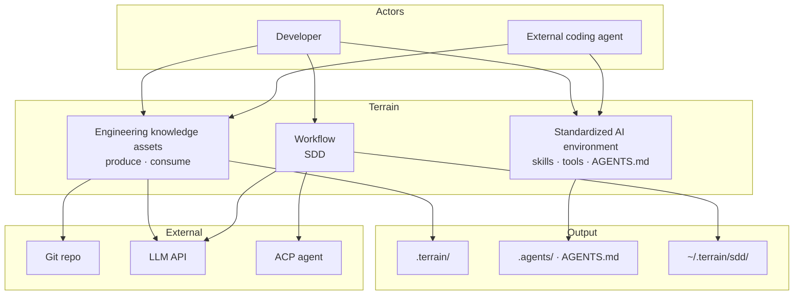
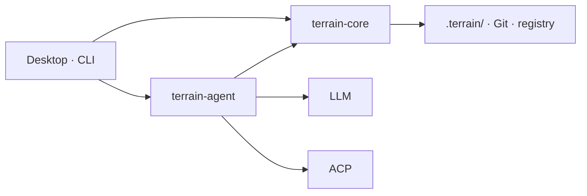

<div align="center">
    

# Terrain

**Terrain prepares the ground so agents don't have to guess where to stand.**

Engineering environment management for human developers and AI coding assistants — knowledge as the map, tools as the roads, conventions as the trail markers.

[](LICENSE)

</div>

---

## What is Terrain?

Terrain is a **standardized, AI-friendly engineering environment** built for the age of AI-assisted development. Point it at a Git repository and it delivers three things:

- **🗺️ Engineering knowledge** — auto-generated, always-in-sync C4 docs and agent context, **produced from your code and consumed by both humans and AI agents**.
- **🤝 A standardized environment for AI agents** — one shared "knowledge contract" (Skills, `AGENTS.md`, CLIs) so every coding agent reads the project the same way instead of blind-grepping the live repo.
- **⚙️ Auto-deployed agent enhancement tools** — one command installs the toolchain your agents need (CodeGraph, RTK, preset Skills); no per-repo yak-shaving.

Knowledge lives **in the repository** — not in a central database. Every branch carries its own docs. Human developers use the **Tauri desktop app** or **CLI**; external AI coding assistants (Claude Code, Codex, OpenCode, Cursor, …) call `terrain tools` over **ACP** to read the same knowledge layers.

### App preview

| Project overview | Engineering knowledge | DeepWiki Q&A | Agent environment |
|------------------|------------------------------|--------------|-------------------|
|  |  |  |  |

*From left to right: project list with freshness scores, auto-generated C4 docs, knowledge-grounded Q&A, and one-command agent tooling setup.*

### Three pillars at a glance

| Pillar | Metaphor | What you get |
|--------|----------|--------------|
| **Engineering knowledge assets** | *Map* | Dual-track docs in `.terrain/` — **produced** from code, **consumed** by humans and agents |
| **Standardized AI environment** | *Roads* | Skills, CLIs, and `AGENTS.md` that route agents to the right knowledge and tools |
| **Agent enhancement tools** | *Gear* | One-command deployment of CodeGraph, RTK, and preset Skills |

### Dual-track knowledge

| Audience | Path | Format |
|----------|------|--------|
| **Humans** | `.terrain/human/` | Narrative C4 docs with Mermaid diagrams |
| **AI agents** | `.terrain/agent/context.md` | Structured architecture overview (≤ 14 KiB) |
| **Source index** | `.terrain/agent/repomix.md` | Repomix pack — grep/read on demand, not preloaded |
| **Domain terms** | `.terrain/knowledge/` | Business glossary and internal conventions |

### Knowledge factory


---

## Why Terrain?

Onboarding to a new codebase usually means days of reading source and stale wiki pages. Terrain compresses that to minutes: register a repo, run initialization, and get a full C4 doc set plus an agent-ready context pack.

| Without Terrain | With Terrain |
|------------------|---------------|
| Architecture knowledge scattered across wikis, Slack, and senior engineers | Engineering knowledge assets generated from the actual codebase |
| AI assistants grep the live repo blindly | Agents read `context.md` first, then targeted repomix slices |
| Docs drift from code on every refactor | Incremental updates + freshness tracking; knowledge travels with Git branches |
| Every team reinvents "how to onboard an AI to our repo" | Env integration installs Skills, CodeGraph, RTK, and `AGENTS.md` snippets |

**Built for:**

- **Developers** exploring or documenting a codebase
- **Tech leads** who want architecture docs that stay close to the code
- **Teams** adopting AI coding assistants and need a shared knowledge contract
- **CI/CD** pipelines that regenerate knowledge assets on merge
- **ACP integrators** wiring `terrain tools` into Claude Code, Codex, OpenCode, or compatible agents

---

## From Litho (deepwiki-rs) to Terrain

Terrain's knowledge engine is the direct successor of **Litho**, the AI documentation generator published as [deepwiki-rs](https://github.com/sopaco/deepwiki-rs) (**1.7k★**). Litho proved the core thesis at scale — *generate architecture docs from code, keep them in sync, make them agent-ready*. Terrain takes that successful practice and hardens it into a platform:

- **Incremental knowledge-base updates.** Instead of regenerating from scratch, Terrain tracks Git HEAD and working-tree state and updates only what changed, so the knowledge base stays fresh on every commit without the full cost (freshness scoring + resumable pipelines).
- **Broad language & framework adaptation.** The generation core is language-agnostic and tuned for Rust, TypeScript/JavaScript, Python, Go, Java, C#, and more, with framework-aware structure extraction.
- **ACP mode for your agents.** Terrain speaks the Agent Client Protocol, so Claude Code, Codex, OpenCode, and Cursor can pull project knowledge through `terrain tools` instead of guessing.
- **Litho Book, built in.** The original Litho Book Markdown reader and its knowledge-grounded Q&A are now integrated into the Terrain desktop app — browse and ask in one place.

In short: if you liked Litho for docs, Terrain is Litho's knowledge core **plus** the environment, workflow, and agent bridge around it.

---

## Features & Capabilities

### 1. Engineering knowledge assets — generate & consume

Terrain turns a codebase into a dual-track knowledge base that both people and agents use. Born from Litho (deepwiki-rs, 1.7k★), it keeps the proven doc-generation core and adds incremental, multi-language, agent-connected delivery.

- **Generate** — a four-phase pipeline produces six standard human docs (overview, architecture, workflows, deep module exploration, boundary interfaces, database overview) plus a structured `agent/context.md` and a grep-friendly `repomix.md` source pack.
- **Consume** — DeepWiki answers natural-language questions over the knowledge base with citations and tool-call traces; external agents consume the same three layers through `terrain tools`.
- **Stay fresh** — incremental regeneration on code change and a freshness score that flags stale assets.
- **Read & ask in one place** — the integrated Litho Book reader and Q&A (formerly a separate tool) now live inside the desktop app.

> The same Litho success story, now incremental, multi-language, and wired to your agents.

### 2. Standardized, AI-friendly engineering environment

A shared "knowledge contract" so every coding agent reads your repo the same way:

- **`AGENTS.md`** — managed snippets that point agents to the knowledge layers first.
- **Preset Skills** — standard playbooks (terrain-knowledge → repomix → codegraph → rtk) your agents can load.
- **Conventions as trail markers** — consistent workflow and access patterns across repositories.

### 3. Auto-deployed agent enhancement tools

One command wires up the toolchain your agents need — no per-repo setup:

- **CodeGraph** — symbol callers/callees/impact queries via `bunx codegraph`.
- **RTK** — shell-output token optimizer that saves agents tokens.
- **Terrain CLI / `terrain tools`** — scan, assets, and ACP access.
- `terrain env apply` installs Skills, CLIs, and `AGENTS.md` in the right dependency order (`terrain-knowledge` → `repomix` → `codegraph` → `rtk`).

### 4. SDD — standardized development workflow

Four sequential phases, each producing a reviewable Markdown artifact:

| Phase | Output | Execution |
|-------|--------|-----------|
| 1. Requirements | `1.requirements.md` | Native LLM |
| 2. Technical design | `2.tech-design.md` | Native LLM |
| 3. Code generation | `3.implementation.md` + repo changes | ACP agent |
| 4. Code review | `4.code-review.md` | Native LLM |

Session outputs live under `~/.terrain/sdd/{project}/sessions/{id}/outputs/` (local, not versioned).

### 5. Freshness tracking

Git HEAD and dirty-state monitoring score knowledge assets. Agents should down-weight context when `freshness_score < 50`.

---

## Architecture

Terrain is an **agent-first engineering environment platform**. For each Git repository it delivers three coordinated solutions:

| Pillar | Metaphor | What agents get |
|--------|----------|-----------------|
| **Engineering knowledge assets** | *Map* | Structured assets in `.terrain/` — **produced** from code, **consumed** through layered access |
| **Standardized AI environment** | *Roads* | Skills, CLIs, and `AGENTS.md` that route agents to the right knowledge and tools |
| **Development workflow (SDD)** | *Trail markers* | A four-phase convention from requirements through code review |

> **Knowledge as the map, tools as the roads, conventions as the trail markers.**

Humans use the **desktop app** or **CLI**; external coding agents (Claude Code, Codex, OpenCode, …) use the same contract via **`terrain tools`** (JSON stdout). Assets live **in-repo** (`.terrain/` travels with branches); `~/.terrain/registry.json` holds project pointers only.

### System overview



### ① Engineering knowledge assets — the map

Dual-track assets from one factory — narrative `human/` for people, structured `agent/` for machines:

```
.terrain/
├── agent/context.md    macro overview
├── agent/repomix.md    grep-friendly source pack
├── human/              engineering knowledge docs (from Litho)
├── knowledge/          domain glossary
└── .meta/freshness.json
```

**Produce** (scan/pack are offline; LLM/ACP where noted):

```
Git ──scan──► index.md
    ──pack──► repomix.md
    ──context (LLM)──► context.md
    ──docs (ACP)──► human/ + .litho-agent/ checkpoints
    ──track──► freshness.json
```

**Consume** — DeepWiki and `terrain tools` share the same three layers:

| Layer | Source | API |
|-------|--------|-----|
| Macro | `agent/context.md` | `read-context` |
| Meso | `human/`, `knowledge/` | `search`, `read-doc` |
| Micro | `agent/repomix.md` | `grep-pack` → `read-pack-file` |

When sources conflict: **repomix > CodeGraph > context.md > human/**. Down-weight macro context when `freshness_score < 50`.

### ② Standardized AI environment — the roads

`terrain env apply` installs the navigation layer so agents don't improvise:

| Component | Purpose |
|-----------|---------|
| **Skills** | Standard playbooks — terrain-knowledge → repomix → codegraph → rtk |
| **Tools** | `~/.terrain/bin/` — CodeGraph, RTK, `terrain` CLI (`terrain tools` for ACP) |
| **AGENTS.md** | Managed snippets — knowledge-first workflow, repomix for code, RTK for shell |

### ③ Development workflow — the trail markers

SDD defines a repeatable path; each phase produces a reviewable Markdown artifact:

| Phase | Output | Engine |
|-------|--------|--------|
| Requirements | `1.requirements.md` | Native LLM |
| Tech design | `2.tech-design.md` | Native LLM |
| Codegen | `3.implementation.md` + repo changes | ACP agent |
| Code review | `4.code-review.md` | Native LLM |

The knowledge pipeline uses the same resumable pattern — research checkpoints under `.terrain/.litho-agent/`.

### Runtime



Core handles scan, pack, search, freshness, and env without an LLM. Agent orchestrates DeepWiki, knowledge generation, SDD, and context generation — lightweight tasks via native LLM, heavy tool-using work via ACP subprocess.

### `.terrain/` directory (per project)

```
{your-repo}/.terrain/
├── index.md                 # Project index (from scan)
├── agent/
│   ├── context.md           # Macro architecture context for agents
│   ├── repomix.md           # Source pack (generated, often gitignored)
│   └── meta.json            # Pack metadata
├── human/                   # Engineering knowledge docs (1.概述.md, 2.架构.md, …)
├── knowledge/               # Domain glossary and conventions
├── .meta/
│   ├── sync.json            # Scan sync state
│   └── freshness.json       # Asset freshness scores
└── .litho-agent/            # Litho/knowledge research workspace (transient)
```

Project registration (slug ↔ repo path) is stored locally at `~/.terrain/registry.json` — pointers only, not knowledge files.

---

## Ecosystem

Terrain composes with the tools your AI workflow already uses:

| Component | Role |
|-----------|------|
| **Claude Code / Codex / OpenCode / ACP agents** | Execute knowledge composition, SDD codegen, and tool calls in an isolated process |
| **Repomix** | Packs source into a grep-friendly index for agents |
| **CodeGraph** | Symbol callers/callees/impact queries via `bunx codegraph` |
| **RTK** | Compresses shell output to save tokens (`@terrain-ai/rtk` on npm, or `~/.terrain/bin/rtk`) |
| **Terrain CLI** | Scan, assets, `terrain tools` for ACP (`@terrain-ai/cli` on npm, or `~/.terrain/bin/terrain`) |
| **Preset Skills** | LLM workflow instructions in `preset_skills/` (knowledge, SDD, Ask, Context) |
| **DeepWiki / Litho Book** | Knowledge-grounded Q&A and Markdown reader, integrated in the desktop UI |

Trust model for coding agents: when sources conflict, **repomix source > codegraph > context.md > human docs**.

---

## Getting Started

### Prerequisites

- **Rust** 1.94+ ([rust-toolchain.toml](rust-toolchain.toml) pins the version)
- **Bun** — Node toolchain for frontend and optional tools
- **LLM access** (optional) — OpenAI-compatible API, Ollama, or LM Studio (configure in the desktop app **Settings** panel)
- **Mainstream coding agent** — e.g. Codex, DeepSeek Harness, or Claude Code, for knowledge composition and SDD codegen

### Build from source

```bash
# Clone and install frontend dependencies
git clone https://github.com/sopaco/terrain.git
cd terrain
bun install

# Build Rust workspace (CLI + libraries)
cargo build --release

# CLI binary
./target/release/terrain --help

# Desktop app (development)
bun run dev:app
```

## License

MIT — see [LICENSE](LICENSE).
