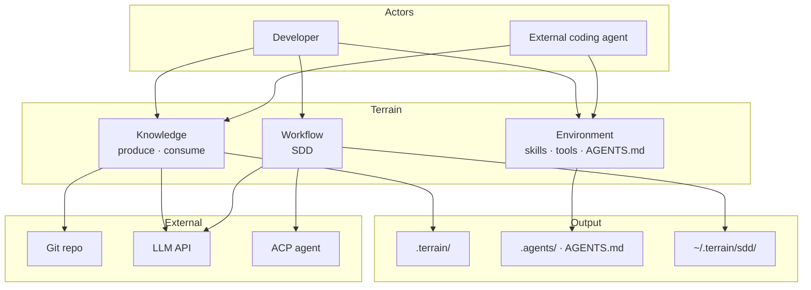
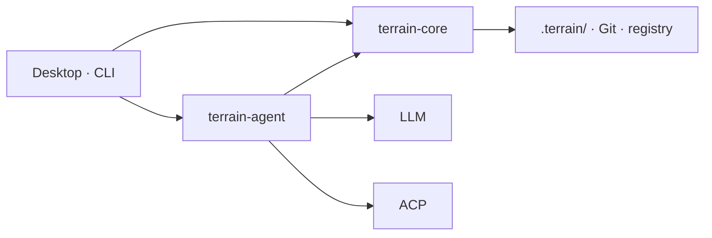

<div align="center">
    

# Terrain

**Terrain prepares the ground so agents don't have to guess where to stand.**

Engineering environment management for human developers and AI coding assistants — knowledge as the map, tools as the roads, conventions as the trail markers.

[](LICENSE)

</div>

---

## What is Terrain?

Terrain is an **engineering environment management platform** built for the age of AI-assisted development. Point it at a Git repository and it will:

- **Scan** the codebase and index project structure
- **Generate** human-readable C4 architecture documentation (Litho)
- **Maintain** AI-friendly structured knowledge assets under `.terrain/`
- **Answer** architecture questions via DeepWiki (RAG over your knowledge base)
- **Run** standardized development workflows (SDD: requirements → design → codegen → review)
- **Integrate** Skills, tools, and `AGENTS.md` guidance for external coding agents

Knowledge lives **in the repository** — not in a central database. Every branch carries its own docs. Human developers use the **Tauri desktop app** or **CLI**; external AI coding assistants (OpenCode, Cursor, etc.) call `terrain tools` over ACP to read the same knowledge layers.

### Dual-track knowledge

| Audience | Path | Format |
|----------|------|--------|
| **Humans** | `.terrain/human/` | Narrative C4 docs with Mermaid diagrams |
| **AI agents** | `.terrain/agent/context.md` | Structured architecture overview (≤ 14 KiB) |
| **Source index** | `.terrain/agent/repomix.md` | Repomix pack — grep/read on demand, not preloaded |
| **Domain terms** | `.terrain/knowledge/` | Business glossary and internal conventions |

### Knowledge factory


---

## Why Terrain?

Onboarding to a new codebase usually means days of reading source and stale wiki pages. Terrain compresses that to minutes: register a repo, run initialization, and get a full C4 doc set plus an agent-ready context pack.

| Without Terrain | With Terrain |
|------------------|---------------|
| Architecture knowledge scattered across wikis, Slack, and senior engineers | C4 docs and agent context generated from the actual codebase |
| AI assistants grep the live repo blindly | Agents read `context.md` first, then targeted repomix slices |
| Docs drift from code on every refactor | Freshness tracking flags stale assets; knowledge travels with Git branches |
| Every team reinvents "how to onboard an AI to our repo" | Env integration installs Skills, CodeGraph, RTK, and `AGENTS.md` snippets |

**Built for:**

- **Developers** exploring or documenting a codebase
- **Tech leads** who want architecture docs that stay close to the code
- **Teams** adopting AI coding assistants and need a shared knowledge contract
- **CI/CD** pipelines that regenerate knowledge assets on merge
- **ACP integrators** wiring `terrain tools` into OpenCode or compatible agents

---

## Features & Capabilities

### Litho — C4 architecture documentation

Automated four-phase pipeline (research → composition) produces six standard human docs:

1. Overview
2. Architecture
3. Workflows
4. Deep module exploration
5. Boundary interfaces
6. Database overview

Intermediate research artifacts persist under `.terrain/.litho-agent/` so generation can resume after interruption.

### DeepWiki — knowledge-grounded Q&A

Ask natural-language questions against your project's knowledge base. The Chat engine preloads macro context from `agent/context.md`, fetches meso sections on demand, and uses repomix grep/read for micro-level source detail. Answers include citations and tool-call traces.

### SDD — standardized development workflow

Four sequential phases, each producing a reviewable Markdown artifact:

| Phase | Output | Execution |
|-------|--------|-----------|
| 1. Requirements | `1.requirements.md` | Native LLM |
| 2. Technical design | `2.tech-design.md` | Native LLM |
| 3. Code generation | `3.implementation.md` + repo changes | ACP agent |
| 4. Code review | `4.code-review.md` | Native LLM |

Session outputs live under `~/.terrain/sdd/{project}/sessions/{id}/outputs/` (local, not versioned).

### Env — AI engineering environment integration

Detect and install the toolchain your coding agents need:

- **Skills** — terrain-knowledge, repomix-context, codegraph, rtk
- **Tools** — CodeGraph CLI, RTK token optimizer
- **AGENTS.md** — managed snippets guiding agents to the knowledge layers

Dependency order is respected: `terrain-knowledge` → `repomix` → `codegraph` → `rtk`.

### ACP tools — CLI for external agents

When Terrain runs in ACP mode, external agents call `terrain tools` (JSON stdout) instead of built-in function tools. Same three-layer model: macro (preloaded) → meso (`read-context`) → micro (`grep-pack` / `read-pack-file`).

### Freshness tracking

Git HEAD and dirty-state monitoring score knowledge assets. Agents should down-weight context when `freshness_score < 50`.

---

## Architecture

Terrain is an **agent-first engineering environment platform**. For each Git repository it delivers three coordinated solutions:

| Pillar | Metaphor | What agents get |
|--------|----------|-----------------|
| **Knowledge** | *Map* | Structured assets in `.terrain/` — **produced** from code, **consumed** through layered access |
| **Environment** | *Roads* | Skills, CLIs, and `AGENTS.md` that route agents to the right knowledge and tools |
| **Workflow** | *Trail markers* | SDD — a four-phase convention from requirements through code review |

> **Knowledge as the map, tools as the roads, conventions as the trail markers.**

Humans use the **desktop app** or **CLI**; external coding agents (Cursor, OpenCode, …) use the same contract via **`terrain tools`** (JSON stdout). Assets live **in-repo** (`.terrain/` travels with branches); `~/.terrain/registry.json` holds project pointers only.

### System overview



### ① Knowledge — the map

Dual-track assets from one factory — narrative `human/` for people, structured `agent/` for machines:

```
.terrain/
├── agent/context.md    macro overview
├── agent/repomix.md    grep-friendly source pack
├── human/              Litho C4 docs
├── knowledge/          domain glossary
└── .meta/freshness.json
```

**Produce** (scan/pack are offline; LLM/ACP where noted):

```
Git ──scan──► index.md
    ──pack──► repomix.md
    ──context (LLM)──► context.md
    ──litho (ACP)──► human/ + .litho-agent/ checkpoints
    ──track──► freshness.json
```

**Consume** — DeepWiki and `terrain tools` share the same three layers:

| Layer | Source | API |
|-------|--------|-----|
| Macro | `agent/context.md` | `read-context` |
| Meso | `human/`, `knowledge/` | `search`, `read-doc` |
| Micro | `agent/repomix.md` | `grep-pack` → `read-pack-file` |

When sources conflict: **repomix > CodeGraph > context.md > human/**. Down-weight macro context when `freshness_score < 50`.

### ② Environment — the roads

`terrain env apply` installs the navigation layer so agents don't improvise:

| Component | Purpose |
|-----------|---------|
| **Skills** | Standard playbooks — terrain-knowledge → repomix → codegraph → rtk |
| **Tools** | `~/.terrain/bin/` — CodeGraph, RTK, `terrain` CLI (`terrain tools` for ACP) |
| **AGENTS.md** | Managed snippets — knowledge-first workflow, repomix for code, RTK for shell |

### ③ Workflow — the trail markers

SDD defines a repeatable path; each phase produces a reviewable Markdown artifact:

| Phase | Output | Engine |
|-------|--------|--------|
| Requirements | `1.requirements.md` | Native LLM |
| Tech design | `2.tech-design.md` | Native LLM |
| Codegen | `3.implementation.md` + repo changes | ACP agent |
| Code review | `4.code-review.md` | Native LLM |

Litho uses the same resumable pattern — research checkpoints under `.terrain/.litho-agent/`.

### Runtime



Core handles scan, pack, search, freshness, and env without an LLM. Agent orchestrates DeepWiki, Litho, SDD, and context generation — lightweight tasks via native LLM, heavy tool-using work via ACP subprocess.

### `.terrain/` directory (per project)

```
{your-repo}/.terrain/
├── index.md                 # Project index (from scan)
├── agent/
│   ├── context.md           # Macro architecture context for agents
│   ├── repomix.md           # Source pack (generated, often gitignored)
│   └── meta.json            # Pack metadata
├── human/                   # Litho C4 docs (1.概述.md, 2.架构.md, …)
├── knowledge/               # Domain glossary and conventions
├── .meta/
│   ├── sync.json            # Scan sync state
│   └── freshness.json       # Asset freshness scores
└── .litho-agent/            # Litho research workspace (transient)
```

Project registration (slug ↔ repo path) is stored locally at `~/.terrain/registry.json` — pointers only, not knowledge files.

---

## Ecosystem

Terrain composes with the tools your AI workflow already uses:

| Component | Role |
|-----------|------|
| **OpenCode / ACP agents** | Execute Litho composition, SDD codegen, and tool calls in an isolated process |
| **Repomix** | Packs source into a grep-friendly index for agents |
| **CodeGraph** | Symbol callers/callees/impact queries via `bunx codegraph` |
| **RTK** | Compresses shell output to save tokens (`@terrain-ai/rtk` on npm, or `~/.terrain/bin/rtk`) |
| **Terrain CLI** | Scan, assets, `terrain tools` for ACP (`@terrain-ai/cli` on npm, or `~/.terrain/bin/terrain`) |
| **Preset Skills** | LLM workflow instructions in `preset_skills/` (Litho, SDD, Ask, Context) |
| **DeepWiki MCP** | Optional GitHub repo documentation in the desktop UI |

Trust model for coding agents: when sources conflict, **repomix source > codegraph > context.md > human docs**.

---

## UI Showcase

Screenshots are placeholders — replace with captures from the desktop app when ready.

### Overview

<!-- Capture: Desktop app project list with freshness indicators -->


*Project list, registration status, and freshness scores.*

### Knowledge & Litho

<!-- Capture: Human docs tree with Litho C4 document open -->


*Human-facing C4 architecture docs generated by the Litho pipeline.*

### DeepWiki

<!-- Capture: DeepWiki Ask panel with a question and cited answer -->


*Knowledge-grounded Q&A with citations and tool-call traces.*

### SDD Workflow

<!-- Capture: SDD session panel showing phase outputs -->


*Four-phase standardized development: requirements through code review.*

### Env Integration

<!-- Capture: Env panel with integration status and apply action -->


*Skills, tools, and AGENTS.md integration status for coding agents.*

---

## Getting Started

### Prerequisites

- **Rust** 1.94+ ([rust-toolchain.toml](rust-toolchain.toml) pins the version)
- **Bun** — Node toolchain for frontend and optional tools
- **Git** — repositories must be Git workspaces
- **ACP agent** — OpenCode or compatible agent for Litho composition and SDD codegen
- **LLM access** (optional) — OpenAI-compatible API, Ollama, or LM Studio (configure in the desktop app **Settings** panel)

### Build from source

```bash
# Clone and install frontend dependencies
git clone https://github.com/sopaco/terrain.git
cd terrain
bun install

# Build Rust workspace (CLI + libraries)
cargo build --release

# CLI binary
./target/release/terrain --help

# Desktop app (development)
bun run dev:app
```

## License

MIT — see [LICENSE](LICENSE).
