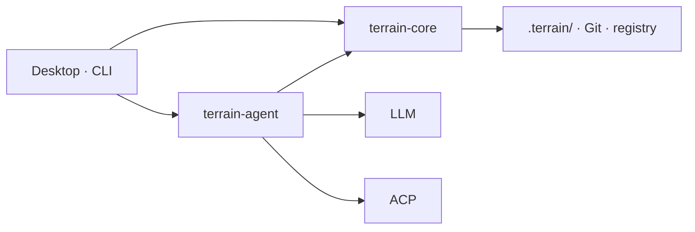

<div align="center">
    

# Terrain

**Terrain prepares the ground so agents don't have to guess where to stand.**

Engineering environment management for human developers and AI coding assistants — knowledge as the map, tools as the roads, conventions as the trail markers.

**English** · [简体中文](README_zh.md)

<a href="https://github.com/sopaco/terrain/tree/dev/.terrain/human"></a>
[](LICENSE)

</div>

---

## App preview

| Project overview | Engineering knowledge | DeepWiki Q&A | Agent environment |
|------------------|------------------------------|--------------|-------------------|
|  |  |  |  |

*From left to right: project list with freshness scores, auto-generated C4 docs, knowledge-grounded Q&A, and one-command agent tooling setup.*

---

## Contents

- [What is Terrain?](#what-is-terrain)
- [Install](#install)
- [Getting started](#getting-started)
- [CLI command reference](#cli-command-reference)
- [Why Terrain?](#why-terrain)
- [Architecture](#architecture)
- [Ecosystem](#ecosystem)
- [From Litho to Terrain](#from-litho-to-terrain)
- [License](#license)

---

## What is Terrain?

Terrain is a **standardized, AI-friendly engineering environment**. Point it at a Git repository and it delivers three things:


- **🗺️ Engineering knowledge** — always-in-sync C4 docs and agent context, **produced from your code and consumed by both humans and AI agents**.
- **🤝 A shared agent contract** — Skills, `AGENTS.md`, and CLIs, so every coding agent reads the project the same way instead of blind-grepping the live repo.
- **⚙️ Auto-deployed tooling** — one command installs what your agents need (CodeGraph, RTK, preset Skills); no per-repo yak-shaving.

It runs as a **desktop app (GUI)** or a **CLI** — see [Getting started](#getting-started) for which to pick.

### Three pillars

| Pillar | Metaphor | What you get |
|--------|----------|--------------|
| **Knowledge assets** | *Map* | Dual-track docs in `.terrain/`, produced from code |
| **Agent tooling** | *Roads* | CodeGraph, RTK, and the Terrain CLI |
| **Conventions & workflow** | *Trail markers* | Skills, `AGENTS.md`, and the four-phase SDD workflow |

One codebase, two audiences:

| Audience | Path | Format |
|----------|------|--------|
| **Humans** | `.terrain/human/` | Narrative C4 docs with Mermaid diagrams |
| **AI agents** | `.terrain/agent/context.md` | Structured architecture overview (≤ 14 KiB) |
| **Source index** | `.terrain/agent/repomix.md` | Repomix pack — grep/read on demand, not preloaded |
| **Domain terms** | `.terrain/knowledge/` | Business glossary and internal conventions |

### Knowledge factory


### Why it stands out

- **Incremental** — tracks Git HEAD and regenerates only what changed, not the whole knowledge base.
- **Freshness-scored** — every asset carries a score; agents down-weight context below 50.
- **One contract for every agent** — Claude Code, Codex, OpenCode, and Cursor read the same layers through `terrain tools`.
- **Toolchain in one command** — `terrain env apply` installs CodeGraph, RTK, and preset Skills in dependency order.
- **Reviewable workflow** — SDD turns requirements → design → codegen → review into Markdown artifacts.

### Performance & integration

- **Native Rust core** — a single binary, no runtime, no database. Scan, pack, search, freshness, and env run fully offline with no LLM call.
- **Cross-platform** — prebuilt desktop installers for macOS (Apple Silicon) and Windows x64, plus `@terrain-ai/cli` on npm for headless machines and CI.
- **Pipeline-friendly** — JSON stdout on every `terrain tools` call and NDJSON event streaming from `terrain ask query --stream`, so Terrain drops into CI jobs, PR checks, and agent loops without glue code.

---

## Install

### Option 1 — Prebuilt installer (recommended)

Download the package for your platform from [**GitHub Releases**](https://github.com/sopaco/terrain/releases) and open it — no Rust or Node toolchain required.

| Platform | Asset |
|----------|-------|
| macOS (Apple Silicon) | `Terrain_<version>_macos_aarch64.dmg` |
| Windows (x64) | `Terrain_<version>_windows_x64.exe` |

### Option 2 — Build from source

Use this path for unsupported platforms, custom patches, or contributing to Terrain itself.

#### Prerequisites

- **Rust** — stable toolchain (MSRV 1.94; see [rust-toolchain.toml](rust-toolchain.toml))
- **Node.js / Bun** — frontend toolchain and optional Node-based tools
- **LLM access** (optional) — OpenAI-compatible API, Ollama, or LM Studio (configure in the desktop app **Settings** panel)
- **Mainstream coding agent** (optional) — e.g. Codex, DeepSeek Harness, or Claude Code, for knowledge composition and SDD codegen

#### Build

```bash
# Clone and install frontend dependencies
git clone https://github.com/sopaco/terrain.git
cd terrain
bun install

# Build Rust workspace (CLI + libraries)
cargo build --release

# CLI binary
./target/release/terrain --help

# Desktop app (development)
bun run dev:app
```

---

## Getting started

### Which entry point should I use?

| | Desktop app (GUI) | CLI |
|---|---|---|
| **Best for** | Day-to-day exploration and documentation of a codebase | R&D infrastructure, CI/CD, headless servers, agent pipelines |
| **What you get** | Everything pre-wired: project list, freshness scores, C4 docs, Q&A, env setup, SDD | 15 scriptable subcommands with JSON output for automation |
| **Requires** | Nothing beyond an optional LLM endpoint | No display; install via npm or let env integration deploy it |
| **Typical use** | Click through the app | `terrain init`, `terrain ask query`, `terrain tools …` inside a pipeline |

### Path A — Desktop app (start here)

The app bundles the full loop, so there is nothing to compose yourself.

1. **Install and open** Terrain (see [Install](#install)).
2. **Add a project** — point Terrain at a local Git repository.
3. **Run initialization** — Terrain scans the repo, generates the six C4 docs, and writes `.terrain/`.
4. **Read or ask** — browse the generated docs in the built-in reader, or ask a question in DeepWiki Q&A and get answers with citations.
5. **Wire up your agents** — one click in the *Agent environment* screen installs Skills, CodeGraph, RTK, and the managed `AGENTS.md` snippets.

> The CLI is included: env integration deploys it to `~/.terrain/bin/terrain`, so you can drop to the terminal at any point without a separate install.

### Path B — CLI (infrastructure, CI, agent pipelines)

For headless machines, install the CLI from npm:

```bash
npm install -g @terrain-ai/cli   # or: bunx @terrain-ai/cli <command>
```

Then drive the same knowledge pipeline from a script or pipeline:

```bash
# 1. Register a repository
terrain assets register ./my-repo --slug my-repo

# 2. Full initialization: scan + C4 docs + agent context
terrain init ./my-repo

# 3. Ask the knowledge base
terrain ask query "How does authentication flow through this project?" --project my-repo

# 4. Cheap refresh after commits (skips doc regeneration)
terrain refresh ./my-repo
```

Typical CI usage — regenerate knowledge on merge, then report freshness in the job log:

```bash
terrain refresh .
terrain project freshness-cached --project my-repo
```

External agents (Claude Code, Codex, OpenCode, Cursor) pull the same knowledge through the JSON API:

```bash
terrain tools list-projects
terrain tools read-context --project my-repo
terrain tools grep-pack --project my-repo --pattern "authenticate"
```

---

## CLI command reference

The commands you will reach for most. Every command accepts a global `--repo-path` override.

### Knowledge assets

| Command | Purpose |
|---------|---------|
| `terrain assets register <path> --slug <slug>` | Register a repository with the local registry |
| `terrain init [path]` | Full initialization — scan + C4 docs + agent context |
| `terrain refresh [path]` | Quick refresh — scan + repack + context, skips doc generation |
| `terrain ask query <query> --project <slug>` | Natural-language Q&A over the knowledge base (`--stream` for NDJSON) |
| `terrain search <query>` | Full-text search across generated knowledge |
| `terrain project overview --project <slug>` | Freshness scores, doc counts, and paths |

### Environment standardization

| Command | Purpose |
|---------|---------|
| `terrain env status` | Check which Skills, tools, and `AGENTS.md` snippets are installed |
| `terrain env plan` | Preview what `apply` would change |
| `terrain env apply` | Install Skills, CodeGraph, RTK, and `AGENTS.md` in dependency order |
| `terrain tools <command> --project <slug>` | JSON API for external agents — `read-context`, `search`, `read-doc`, `grep-pack`, `freshness` |

**Full CLI guide:** [Terrain CLI Guides](.terrain/human/5.Boundaries-Interfaces.md) — all 15 subcommands, including SDD (`sdd run`), token usage (`usage`), and pipeline internals (`assets …`).

---

## Why Terrain?

Onboarding to a new codebase usually means days of reading source and stale wiki pages. Terrain compresses that to minutes: register a repo, run initialization, and get a full C4 doc set plus an agent-ready context pack.

| Without Terrain | With Terrain |
|------------------|---------------|
| Architecture knowledge scattered across wikis, Slack, and senior engineers | Engineering knowledge assets generated from the actual codebase |
| AI assistants grep the live repo blindly | Agents read `context.md` first, then targeted repomix slices |
| Docs drift from code on every refactor | Incremental updates + freshness tracking; knowledge travels with Git branches |
| Every team reinvents "how to onboard an AI to our repo" | Env integration installs Skills, CodeGraph, RTK, and `AGENTS.md` snippets |

**Built for:**

- **Developers** exploring or documenting a codebase
- **Tech leads** who want architecture docs that stay close to the code
- **Teams** adopting AI coding assistants and need a shared knowledge contract
- **CI/CD** pipelines that regenerate knowledge assets on merge
- **ACP integrators** wiring `terrain tools` into Claude Code, Codex, OpenCode, or compatible agents

---

## Architecture

### System overview


Humans use the **desktop app** or **CLI**; external coding agents use the same contract via **`terrain tools`** (JSON stdout). Assets live **in-repo** (`.terrain/` travels with branches); `~/.terrain/registry.json` holds project pointers only.

### ① Knowledge assets — the map

Dual-track output from one factory — narrative `human/` for people, structured `agent/` for machines.

**Produce** (scan/pack run offline; LLM/ACP where noted):

```
Git ──scan──► index.md
    ──pack──► repomix.md
    ──context (LLM)──► context.md
    ──docs (ACP)──► human/ + .litho-agent/ checkpoints
    ──track──► freshness.json
```

**Consume** — DeepWiki and `terrain tools` share the same three layers:

| Layer | Source | API |
|-------|--------|-----|
| Macro | `agent/context.md` | `read-context` |
| Meso | `human/`, `knowledge/` | `search`, `read-doc` |
| Micro | `agent/repomix.md` | `grep-pack` → `read-pack-file` |

When sources conflict: **repomix > CodeGraph > context.md > human/**. Down-weight macro context when `freshness_score < 50`.

### ② Agent tooling — the roads

`terrain env apply` installs the navigation layer so agents don't improvise:

| Component | Purpose |
|-----------|---------|
| **Tools** | `~/.terrain/bin/` — CodeGraph, RTK, `terrain` CLI (`terrain tools` for ACP) |
| **Skills** | Standard playbooks — terrain-knowledge → repomix → codegraph → rtk |
| **AGENTS.md** | Managed snippets — knowledge-first workflow, repomix for code, RTK for shell |

### ③ Conventions & workflow — the trail markers

SDD defines a repeatable path; each phase produces a reviewable Markdown artifact:

| Phase | Output | Engine |
|-------|--------|--------|
| Requirements | `1.requirements.md` | Native LLM |
| Tech design | `2.tech-design.md` | Native LLM |
| Codegen | `3.implementation.md` + repo changes | ACP agent |
| Code review | `4.code-review.md` | Native LLM |

```bash
terrain sdd run --project my-repo --phase requirements
```

Session outputs live under `~/.terrain/sdd/{project}/sessions/{id}/outputs/` (local, not versioned). The knowledge pipeline uses the same resumable pattern — research checkpoints under `.terrain/.litho-agent/`.

### Runtime



Core handles scan, pack, search, freshness, and env without an LLM. Agent orchestrates DeepWiki, knowledge generation, SDD, and context generation — lightweight tasks via native LLM, heavy tool-using work via ACP subprocess.

### `.terrain/` directory (per project)

```
{your-repo}/.terrain/
├── index.md                 # Project index (from scan)
├── agent/
│   ├── context.md           # Macro architecture context for agents
│   ├── repomix.md           # Source pack (generated, often gitignored)
│   └── meta.json            # Pack metadata
├── human/                   # Engineering knowledge docs (1.Overview.md, 2.Architecture.md, …)
├── knowledge/               # Domain glossary and conventions
├── .meta/
│   ├── sync.json            # Scan sync state
│   └── freshness.json       # Asset freshness scores
└── .litho-agent/            # Litho/knowledge research workspace (transient)
```

---

## Ecosystem

Terrain composes with the tools your AI workflow already uses:

| Component | Role |
|-----------|------|
| **Claude Code / Codex / OpenCode / ACP agents** | Execute knowledge composition, SDD codegen, and tool calls in an isolated process |
| **Repomix** | Packs source into a grep-friendly index for agents |
| **CodeGraph** | Symbol callers/callees/impact queries via `bunx codegraph` |
| **RTK** | Compresses shell output to save tokens (`@terrain-ai/rtk` on npm, or `~/.terrain/bin/rtk`) |
| **Terrain CLI** | Scan, assets, `terrain tools` for ACP (`@terrain-ai/cli` on npm, or `~/.terrain/bin/terrain`) |
| **Preset Skills** | LLM workflow instructions in `preset_skills/` (knowledge, SDD, Ask, Context) |
| **DeepWiki / Litho Book** | Knowledge-grounded Q&A and Markdown reader, integrated in the desktop UI |

Trust model for coding agents: when sources conflict, **repomix source > CodeGraph > context.md > human docs**.

---

## From Litho to Terrain

Terrain's knowledge engine is the direct successor of **Litho**, the AI documentation generator published as [deepwiki-rs](https://github.com/sopaco/deepwiki-rs) (**1.7k★**). Litho proved the core thesis at scale — *generate architecture docs from code, keep them in sync, make them agent-ready*. Terrain takes that practice and hardens it into a platform: incremental updates instead of full regeneration, broad language and framework adaptation, ACP access for external agents, and the Litho Book reader and Q&A built into the desktop app.

In short: if you liked Litho for docs, Terrain is Litho's knowledge core **plus** the environment, workflow, and agent bridge around it.

---

## License

MIT — see [LICENSE](LICENSE).
