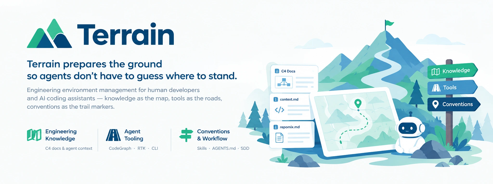
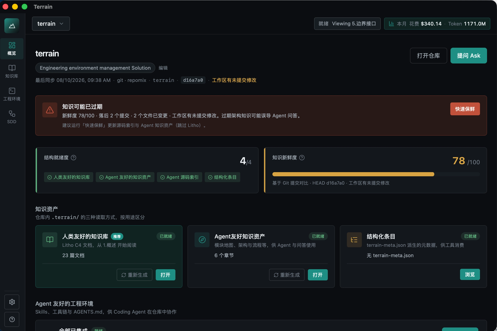
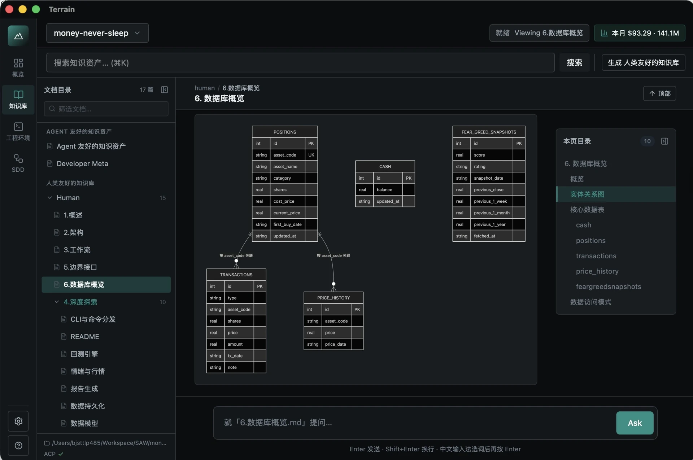
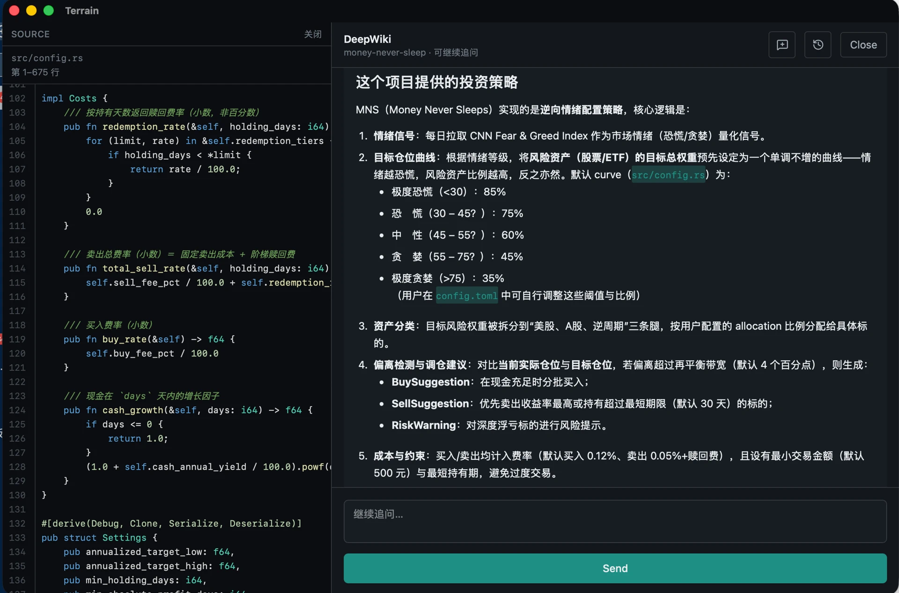
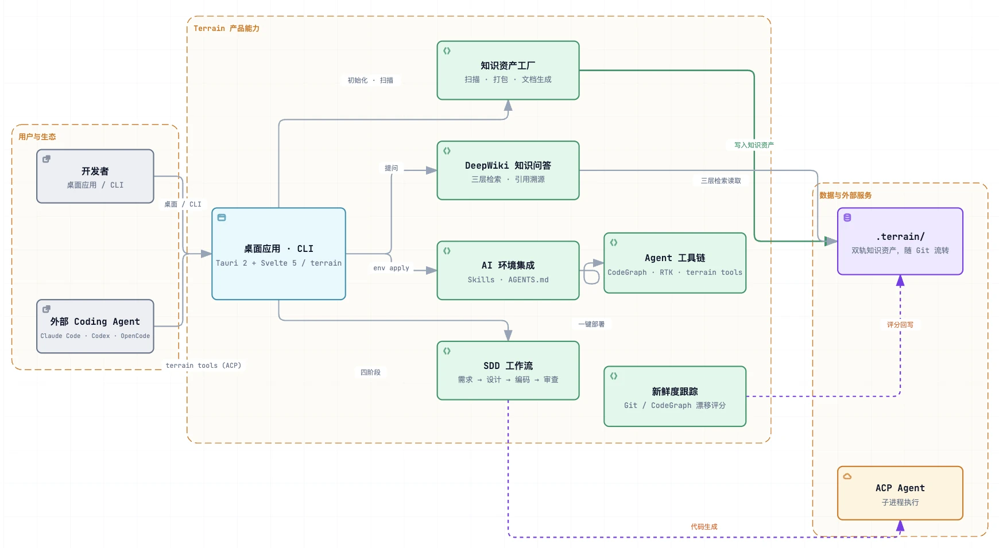
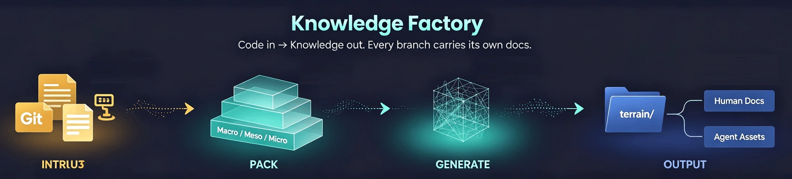
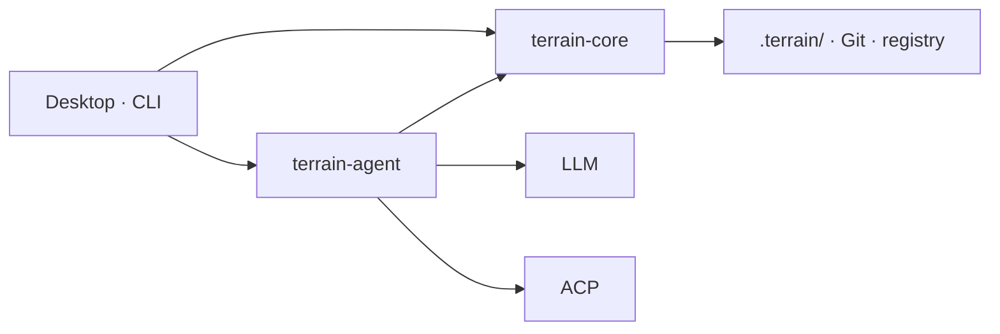

<div align="center">
    

# Terrain

**Terrain 为 Agent 铺好路，让它们不必猜测该站在哪里。**

面向人类开发者与 AI 编码助手的工程环境管理工具——知识充当地图，工具充当道路，约定充当路标。

<a href="https://github.com/sopaco/terrain/tree/dev/.terrain/human"></a>
[](LICENSE)

</div>

---

## 什么是 Terrain？

Terrain 是一个为 AI 辅助开发生态量身定制的**标准化、AI 友好的工程环境**。指向一个 Git 仓库，即可获得三样东西：

- **🗺️ 工程知识**——自动生成、始终同步的 C4 文档和 Agent 上下文，**从代码中产生，供人类和 AI Agent 共同消费**。
- **🤝 面向 AI Agent 的标准化环境**——统一的"知识契约"（Skills、`AGENTS.md`、CLI），让每个编码 Agent 都以一致的视角阅读项目，而不再是盲目地对实时仓库 grep。
- **⚙️ 自动部署的 Agent 增强工具**——一条命令即可安装 Agent 所需的工具链（CodeGraph、RTK、预设 Skills）；无需为每个仓库做繁琐的重复配置。

Terrain 同时提供 **GUI** 和 **CLI** 两种模式。通过 CLI，可便捷地将工程知识生成和 Deepwiki 问答功能集成到 PR 与 CI/CD 流水线。人类开发者使用 **Tauri 桌面应用**或 **CLI**。CLI 的具体用法请见 [**Terrain CLI 指南**](.terrain/human/5.Boundaries-Interfaces.md)。

### 应用预览

| 项目总览 | 工程知识 | DeepWiki 问答 | Agent 环境 |
|----------|----------|------------|-----------|
|  |  |  |  |

*从左到右：带新鲜度评分的项目列表、自动生成的 C4 文档、基于知识的问答、以及一键配置 Agent 工具链。*



### 三大支柱概览

| 支柱 | 比喻 | 你能得到什么 |
|------|------|-------------|
| **工程知识资产** | *地图* | `.terrain/` 下的双轨文档——**从代码中产出**，被人类和 Agent **消费** |
| **标准化 AI 环境** | *道路* | Skills、CLI 和 `AGENTS.md`，将 Agent 引导至正确的知识与工具 |
| **Agent 增强工具** | *装备* | 一键部署 CodeGraph、RTK 和预设 Skills |

### 双轨知识

| 受众 | 路径 | 格式 |
|------|------|------|
| **人类** | `.terrain/human/` | 带 Mermaid 图表的叙述性 C4 文档 |
| **AI Agent** | `.terrain/agent/context.md` | 结构化架构概览（≤ 14 KiB） |
| **源码索引** | `.terrain/agent/repomix.md` | Repomix 代码包——按需 grep/读取，预加载 |
| **业务术语** | `.terrain/knowledge/` | 业务术语表和内部约定 |

### 知识工厂流程



---

## 为什么要用 Terrain？

 onboarding 一个全新代码库通常意味着数天的源码阅读和过时的 Wiki 页面浏览。Terrain 将这一过程压缩到分钟级：注册仓库，运行初始化，即可获得完整的 C4 文档集和 Agent 就绪的上下文包。

| 没有 Terrain | 使用 Terrain |
|--------------|--------------|
| 架构知识分散在 Wiki、Slack 和资深工程师的脑中 | 从实际代码库自动生成的工程知识资产 |
| AI 助手盲目 grep 实时仓库 | Agent 先读 `context.md`，再有针对性地查看 repomix 切片 |
| 每次重构文档都与代码脱节 | 增量更新 + 新鲜度追踪；知识随 Git 分支一起流转 |
| 每个团队都在重新发明"如何让 AI 上手我们的仓库" | 环境集成一键安装 Skills、CodeGraph、RTK 和 `AGENTS.md` 片段 |

**适用对象：**

- **开发者**——探索或文档化一个代码库
- **技术负责人**——希望架构文档始终贴近代码
- **团队**——采用 AI 编码助手，需要一个共享的知识契约
- **CI/CD** 流水线——在合入时自动重新生成知识资产
- **ACP 集成者**——将 `terrain tools` 接入 Claude Code、Codex、OpenCode 或其他兼容 Agent

---

## 从 Litho（deepwiki-rs）到 Terrain

Terrain 的知识引擎是 **Litho** 的直接后继者，Litho 作为 [deepwiki-rs](https://github.com/sopaco/deepwiki-rs) 发布（**1.7k★**）。Litho 大规模验证了核心论点——*从代码生成架构文档，保持同步，使其 Agent 就绪*。Terrain 将这些成功的实践固化为平台：

- **增量知识库更新。** 不再全量重新生成，Terrain 追踪 Git HEAD 和工作区状态，只更新变更的部分，使知识库在每次提交时保持最新，无需承担全量代价（新鲜度评分 + 可恢复流水线）。
- **广泛的语言与框架适配。** 生成核心语言无关，针对 Rust、TypeScript/JavaScript、Python、Go、Java、C# 等语言做了调优，支持框架感知的结构提取。
- **面向 Agent 的 ACP 模式。** Terrain 支持 Agent 客户端协议，Claude Code、Codex、OpenCode 和 Cursor 可通过 `terrain tools` 拉取项目知识，无需猜测。
- **内置 Litho Book。** 原 Litho Book Markdown 阅读器及其知识问答功能现已集成到 Terrain 桌面应用中——一站式浏览与提问。

一句话：如果你喜欢 Litho 的文档能力，Terrain 就是 Litho 的知识核心，**加上**环境、工作流和 Agent 桥接层。

---

## 功能与能力

### 1. 工程知识资产——生成与消费

Terrain 将一个代码库转换为人类和 Agent 都能使用的双轨知识库。承袭自 Litho（deepwiki-rs，1.7k★），保留了经过验证的文档生成核心，并增加了增量、多语言、与 Agent 联动的交付能力。

- **生成**——四阶段流水线产出六份标准人类文档（概述、架构、工作流、深度模块探索、边界接口、数据库概览），以及结构化的 `agent/context.md` 和便于 grep 的 `repomix.md` 源码包。
- **消费**——DeepWiki 基于知识库回答自然语言问题，提供引用和工具调用追踪；外部 Agent 同样通过 `terrain tools` 消费这三层知识。
- **保持新鲜**——代码变更时增量重新生成，新鲜度评分可标记过时资产。
- **一站式阅读与提问**——集成 Litho Book 阅读器和问答（原独立工具）现内置于桌面应用中。

> 同样的 Litho 成功故事，如今已具备增量更新、多语言支持和与 Agent 深度联动的能力。

### 2. 标准化、AI 友好的工程环境

统一的"知识契约"，让每个编码 Agent 都以相同的方式阅读你的仓库：

- **`AGENTS.md`**——受管理的模板片段，引导 Agent 优先查看知识层。
- **预设 Skills**——标准 playbook（terrain-knowledge → repomix → codegraph → rtk），Agent 可加载使用。
- **约定作为路标**——跨仓库保持一致的工作流和访问模式。

### 3. 自动部署的 Agent 增强工具

一条命令即可串联 Agent 所需的工具链——无需针对每个仓库做繁琐配置：

- **CodeGraph**——通过 `bunx codegraph` 进行符号调用方/被调用方/影响分析查询。
- **RTK**——压缩 Shell 输出的 Token 优化器，为 Agent 节省 Token。
- **Terrain CLI / `terrain tools`**——扫描、资产管理和 ACP 访问。
- `terrain env apply` 按正确的依赖顺序安装 Skills、CLI 和 `AGENTS.md`（terrain-knowledge → repomix → codegraph → rtk）。

### 4. SDD——标准化开发工作流

四个顺序阶段，每个阶段产出可复核的 Markdown 产物：

| 阶段 | 产出 | 执行方式 |
|------|------|----------|
| 1. 需求 | `1.requirements.md` | 原生 LLM |
| 2. 技术设计 | `2.tech-design.md` | 原生 LLM |
| 3. 代码生成 | `3.implementation.md` + 仓库变更 | ACP Agent |
| 4. 代码复审 | `4.code-review.md` | 原生 LLM |

Session 输出存放于 `~/.terrain/sdd/{project}/sessions/{id}/outputs/`（本地，不纳入版本控制）。

### 5. 新鲜度追踪

Git HEAD 和工作区脏状态监控为知识资产评分。当 `freshness_score < 50` 时，Agent 应降低上下文的可信权重。

---

## 架构

Terrain 是一个**面向 Agent 的工程环境平台**。它为每个 Git 仓库提供三种协同解决方案：

| 支柱 | 比喻 | Agent 得到什么 |
|------|------|--------------|
| **工程知识资产** | *地图* | `.terrain/` 中的结构化资产——**从代码中产出**，通过分层访问**消费** |
| **标准化 AI 环境** | *道路* | Skills、CLI 和 `AGENTS.md`，将 Agent 引导至正确的知识与工具 |
| **开发工作流（SDD）** | *路标* | 从需求到代码复审的四阶段约定 |

> **知识做地图，工具做道路，约定做路标。**

人类使用 **桌面应用**或 **CLI**；外部编码 Agent（Claude Code、Codex、OpenCode，…）通过 **`terrain tools`**（JSON stdout）遵循同一份契约。资产**内嵌于仓库**（`.terrain/` 随分支流转）；`~/.terrain/registry.json` 仅保存项目指针。

### 系统概览


### ① 工程知识资产——地图

一个工厂产出双轨资产——叙述性的 `human/` 供人阅读，结构化的 `agent/` 供机器使用：

```
.terrain/
├── agent/context.md    宏观架构概览
├── agent/repomix.md    便于 grep 的源码包
├── human/              工程知识文档（来自 Litho）
├── knowledge/          业务术语表
└── .meta/freshness.json
```

**产出**（scan/pack 为离线；标注 LLM/ACP 处需要相应服务）：

```
Git ──scan──► index.md
    ──pack──► repomix.md
    ──context (LLM)──► context.md
    ──docs (ACP)──► human/ + .litho-agent/ 检查点
    ──track──► freshness.json
```

**消费**——DeepWiki 与 `terrain tools` 共享相同的三层结构：

| 层级 | 来源 | API |
|------|------|-----|
| 宏观 | `agent/context.md` | `read-context` |
| 中观 | `human/`、`knowledge/` | `search`、`read-doc` |
| 微观 | `agent/repomix.md` | `grep-pack` → `read-pack-file` |

来源冲突时的优先级：**repomix > CodeGraph > context.md > human/**。当 `freshness_score < 50` 时，降低宏观上下文的权重。

### ② 标准化 AI 环境——道路

`terrain env apply` 安装导航层，让 Agent 无需自行摸索：

| 组件 | 用途 |
|------|------|
| **Skills** | 标准 playbook——terrain-knowledge → repomix → codegraph → rtk |
| **Tools** | `~/.terrain/bin/`——CodeGraph、RTK、Terrain CLI（`terrain tools` 用于 ACP） |
| **AGENTS.md** | 受管理的模板片段——知识优先的工作流、代码使用 repomix、Shell 使用 RTK |

### ③ 开发工作流——路标

SDD 定义了一条可重复的路径；每个阶段产出可复核的 Markdown 产物：

| 阶段 | 产出 | 引擎 |
|------|------|------|
| 需求 | `1.requirements.md` | 原生 LLM |
| 技术设计 | `2.tech-design.md` | 原生 LLM |
| 代码生成 | `3.implementation.md` + 仓库变更 | ACP Agent |
| 代码复审 | `4.code-review.md` | 原生 LLM |

知识流水线使用相同的可恢复模式——`.terrain/.litho-agent/` 下的研究检查点。

### 运行时



Core 负责 scan、pack、search、freshness 和 env，无需 LLM。Agent 负责编排 DeepWiki、知识生成、SDD 和上下文生成——轻量任务通过原生 LLM，重度工具使用工作通过 ACP 子进程。

### `.terrain/` 目录（每个项目）

```
{your-repo}/.terrain/
├── index.md                 # 项目索引（来自 scan）
├── agent/
│   ├── context.md           # 面向 Agent 的宏观架构上下文
│   ├── repomix.md           # 源码包（生成，通常 gitignore）
│   └── meta.json            # 包元数据
├── human/                   # 工程知识文档（1.概述.md、2.架构.md，…）
├── knowledge/               # 业务术语表和约定
├── .meta/
│   ├── sync.json            # Scan 同步状态
│   └── freshness.json       # 资产新鲜度评分
└── .litho-agent/            # Litho/知识研究工作区（临时）
```

项目注册信息（slug ↔ 仓库路径）存储在 `~/.terrain/registry.json`——仅保存指针，不包含知识文件。

---

## 生态系统

Terrain 与你 AI 工作流中已有的工具协同工作：

| 组件 | 角色 |
|------|------|
| **Claude Code / Codex / OpenCode / ACP Agent** | 在隔离进程中执行知识组合、SDD 代码生成和工具调用 |
| **Repomix** | 将源码打包为便于 Agent 检索的索引 |
| **CodeGraph** | 通过 `bunx codegraph` 进行符号调用方/被调用方/影响分析查询 |
| **RTK** | 压缩 Shell 输出以节省 Token（npm 上的 `@terrain-ai/rtk`，或 `~/.terrain/bin/rtk`） |
| **Terrain CLI** | 扫描、资产管理、`terrain tools` 用于 ACP（npm 上的 `@terrain-ai/cli`，或 `~/.terrain/bin/terrain`） |
| **预设 Skills** | `preset_skills/` 中的 LLM 工作流指令（知识、SDD、Ask、Context） |
| **DeepWiki / Litho Book** | 基于知识的问答和 Markdown 阅读器，集成在桌面 UI 中 |

编码 Agent 的信任模型：来源冲突时，**repomix 源码 > CodeGraph > context.md > human 文档**。

---

## 快速开始

### 使用预编译安装包（推荐）

推荐从 [**GitHub Release**](https://github.com/sopaco/terrain/releases) 下载预编译的软件包，解压即可使用。

### 从源码构建（可选 & 自托管）

#### 前置要求

- **Rust** 1.94+（版本锁定于 [rust-toolchain.toml](rust-toolchain.toml)）
- **Node.js / Bun**——前端及可选工具的 Node 工具链
- **LLM 访问**（可选）——OpenAI 兼容 API、Ollama 或 LM Studio（在桌面应用 **设置** 面板中配置）
- **主流编码 Agent**——如 Codex、DeepSeek Harness 或 Claude Code，用于知识组合和 SDD 代码生成

### 构建

```bash
# 克隆仓库并安装前端依赖
git clone https://github.com/sopaco/terrain.git
cd terrain
bun install

# 编译 Rust 工作区（CLI + 库）
cargo build --release

# CLI 二进制
./target/release/terrain --help

# 桌面应用（开发模式）
bun run dev:app
```

## 许可证

MIT——见 [LICENSE](LICENSE)。
