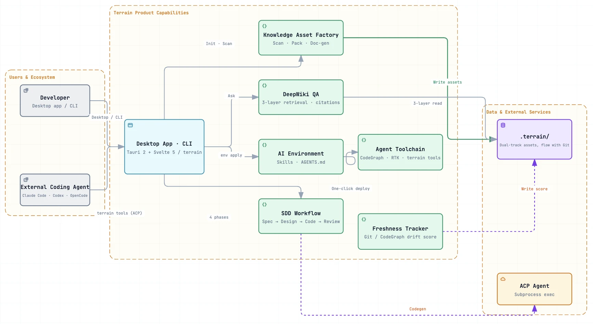
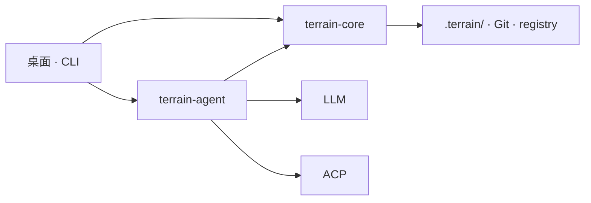

<div align="center">
    

# Terrain

**Terrain 为你的Agent铺好路，让它不再摸黑前行。**

专为人类开发者和 AI 编程助手打造的工程环境管理工具——用知识绘制地图，用工具铺设道路，用约定树立路标。

[](LICENSE)

</div>

---

## 什么是 Terrain？

Terrain 是一款**标准化、对 AI 友好的工程环境**，面向 AI 辅助开发时代。只需指向一个 Git 仓库，它就能交付三件事：

- **🗺️ 工程知识资产** —— 自动生成、与代码实时同步的 C4 文档与 Agent 上下文，**从你的代码提炼，供人类与 AI Agent 共同消费**。
- **🤝 面向 AI Agent 的标准化环境** —— 一份共享的"知识契约"（Skills、`AGENTS.md`、CLI），让每个编程 Agent 都用同一种方式读懂项目，而不是对着仓库盲目 grep。
- **⚙️ 自动部署的 Agent 增强工具** —— 一条命令装好 Agent 所需的工具链（CodeGraph、RTK、预设 Skills），无需逐仓库手工配置。

知识就存放在**仓库里**，而不是某个远程数据库。每个分支都自带一份文档。人类开发者通过 **Tauri 桌面应用**或 **CLI** 使用；外部 AI 编程助手（Claude Code、Codex、OpenCode、Cursor 等）则通过 ACP 调用 `terrain tools`，读取同一套知识体系。

### 应用预览

| 项目总览 | 工程知识资产 | DeepWiki 问答 | Agent 环境 |
|----------|--------------|---------------|------------|
|  |  |  |  |

*从左到右：带新鲜度评分的项目列表、自动生成的 C4 文档、基于知识的智能问答、一键部署的 Agent 工具链。*



### 三支柱速览

| 支柱 | 隐喻 | 你能得到什么 |
|------|------|--------------|
| **工程知识资产** | *地图* | `.terrain/` 中的双轨文档——从代码**提炼**，供人类与 Agent **消费** |
| **标准化 AI 环境** | *道路* | Skills、CLI 和 `AGENTS.md`，引导 Agent 找到正确的知识与工具 |
| **Agent 增强工具** | *齿轮* | 一条命令部署 CodeGraph、RTK 与预设 Skills |

### 双轨知识体系

| 受众 | 路径 | 格式 |
|------|------|------|
| **人类** | `.terrain/human/` | 附带 Mermaid 图表的叙述式 C4 文档 |
| **AI Agent** | `.terrain/agent/context.md` | 结构化架构概览（≤ 14 KiB） |
| **源码索引** | `.terrain/agent/repomix.md` | Repomix 源码包——按需 grep/read，不做预加载 |
| **领域术语** | `.terrain/knowledge/` | 业务词汇表与团队内部约定 |

### 知识工厂


---

## 为什么选择 Terrain？

接手一个新项目，通常要花好几天翻源码、看过期 Wiki。Terrain 把这件事压缩到几分钟：注册仓库、跑一下初始化，就能拿到完整的 C4 文档和给 Agent 准备好的上下文包。

| 没有 Terrain | 有了 Terrain |
|--------------|--------------|
| 架构知识散落在 Wiki、Slack 和老员工的脑子里 | 工程知识资产直接从代码生成 |
| AI 助手只能对着仓库盲目 grep | Agent 先读 `context.md`，再按需查看 repomix 源码切片 |
| 每次重构后文档就和代码对不上了 | 增量更新 + 新鲜度追踪；知识跟着 Git 分支走 |
| 每个团队都在重复造"怎么让 AI 上手我们的仓库"这个轮子 | 一键集成 Skills、CodeGraph、RTK 和 `AGENTS.md` 配置 |

**适合谁用：**

- **开发者**——快速探索或梳理代码库
- **技术负责人**——让架构文档始终紧跟代码演进
- **团队**——引入 AI 编程助手后，需要一份共享的知识契约
- **CI/CD 流水线**——在代码合并时自动刷新知识资产
- **ACP 集成方**——把 `terrain tools` 接入 Claude Code、Codex、OpenCode 或兼容 Agent

---

## 从 Litho (deepwiki-rs) 到 Terrain

Terrain 的知识引擎是 **Litho** 的直接继承者——Litho 即以 [deepwiki-rs](https://github.com/sopaco/deepwiki-rs)（**1.7k★**）发布的 AI 文档生成器。Litho 已在大规模实践中验证了核心命题：*从代码生成架构文档、与代码保持同步、并让 Agent 开箱即用*。Terrain 把这套成熟实践进一步打磨成平台：

- **知识库增量更新。** 不再全量重生成，而是追踪 Git HEAD 与工作区状态，只更新变化的部分，让知识库在每次提交后保持新鲜，而无需付出全量成本（新鲜度评分 + 可恢复流水线）。
- **更广的语言与框架适配。** 生成内核语言无关，并对 Rust、TypeScript/JavaScript、Python、Go、Java、C# 等做了调优，支持框架感知的结构提取。
- **面向 Agent 的 ACP 模式。** Terrain 支持 Agent Client Protocol，Claude Code、Codex、OpenCode、Cursor 都能通过 `terrain tools` 拉取项目知识，而不是瞎猜。
- **内置 Litho Book。** 原 Litho Book 的 Markdown 阅读器与基于知识的问答，现已整合进 Terrain 桌面应用——阅读与提问一处搞定。

简而言之：如果你喜欢 Litho 的文档能力，Terrain 就是 Litho 的知识内核 **加上** 环绕它的环境、工作流与 Agent 桥接。

---

## 功能与能力

### 1. 工程知识资产 —— 生成与消费

Terrain 把代码库变成一份人类与 Agent 共用的双轨知识库。它源自 Litho（deepwiki-rs，1.7k★），保留了经过验证的文档生成内核，并增加了增量、多语言、对接 Agent 的投递能力。

- **生成** —— 四阶段流水线产出六份标准人类文档（项目概述、系统架构、核心工作流、模块深入解析、边界与接口、数据库概览），外加结构化的 `agent/context.md` 与便于 grep 的 `repomix.md` 源码包。
- **消费** —— DeepWiki 基于知识库用自然语言问答，每条回答都附带引用来源与工具调用链路；外部 Agent 通过 `terrain tools` 消费同一套三层知识。
- **保持新鲜** —— 代码变更时增量再生，并用新鲜度评分标记过期资产。
- **阅读与提问一处搞定** —— 原独立的 Litho Book 阅读器与问答，现已整合进桌面应用。

> 同样的 Litho 成功实践，如今增量更新、多语言、并接入你的 Agent。

### 2. 标准化、对 AI 友好的工程环境

一份共享的"知识契约"，让每个编程 Agent 都用同一种方式读懂你的仓库：

- **`AGENTS.md`** —— 托管配置片段，引导 Agent 优先走知识层。
- **预设 Skills** —— 标准操作手册（terrain-knowledge → repomix → codegraph → rtk），Agent 可直接加载。
- **约定即路标** —— 跨仓库一致的工作流与访问模式。

### 3. 自动部署的 Agent 增强工具

一条命令装好 Agent 所需的工具链——无需逐仓库配置：

- **CodeGraph** —— 通过 `bunx codegraph` 查询符号的调用关系与影响范围。
- **RTK** —— 压缩 shell 输出、为 Agent 节省 Token。
- **Terrain CLI / `terrain tools`** —— 负责 scan、资产管理与 ACP 访问。
- `terrain env apply` 按正确依赖顺序（terrain-knowledge → repomix → codegraph → rtk）安装 Skills、CLI 与 `AGENTS.md`。

### 4. SDD —— 标准化开发工作流

四个阶段依次推进，每步都产出可评审的 Markdown 文档：

| 阶段 | 产物 | 执行方式 |
|------|------|----------|
| 1. 需求分析 | `1.requirements.md` | 原生 LLM |
| 2. 技术设计 | `2.tech-design.md` | 原生 LLM |
| 3. 代码生成 | `3.implementation.md` + 仓库变更 | ACP Agent |
| 4. 代码评审 | `4.code-review.md` | 原生 LLM |

会话产物保存在 `~/.terrain/sdd/{project}/sessions/{id}/outputs/`（仅存本地，不纳入版本控制）。

### 5. 新鲜度追踪

基于 Git HEAD 和工作区脏状态，自动为知识资产打分。当 `freshness_score < 50` 时，Agent 应当降低对这些上下文的信任权重。

---

## 架构

Terrain 是一个 **Agent 优先的工程环境平台**。它为每个 Git 仓库提供三大核心能力：

| 支柱 | 隐喻 | Agent 获得什么 |
|------|------|----------------|
| **工程知识资产** | *地图* | `.terrain/` 中的结构化资产——从代码**提炼**，通过分层访问**消费** |
| **标准化 AI 环境** | *道路* | Skills、CLI 和 `AGENTS.md`，引导 Agent 找到正确的知识与工具 |
| **开发工作流（SDD）** | *路标* | 从需求到代码评审的四阶段标准流程 |

> **知识即地图，工具即道路，约定即路标。**

人类通过**桌面应用**或 **CLI** 使用；外部编程 Agent（Claude Code、Codex、OpenCode 等）则通过 **`terrain tools`**（JSON 标准输出）接入同一套体系。知识资产存放在**仓库内部**（`.terrain/` 随分支流转）；`~/.terrain/registry.json` 只记录项目指针，不存放知识内容。

### 系统概览


### ① 工程知识资产 —— 地图

同一座工厂产出两条线的资产——叙述式 `human/` 给人看，结构化 `agent/` 给机器读：

```
.terrain/
├── agent/context.md    宏观架构概览
├── agent/repomix.md    便于 grep 的源码包
├── human/              工程知识文档（源自 Litho）
├── knowledge/          领域词汇表
└── .meta/freshness.json
```

**提炼**（scan/pack 完全离线；LLM/ACP 环节已标注）：

```
Git ──scan──► index.md
    ──pack──► repomix.md
    ──context (LLM)──► context.md
    ──docs (ACP)──► human/ + .litho-agent/ 检查点
    ──track──► freshness.json
```

**消费** —— DeepWiki 和 `terrain tools` 共享同一套三层访问模型：

| 层级 | 来源 | API |
|------|------|-----|
| 宏观 | `agent/context.md` | `read-context` |
| 中观 | `human/`、`knowledge/` | `search`、`read-doc` |
| 微观 | `agent/repomix.md` | `grep-pack` → `read-pack-file` |

来源冲突时的优先级：**repomix 源码 > CodeGraph > context.md > human/**。当 `freshness_score < 50` 时应降低宏观上下文的权重。

### ② 标准化 AI 环境 —— 道路

一条 `terrain env apply` 命令，装好 Agent 需要的导航设施，让它们不再各走各的路：

| 组件 | 用途 |
|------|------|
| **Skills** | 标准操作手册——terrain-knowledge → repomix → codegraph → rtk |
| **Tools** | `~/.terrain/bin/` — CodeGraph、RTK、`terrain` CLI（ACP 场景用 `terrain tools`） |
| **AGENTS.md** | 托管配置片段——知识优先的工作流、用 repomix 查代码、用 RTK 处理 shell 输出 |

### ③ 开发工作流 —— 路标

SDD 定义了一条可复用的开发路径，每个阶段都有对应的可评审产出：

| 阶段 | 产物 | 引擎 |
|------|------|------|
| 需求分析 | `1.requirements.md` | 原生 LLM |
| 技术设计 | `2.tech-design.md` | 原生 LLM |
| 代码生成 | `3.implementation.md` + 仓库变更 | ACP Agent |
| 代码评审 | `4.code-review.md` | 原生 LLM |

知识流水线同样采用可恢复设计——调研检查点保存在 `.terrain/.litho-agent/` 下。

### 运行时



Core 负责 scan、pack、search、freshness 和 env，全程不依赖 LLM。Agent 模块编排 DeepWiki、知识生成、SDD 和上下文生成——轻量任务走原生 LLM，重度工具调用走 ACP 子进程。

### `.terrain/` 目录结构（每个项目）

```
{your-repo}/.terrain/
├── index.md                 # 项目索引（scan 生成）
├── agent/
│   ├── context.md           # 面向 Agent 的宏观架构上下文
│   ├── repomix.md           # 源码包（自动生成，通常加入 gitignore）
│   └── meta.json            # 包元数据
├── human/                   # 工程知识文档（1.概述.md, 2.架构.md, …）
├── knowledge/               # 领域词汇表与团队约定
├── .meta/
│   ├── sync.json            # Scan 同步状态
│   └── freshness.json       # 资产新鲜度评分
└── .litho-agent/            # Litho/知识 调研工作区（临时文件）
```

项目注册信息（slug ↔ 仓库路径）保存在本地 `~/.terrain/registry.json`——只有指针，没有知识文件。

---

## 生态

Terrain 能和你已有的 AI 工具链无缝配合：

| 组件 | 角色 |
|------|------|
| **Claude Code / Codex / OpenCode / ACP Agent** | 在隔离进程中执行知识撰写、SDD 代码生成与工具调用 |
| **Repomix** | 把源码打包成便于 grep 的索引，供 Agent 使用 |
| **CodeGraph** | 通过 `bunx codegraph` 查询符号的调用关系和影响范围 |
| **RTK** | 压缩 shell 输出以节省 Token（npm 上的 `@terrain-ai/rtk`，或 `~/.terrain/bin/rtk`） |
| **Terrain CLI** | Scan、资产管理、ACP 场景用 `terrain tools`（npm 上的 `@terrain-ai/cli`，或 `~/.terrain/bin/terrain`） |
| **预设 Skills** | `preset_skills/` 中的 LLM 工作流指令（知识、SDD、Ask、Context） |
| **DeepWiki / Litho Book** | 基于知识的问答与 Markdown 阅读器，整合进桌面 UI |

编程 Agent 的信任模型：来源冲突时，**repomix 源码 > codegraph > context.md > human 文档**。

---

## 快速开始

### 前置条件

- **Rust** 1.94+（版本由 [rust-toolchain.toml](rust-toolchain.toml) 锁定）
- **Bun** —— 前端及可选工具的 Node 工具链
- **LLM 访问**（可选）—— OpenAI 兼容 API、Ollama 或 LM Studio（在桌面应用的**设置**面板中配置）
- **主流编程 Agent** —— 如 Codex、DeepSeek Harness 或 Claude Code，用于知识撰写与 SDD 代码生成

### 从源码构建

```bash
# 克隆仓库并安装前端依赖
git clone https://github.com/sopaco/terrain.git
cd terrain
bun install

# 构建 Rust 工作区（CLI + 库）
cargo build --release

# CLI 可执行文件
./target/release/terrain --help

# 启动桌面应用（开发模式）
bun run dev:app
```

## 许可证

MIT — 详见 [LICENSE](LICENSE)。
