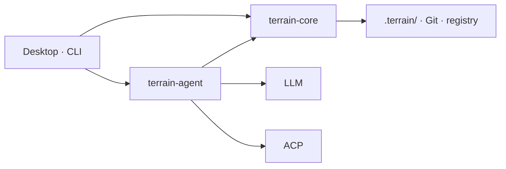

<div align="center">
    

# Terrain

**Terrain 为 Agent 铺好路，让它们不必猜测该站在哪里。**

面向人类开发者与 AI 编码助手的工程环境管理工具——知识充当地图，工具充当道路，约定充当路标。

[English](README.md) · **简体中文**

<a href="https://github.com/sopaco/terrain/tree/dev/.terrain/human"></a>
[](LICENSE)

</div>

---

## 应用预览

| 项目总览 | 工程知识 | DeepWiki 问答 | Agent 环境 |
|----------|----------|------------|-----------|
|  |  |  |  |

*从左到右：带新鲜度评分的项目列表、自动生成的 C4 文档、基于知识的问答、以及一键配置 Agent 工具链。*

---

## 目录

- [什么是 Terrain？](#什么是-terrain)
- [安装](#安装)
- [快速开始](#快速开始)
- [CLI 命令参考](#cli-命令参考)
- [为什么要用 Terrain？](#为什么要用-terrain)
- [架构](#架构)
- [生态系统](#生态系统)
- [从 Litho 到 Terrain](#从-litho-到-terrain)
- [许可证](#许可证)

---

## 什么是 Terrain？

Terrain 是一个**标准化、AI 友好的工程环境**。指向一个 Git 仓库，即可获得三样东西：


- **🗺️ 工程知识**——始终同步的 C4 文档和 Agent 上下文，**从代码中产生，供人类和 AI Agent 共同消费**。
- **🤝 统一的 Agent 契约**——Skills、`AGENTS.md` 和 CLI，让每个编码 Agent 都以一致的视角阅读项目，而不再是盲目地对实时仓库 grep。
- **⚙️ 自动部署的工具链**——一条命令即可安装 Agent 所需的工具（CodeGraph、RTK、预设 Skills）；无需为每个仓库做繁琐的重复配置。

它提供**桌面应用（GUI）**和 **CLI** 两种形态——该选哪个，见[快速开始](#快速开始)。

### 三大支柱

| 支柱 | 比喻 | 你能得到什么 |
|------|------|-------------|
| **知识资产** | *地图* | `.terrain/` 下的双轨文档，从代码中产出 |
| **Agent 工具链** | *道路* | CodeGraph、RTK 和 Terrain CLI |
| **约定与工作流** | *路标* | Skills、`AGENTS.md` 以及四阶段的 SDD 工作流 |

一份代码库，两类受众：

| 受众 | 路径 | 格式 |
|------|------|------|
| **人类** | `.terrain/human/` | 带 Mermaid 图表的叙述性 C4 文档 |
| **AI Agent** | `.terrain/agent/context.md` | 结构化架构概览（≤ 14 KiB） |
| **源码索引** | `.terrain/agent/repomix.md` | Repomix 代码包——按需 grep/读取，**非**预加载 |
| **业务术语** | `.terrain/knowledge/` | 业务术语表和内部约定 |

### 知识工厂流程


### 为何出众

- **增量更新**——追踪 Git HEAD，只重新生成变更的部分，而不是全量重建知识库。
- **新鲜度评分**——每份资产都带有评分；低于 50 时 Agent 会自动降低上下文权重。
- **一份契约适配所有 Agent**——Claude Code、Codex、OpenCode 和 Cursor 都通过 `terrain tools` 读取相同的知识层。
- **一键装好工具链**——`terrain env apply` 按依赖顺序安装 CodeGraph、RTK 和预设 Skills。
- **工作流可复核**——SDD 将需求 → 设计 → 代码生成 → 复审转化为可审阅的 Markdown 产物。

### 性能与集成

- **Rust 原生内核**——单一二进制，无运行时、无数据库。scan、pack、search、freshness 和 env 全部离线执行，不调用 LLM。
- **跨平台**——提供 macOS（Apple Silicon）与 Windows x64 的预编译桌面安装包，并可通过 npm 上的 `@terrain-ai/cli` 覆盖无界面机器与 CI。
- **易于集成流水线**——`terrain tools` 每次调用都输出 JSON，`terrain ask query --stream` 输出 NDJSON 事件流，因此 Terrain 无需胶水代码即可接入 CI 任务、PR 检查和 Agent 循环。

---

## 安装

### 方式一 —— 预编译安装包（推荐）

从 [**GitHub Releases**](https://github.com/sopaco/terrain/releases) 下载对应平台的软件包，打开即可使用——无需 Rust 或 Node 工具链。

| 平台 | 安装包 |
|------|--------|
| macOS（Apple Silicon） | `Terrain_<version>_macos_aarch64.dmg` |
| Windows（x64） | `Terrain_<version>_windows_x64.exe` |

### 方式二 —— 从源码构建

适用于未覆盖的平台、自定义改动，或参与 Terrain 开发。

#### 前置要求

- **Rust**——stable 工具链（MSRV 1.94，见 [rust-toolchain.toml](rust-toolchain.toml)）
- **Node.js / Bun**——前端工具链及可选的 Node 工具
- **LLM 访问**（可选）——OpenAI 兼容 API、Ollama 或 LM Studio（在桌面应用 **设置** 面板中配置）
- **主流编码 Agent**（可选）——如 Codex、DeepSeek Harness 或 Claude Code，用于知识组合与 SDD 代码生成

#### 构建

```bash
# 克隆仓库并安装前端依赖
git clone https://github.com/sopaco/terrain.git
cd terrain
bun install

# 编译 Rust 工作区（CLI + 库）
cargo build --release

# CLI 二进制
./target/release/terrain --help

# 桌面应用（开发模式）
bun run dev:app
```

---

## 快速开始

### 我该用哪个入口？

| | 桌面应用（GUI） | CLI |
|---|---|---|
| **适用场景** | 日常探索与文档化代码库 | 研发基础设施、CI/CD、无界面服务器、Agent 流水线 |
| **你能得到** | 全部预置好：项目列表、新鲜度评分、C4 文档、问答、环境配置、SDD | 可脚本化的子命令，输出 JSON 便于自动化 |
| **依赖** | 除可选的 LLM 端点外无需其他 | 无需显示界面；通过 npm 安装，或由环境集成自动部署 |
| **典型用法** | 在应用中点击操作 | 在流水线中调用 `terrain init`、`terrain ask query`、`terrain tools …` |

### 路径 A —— 桌面应用（从这里开始）

桌面应用内置了完整闭环，无需自行拼装。

1. **安装并打开** Terrain（见[安装](#安装)）。
2. **添加项目**——将 Terrain 指向一个本地 Git 仓库。
3. **执行初始化**——Terrain 会扫描仓库、生成六份 C4 文档，并写入 `.terrain/`。
4. **阅读或提问**——在内置阅读器中浏览生成的文档，或在 DeepWiki 问答中提问并获得带引用的回答。
5. **接入你的 Agent**——在 *Agent 环境* 页面一键安装 Skills、CodeGraph、RTK 以及受管理的 `AGENTS.md` 片段。

> CLI 已包含在内：环境集成会将其部署到 `~/.terrain/bin/terrain`，因此你可以随时切到终端，无需单独安装。

### 路径 B —— CLI（基础设施、CI、Agent 流水线）

对于无界面机器，可从 npm 安装 CLI：

```bash
npm install -g @terrain-ai/cli   # 或：bunx @terrain-ai/cli <命令>
```

然后通过脚本或流水线驱动同一套知识流程：

```bash
# 1. 注册仓库
terrain assets register ./my-repo --slug my-repo

# 2. 完整初始化：扫描 + C4 文档 + Agent 上下文
terrain init ./my-repo

# 3. 向知识库提问
terrain ask query "这个项目的鉴权流程是怎样的？" --project my-repo

# 4. 提交后的低成本刷新（跳过文档重新生成）
terrain refresh ./my-repo
```

典型的 CI 用法——合入时重新生成知识，并在任务日志中输出新鲜度：

```bash
terrain refresh .
terrain project freshness-cached --project my-repo
```

外部 Agent（Claude Code、Codex、OpenCode、Cursor）通过 JSON API 获取同一份知识：

```bash
terrain tools list-projects
terrain tools read-context --project my-repo
terrain tools grep-pack --project my-repo --pattern "authenticate"
```

---

## CLI 命令参考

最常用的命令。所有命令都支持全局 `--repo-path` 覆盖。

### 知识资产

| 命令 | 用途 |
|------|------|
| `terrain assets register <path> --slug <slug>` | 将仓库注册到本地登记表 |
| `terrain init [path]` | 完整初始化——扫描 + C4 文档 + Agent 上下文 |
| `terrain refresh [path]` | 快速刷新——扫描 + 重新打包 + 上下文，跳过文档生成 |
| `terrain ask query <query> --project <slug>` | 基于知识库的自然语言问答（`--stream` 输出 NDJSON） |
| `terrain search <query>` | 在生成的知识中做全文检索 |
| `terrain project overview --project <slug>` | 查看新鲜度评分、文档数量与路径 |

### 环境标准化

| 命令 | 用途 |
|------|------|
| `terrain env status` | 检查已安装的 Skills、工具和 `AGENTS.md` 片段 |
| `terrain env plan` | 预览 `apply` 将会产生的变更 |
| `terrain env apply` | 按依赖顺序安装 Skills、CodeGraph、RTK 和 `AGENTS.md` |
| `terrain tools <command> --project <slug>` | 面向外部 Agent 的 JSON API——`read-context`、`search`、`read-doc`、`grep-pack`、`freshness` |

**完整 CLI 指南：** [Terrain CLI Guides](.terrain/human/5.Boundaries-Interfaces.md) —— 涵盖全部 15 个子命令，包括 SDD（`sdd run`）、Token 用量（`usage`）和流水线内部命令（`assets …`）。

---

## 为什么要用 Terrain？

onboarding 一个全新代码库通常意味着数天的源码阅读和过时的 Wiki 浏览。Terrain 将这一过程压缩到分钟级：注册仓库，运行初始化，即可获得完整的 C4 文档集和 Agent 就绪的上下文包。

| 没有 Terrain | 使用 Terrain |
|--------------|--------------|
| 架构知识分散在 Wiki、Slack 和资深工程师的脑中 | 从实际代码库自动生成的工程知识资产 |
| AI 助手盲目 grep 实时仓库 | Agent 先读 `context.md`，再有针对性地查看 repomix 切片 |
| 每次重构文档都与代码脱节 | 增量更新 + 新鲜度追踪；知识随 Git 分支一起流转 |
| 每个团队都在重新发明「如何让 AI 上手我们的仓库」 | 环境集成一键安装 Skills、CodeGraph、RTK 和 `AGENTS.md` 片段 |

**适用对象：**

- **开发者**——探索或文档化一个代码库
- **技术负责人**——希望架构文档始终贴近代码
- **团队**——采用 AI 编码助手，需要一个共享的知识契约
- **CI/CD** 流水线——在合入时自动重新生成知识资产
- **ACP 集成者**——将 `terrain tools` 接入 Claude Code、Codex、OpenCode 或其他兼容 Agent

---

## 架构

### 系统概览


人类使用**桌面应用**或 **CLI**；外部编码 Agent 通过 **`terrain tools`**（JSON stdout）遵循同一份契约。资产**内嵌于仓库**（`.terrain/` 随分支流转）；`~/.terrain/registry.json` 仅保存项目指针。

### ① 知识资产——地图

一个工厂产出双轨资产——叙述性的 `human/` 供人阅读，结构化的 `agent/` 供机器使用。

**产出**（scan/pack 为离线；标注 LLM/ACP 处需要相应服务）：

```
Git ──scan──► index.md
    ──pack──► repomix.md
    ──context (LLM)──► context.md
    ──docs (ACP)──► human/ + .litho-agent/ 检查点
    ──track──► freshness.json
```

**消费**——DeepWiki 与 `terrain tools` 共享相同的三层结构：

| 层级 | 来源 | API |
|------|------|-----|
| 宏观 | `agent/context.md` | `read-context` |
| 中观 | `human/`、`knowledge/` | `search`、`read-doc` |
| 微观 | `agent/repomix.md` | `grep-pack` → `read-pack-file` |

来源冲突时的优先级：**repomix > CodeGraph > context.md > human/**。当 `freshness_score < 50` 时，降低宏观上下文的权重。

### ② Agent 工具链——道路

`terrain env apply` 安装导航层，让 Agent 无需自行摸索：

| 组件 | 用途 |
|------|------|
| **工具** | `~/.terrain/bin/`——CodeGraph、RTK、`terrain` CLI（`terrain tools` 用于 ACP） |
| **Skills** | 标准 playbook——terrain-knowledge → repomix → codegraph → rtk |
| **AGENTS.md** | 受管理的模板片段——知识优先的工作流、代码使用 repomix、Shell 使用 RTK |

### ③ 约定与工作流——路标

SDD 定义了一条可重复的路径；每个阶段产出可复核的 Markdown 产物：

| 阶段 | 产出 | 引擎 |
|------|------|------|
| 需求 | `1.requirements.md` | 原生 LLM |
| 技术设计 | `2.tech-design.md` | 原生 LLM |
| 代码生成 | `3.implementation.md` + 仓库变更 | ACP Agent |
| 代码复审 | `4.code-review.md` | 原生 LLM |

```bash
terrain sdd run --project my-repo --phase requirements
```

Session 输出存放于 `~/.terrain/sdd/{project}/sessions/{id}/outputs/`（本地，不纳入版本控制）。知识流水线使用相同的可恢复模式——`.terrain/.litho-agent/` 下的研究检查点。

### 运行时



Core 负责 scan、pack、search、freshness 和 env，无需 LLM。Agent 负责编排 DeepWiki、知识生成、SDD 和上下文生成——轻量任务通过原生 LLM，重度工具使用工作通过 ACP 子进程。

### `.terrain/` 目录（每个项目）

```
{your-repo}/.terrain/
├── index.md                 # 项目索引（来自 scan）
├── agent/
│   ├── context.md           # 面向 Agent 的宏观架构上下文
│   ├── repomix.md           # 源码包（生成，通常 gitignore）
│   └── meta.json            # 包元数据
├── human/                   # 工程知识文档（1.Overview.md、2.Architecture.md，…）
├── knowledge/               # 业务术语表和约定
├── .meta/
│   ├── sync.json            # Scan 同步状态
│   └── freshness.json       # 资产新鲜度评分
└── .litho-agent/            # Litho/知识研究工作区（临时）
```

---

## 生态系统

Terrain 与你 AI 工作流中已有的工具协同工作：

| 组件 | 角色 |
|------|------|
| **Claude Code / Codex / OpenCode / ACP Agent** | 在隔离进程中执行知识组合、SDD 代码生成和工具调用 |
| **Repomix** | 将源码打包为便于 Agent 检索的索引 |
| **CodeGraph** | 通过 `bunx codegraph` 进行符号调用方/被调用方/影响分析查询 |
| **RTK** | 压缩 Shell 输出以节省 Token（npm 上的 `@terrain-ai/rtk`，或 `~/.terrain/bin/rtk`） |
| **Terrain CLI** | 扫描、资产管理、`terrain tools` 用于 ACP（npm 上的 `@terrain-ai/cli`，或 `~/.terrain/bin/terrain`） |
| **预设 Skills** | `preset_skills/` 中的 LLM 工作流指令（知识、SDD、Ask、Context） |
| **DeepWiki / Litho Book** | 基于知识的问答和 Markdown 阅读器，集成在桌面 UI 中 |

编码 Agent 的信任模型：来源冲突时，**repomix 源码 > CodeGraph > context.md > human 文档**。

---

## 从 Litho 到 Terrain

Terrain 的知识引擎是 **Litho** 的直接后继者，Litho 作为 [deepwiki-rs](https://github.com/sopaco/deepwiki-rs) 发布（**1.7k★**）。Litho 大规模验证了核心论点——*从代码生成架构文档，保持同步，使其 Agent 就绪*。Terrain 将这些实践固化为平台：增量更新取代全量重新生成、广泛的语言与框架适配、面向外部 Agent 的 ACP 访问，以及内置于桌面应用的 Litho Book 阅读器与问答。

一句话：如果你喜欢 Litho 的文档能力，Terrain 就是 Litho 的知识核心，**加上**环境、工作流和 Agent 桥接层。

---

## 许可证

MIT——见 [LICENSE](LICENSE)。
