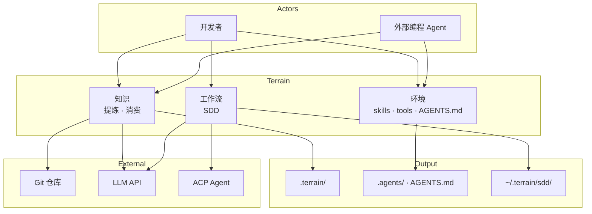
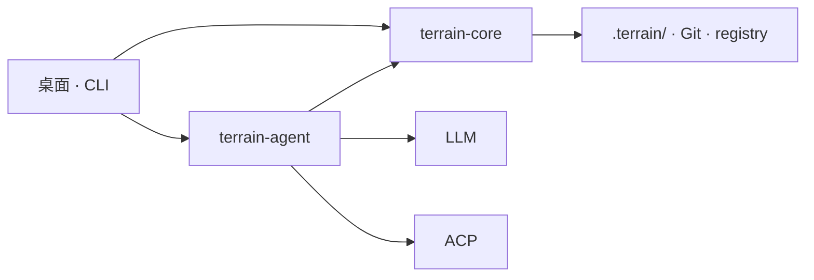

<div align="center">
    

# Terrain

**Terrain 为你的Agent铺好路，让它不再摸黑前行。**

专为人类开发者和 AI 编程助手打造的工程环境管理工具——用知识绘制地图，用工具铺设道路，用约定树立路标。

[](LICENSE)

</div>

---

## 什么是 Terrain？

Terrain 是一款面向 AI 辅助开发时代的**工程环境管理平台**。只需指向一个 Git 仓库，它就能帮你完成以下工作：

- **扫描**代码库，建立项目结构索引
- **生成**人类可读的 C4 架构文档（Litho）
- **维护** `.terrain/` 目录下 AI 友好的结构化知识资产
- **回答**架构问题——通过 DeepWiki 对你的知识库进行 RAG 检索
- **驱动**标准化开发工作流（SDD：需求 → 设计 → 代码生成 → 评审）
- **集成** Skills、工具以及面向外部编程 Agent 的 `AGENTS.md` 指引

知识就存放在**仓库里**，而不是某个远程数据库。每个分支都自带一份文档。人类开发者通过 **Tauri 桌面应用**或 **CLI** 使用；外部 AI 编程助手（OpenCode、Cursor 等）则通过 ACP 调用 `terrain tools`，读取同一套知识体系。

### 双轨知识体系

| 受众 | 路径 | 格式 |
|------|------|------|
| **人类** | `.terrain/human/` | 附带 Mermaid 图表的叙述式 C4 文档 |
| **AI Agent** | `.terrain/agent/context.md` | 结构化架构概览（≤ 14 KiB） |
| **源码索引** | `.terrain/agent/repomix.md` | Repomix 源码包——按需 grep/read，不做预加载 |
| **领域术语** | `.terrain/knowledge/` | 业务词汇表与团队内部约定 |

### 知识工厂


---

## 为什么选择 Terrain？

接手一个新项目，通常要花好几天翻源码、看过期 Wiki。Terrain 把这件事压缩到几分钟：注册仓库、跑一下初始化，就能拿到完整的 C4 文档和给 Agent 准备好的上下文包。

| 没有 Terrain | 有了 Terrain |
|--------------|--------------|
| 架构知识散落在 Wiki、Slack 和老员工的脑子里 | C4 文档和 Agent 上下文直接从代码生成 |
| AI 助手只能对着仓库盲目 grep | Agent 先读 `context.md`，再按需查看 repomix 源码切片 |
| 每次重构后文档就和代码对不上了 | 新鲜度追踪自动标记过期内容；知识跟着 Git 分支走 |
| 每个团队都在重复造"怎么让 AI 上手我们的仓库"这个轮子 | 一键集成 Skills、CodeGraph、RTK 和 `AGENTS.md` 配置 |

**适合谁用：**

- **开发者**——快速探索或梳理代码库
- **技术负责人**——让架构文档始终紧跟代码演进
- **团队**——引入 AI 编程助手后，需要一份共享的知识契约
- **CI/CD 流水线**——在代码合并时自动刷新知识资产
- **ACP 集成方**——把 `terrain tools` 接入 OpenCode 或其他兼容 Agent

---

## 功能与能力

### Litho — C4 架构文档

自动化的四阶段流水线（调研 → 撰写），产出六份标准文档：

1. 项目概述
2. 系统架构
3. 核心工作流
4. 模块深入解析
5. 边界与接口
6. 数据库概览

中间调研产物保存在 `.terrain/.litho-agent/` 下，即使生成过程中断也能无缝恢复。

### DeepWiki — 基于知识的智能问答

用自然语言向你的项目知识库提问。Chat 引擎会先加载 `agent/context.md` 中的宏观上下文，按需拉取中观章节内容，再通过 repomix grep/read 定位微观层面的源码细节。每条回答都附带引用来源和工具调用链路。

### SDD — 标准化开发工作流

四个阶段依次推进，每步都产出可评审的 Markdown 文档：

| 阶段 | 产物 | 执行方式 |
|------|------|----------|
| 1. 需求分析 | `1.requirements.md` | 原生 LLM |
| 2. 技术设计 | `2.tech-design.md` | 原生 LLM |
| 3. 代码生成 | `3.implementation.md` + 仓库变更 | ACP Agent |
| 4. 代码评审 | `4.code-review.md` | 原生 LLM |

会话产物保存在 `~/.terrain/sdd/{project}/sessions/{id}/outputs/`（仅存本地，不纳入版本控制）。

### Env — AI 工程环境一键集成

自动检测并安装你的编程 Agent 所需的工具链：

- **Skills** — terrain-knowledge、repomix-context、codegraph、rtk
- **Tools** — CodeGraph CLI、RTK 令牌优化器
- **AGENTS.md** — 托管配置片段——引导 Agent 优先走知识层

依赖顺序自动处理：`terrain-knowledge` → `repomix` → `codegraph` → `rtk`。

### ACP 工具 — 给外部 Agent 用的 CLI

当 Terrain 运行在 ACP 模式下，外部 Agent 通过 `terrain tools`（JSON 标准输出）进行调用，而非使用内置函数工具。同样遵循三层模型：宏观（预加载）→ 中观（`read-context`）→ 微观（`grep-pack` / `read-pack-file`）。

### 新鲜度追踪

基于 Git HEAD 和工作区脏状态，自动为知识资产打分。当 `freshness_score < 50` 时，Agent 应当降低对这些上下文的信任权重。

---

## 架构

Terrain 是一个 **Agent 优先的工程环境平台**。它为每个 Git 仓库提供三大核心能力：

| 支柱 | 隐喻 | Agent 获得什么 |
|------|------|----------------|
| **知识** | *地图* | `.terrain/` 中的结构化资产——从代码中**提炼**，通过分层访问**消费** |
| **环境** | *道路* | Skills、CLI 和 `AGENTS.md`，引导 Agent 找到正确的知识和工具 |
| **工作流** | *路标* | SDD——从需求到代码评审的四阶段标准流程 |

> **知识即地图，工具即道路，约定即路标。**

人类通过**桌面应用**或 **CLI** 使用；外部编程 Agent（Cursor、OpenCode 等）则通过 **`terrain tools`**（JSON 标准输出）接入同一套体系。知识资产存放在**仓库内部**（`.terrain/` 随分支流转）；`~/.terrain/registry.json` 只记录项目指针，不存放知识内容。

### 系统概览



### ① 知识 — 地图

同一座工厂产出两条线的资产——叙述式 `human/` 给人看，结构化 `agent/` 给机器读：

```
.terrain/
├── agent/context.md    宏观架构概览
├── agent/repomix.md    便于 grep 的源码包
├── human/              Litho C4 文档
├── knowledge/          领域词汇表
└── .meta/freshness.json
```

**提炼**（scan/pack 完全离线；LLM/ACP 环节已标注）：

```
Git ──scan──► index.md
    ──pack──► repomix.md
    ──context (LLM)──► context.md
    ──litho (ACP)──► human/ + .litho-agent/ 检查点
    ──track──► freshness.json
```

**消费** — DeepWiki 和 `terrain tools` 共享同一套三层访问模型：

| 层级 | 来源 | API |
|------|------|-----|
| 宏观 | `agent/context.md` | `read-context` |
| 中观 | `human/`、`knowledge/` | `search`、`read-doc` |
| 微观 | `agent/repomix.md` | `grep-pack` → `read-pack-file` |

来源冲突时的优先级：**repomix 源码 > CodeGraph > context.md > human/**。当 `freshness_score < 50` 时应降低宏观上下文的权重。

### ② 环境 — 道路

一条 `terrain env apply` 命令，装好 Agent 需要的导航设施，让它们不再各走各的路：

| 组件 | 用途 |
|------|------|
| **Skills** | 标准操作手册——terrain-knowledge → repomix → codegraph → rtk |
| **Tools** | `~/.terrain/bin/` — CodeGraph、RTK、`terrain` CLI（ACP 场景用 `terrain tools`） |
| **AGENTS.md** | 托管配置片段——知识优先的工作流、用 repomix 查代码、用 RTK 处理 shell 输出 |

### ③ 工作流 — 路标

SDD 定义了一条可复用的开发路径，每个阶段都有对应的可评审产出：

| 阶段 | 产物 | 引擎 |
|------|------|------|
| 需求分析 | `1.requirements.md` | 原生 LLM |
| 技术设计 | `2.tech-design.md` | 原生 LLM |
| 代码生成 | `3.implementation.md` + 仓库变更 | ACP Agent |
| 代码评审 | `4.code-review.md` | 原生 LLM |

Litho 也采用了同样的可恢复设计——调研检查点保存在 `.terrain/.litho-agent/` 下。

### 运行时



Core 负责 scan、pack、search、freshness 和 env，全程不依赖 LLM。Agent 模块编排 DeepWiki、Litho、SDD 和上下文生成——轻量任务走原生 LLM，重度工具调用走 ACP 子进程。

### `.terrain/` 目录结构（每个项目）

```
{your-repo}/.terrain/
├── index.md                 # 项目索引（scan 生成）
├── agent/
│   ├── context.md           # 面向 Agent 的宏观架构上下文
│   ├── repomix.md           # 源码包（自动生成，通常加入 gitignore）
│   └── meta.json            # 包元数据
├── human/                   # Litho C4 文档（1.概述.md, 2.架构.md, …）
├── knowledge/               # 领域词汇表与团队约定
├── .meta/
│   ├── sync.json            # Scan 同步状态
│   └── freshness.json       # 资产新鲜度评分
└── .litho-agent/            # Litho 调研工作区（临时文件）
```

项目注册信息（slug ↔ 仓库路径）保存在本地 `~/.terrain/registry.json`——只有指针，没有知识文件。

---

## 生态

Terrain 能和你已有的 AI 工具链无缝配合：

| 组件 | 角色 |
|------|------|
| **OpenCode / ACP Agent** | 在隔离进程中执行 Litho 撰写、SDD 代码生成和工具调用 |
| **Repomix** | 把源码打包成便于 grep 的索引，供 Agent 使用 |
| **CodeGraph** | 通过 `bunx codegraph` 查询符号的调用关系和影响范围 |
| **RTK** | 压缩 shell 输出以节省 Token（npm 上的 `@terrain-ai/rtk`，或 `~/.terrain/bin/rtk`） |
| **Terrain CLI** | Scan、资产管理、ACP 场景用 `terrain tools`（npm 上的 `@terrain-ai/cli`，或 `~/.terrain/bin/terrain`） |
| **预设 Skills** | `preset_skills/` 中的 LLM 工作流指令（Litho、SDD、Ask、Context） |
| **DeepWiki MCP** | 桌面 UI 中可选的 GitHub 仓库文档接入 |

编程 Agent 的信任模型：来源冲突时，**repomix 源码 > codegraph > context.md > human 文档**。

---

## UI 展示

> 当前截图为占位图，后续会替换为桌面应用的真实截图。

### 概览

<!-- 截图：带新鲜度指示器的桌面应用项目列表 -->


*项目列表、注册状态和新鲜度评分一览。*

### 知识与 Litho

<!-- 截图：人类文档树，Litho C4 文档打开 -->


*Litho 流水线自动生成的人类可读 C4 架构文档。*

### DeepWiki

<!-- 截图：DeepWiki 提问面板，含问题和带引用的回答 -->


*基于知识库的智能问答，每条回答都附带引用来源和工具调用链路。*

### SDD 工作流

<!-- 截图：SDD 会话面板，展示各阶段产物 -->


*四阶段标准化开发流程：从需求分析到代码评审，一气呵成。*

### 环境集成

<!-- 截图：环境面板，集成状态和应用操作 -->


*Skills、工具和 AGENTS.md 的集成状态，一目了然。*

---

## 快速开始

### 前置条件

- **Rust** 1.94+（版本由 [rust-toolchain.toml](rust-toolchain.toml) 锁定）
- **Bun** — 前端及可选工具的 Node 工具链
- **Git** — 仓库必须是 Git 工作区
- **ACP Agent** — OpenCode 或兼容 Agent，用于 Litho 文档撰写和 SDD 代码生成
- **LLM 访问**（可选）— OpenAI 兼容 API、Ollama 或 LM Studio（在桌面应用的**设置**面板中配置）

### 从源码构建

```bash
# 克隆仓库并安装前端依赖
git clone https://github.com/sopaco/terrain.git
cd terrain
bun install

# 构建 Rust 工作区（CLI + 库）
cargo build --release

# CLI 可执行文件
./target/release/terrain --help

# 启动桌面应用（开发模式）
bun run dev:app
```

## 许可证

MIT — 详见 [LICENSE](LICENSE)。
