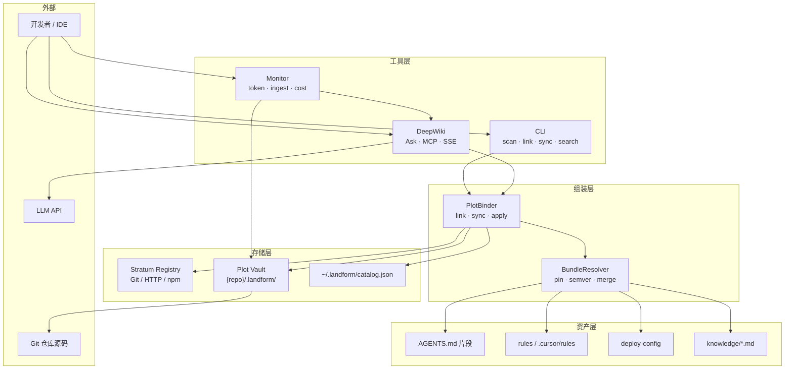
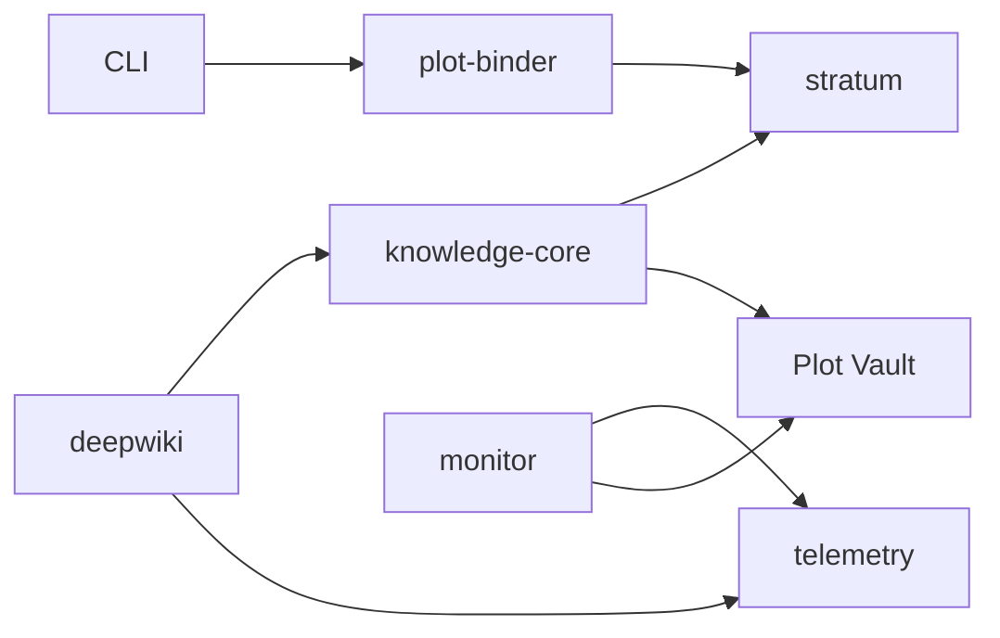
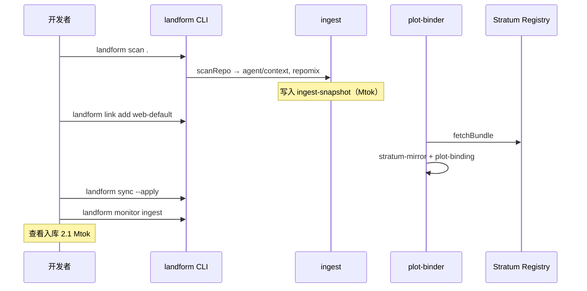
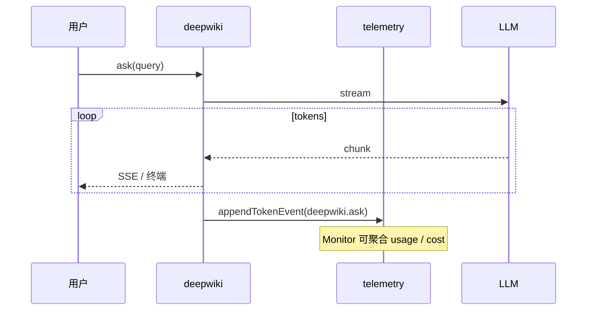

# Landform 技术方案

> **项目代号**：Landform  
> **文档版本**：2.1  
> **日期**：2026-06-26  
> **状态**：草案（供评审）  
> **定位**：面向 Web（JS/TS）团队的 AI 工程环境落地平台——以**资产为中心**，通过 CLI / DeepWiki / Monitor 三类工具消费统一存储  
> **与试验版关系**：Landform 继承试验版 Terrain 的产品理念与 `.terrain/` 知识格式；团队落地以 **Landform** 为产品名，CLI 与 npm 作用域独立命名  
> **技术栈**：Node.js / Bun · TypeScript · MCP · Stratum Registry（可选远程）+ Plot Vault（本地）

---

## 目录

1. [背景与目标](#1-背景与目标)
2. [产品原则与范围](#2-产品原则与范围)
3. [四层架构总览](#3-四层架构总览)
4. [存储层](#4-存储层)
5. [资产层](#5-资产层)
6. [组装层](#6-组装层)
7. [工具层](#7-工具层)
8. [技术选型](#8-技术选型)
9. [仓库与模块拆分](#9-仓库与模块拆分)
10. [数据模型与目录布局](#10-数据模型与目录布局)
11. [核心业务流程](#11-核心业务流程)
12. [分发与安装](#12-分发与安装)
13. [安全与权限](#13-安全与权限)
14. [团队协作与里程碑](#14-团队协作与里程碑)
15. [与试验版 Terrain 的对照](#15-与试验版-terrain-的对照)
16. [风险与决策记录](#16-风险与决策记录)
17. [附录](#17-附录)

---

## 1. 背景与目标

### 1.1 背景

试验版 **Terrain** 验证了「AI 编码助手工程环境管理平台」的可行性：扫描 Git 仓库、生成双轨知识资产、提供基于知识库的问答。团队落地项目代号 **Landform**，不再复刻桌面客户端 + 全功能 Web UI，而是收敛为**可运维、可版本化、可复用**的资产体系，由三类工具统一消费。

### 1.2 目标

| 目标 | 说明 |
|------|------|
| **资产先行** | 团队规范（AGENTS.md、rules、deploy-config、knowledge）以版本化资产包形式维护，项目通过「链接」挂载 |
| **双存储** | 中心 **Stratum Registry**（层位注册中心）做团队源；各项目 **Plot Vault**（地块仓，`.landform/`）做离线缓存与工作副本 |
| **三工具入口** | **CLI** 负责扫描/链接/同步；**DeepWiki** 负责知识问答；**Monitor** 负责**成本与效率**可观测（Token 消耗、入库量级等） |
| **知识原位** | 项目侧产物落在 `{repo}/.landform/`（兼容迁移试验版 `.terrain/`），随 Git 协作；Stratum Registry 仅做分发源 |
| **离线优先** | 扫描、搜索、Monitor 聚合不依赖 LLM；LLM 仅用于 DeepWiki 与资产生成 |

### 1.3 非目标（第一期不做）

- 中心化 SaaS 多租户后台（Stratum Registry 第一期可为 Git 仓库或内网 HTTP）
- 全功能 Web 管理台（Monitor 以 CLI + 可选轻量 HTTP 看板为主）
- 修改用户业务源码（除经外部 Agent 的编码阶段外）
- Electron / Tauri 桌面客户端
- Litho / SDD 完整流水线（可后续作为资产生成插件，不阻塞 M1）

---

## 2. 产品原则与范围

### 2.1 核心原则

1. **分层单向依赖**：工具层 → 组装层 → 资产层 → 存储层；下层不感知上层。
2. **资产可版本化**：每条资产（AGENTS.md 片段、rule、deploy-config、knowledge 文档）有 slug + semver，可 pin 到项目。
3. **链接而非拷贝**：`link` 记录项目 ↔ 资产包的绑定关系；`sync` 按策略拉取至 Plot Vault。
4. **双消费通道**：人类与 Agent 均通过 Plot Vault 读取；DeepWiki 与 MCP 走同一套 `knowledge-core` 检索逻辑。
5. **Monitor 驱动成本可见**：Token 消耗、知识入库量级（含百万 Token 级 repomix / knowledge 体积）、DeepWiki 单次问答成本可汇总、可告警。

### 2.2 功能范围

| 能力域 | 功能 | 优先级 | 所属层 |
|--------|------|--------|--------|
| Stratum Registry | 团队资产包托管、版本索引、拉取 API | P0 | 存储层 |
| Plot Vault | 项目 `.landform/` 读写、manifest、缓存 | P0 | 存储层 |
| 资产包（Bundle） | AGENTS.md、rules、deploy-config、knowledge | P0 | 资产层 |
| Link / Sync | 项目绑定资产包、增量同步 | P0 | 组装层 |
| CLI | scan、link、sync、search、tools | P0 | 工具层 |
| DeepWiki | 流式问答 + 源码引用（CLI / MCP / 可选 HTTP） | P1 | 工具层 |
| Monitor | Token 消耗、入库 Token 量、成本估算、效率指标 | P1 | 工具层 |
| 环境集成 | `env apply` 将链接后的资产写入 `.agents/`、`AGENTS.md` | P1 | 组装层 |
| MCP | DeepWiki + 知识检索 tools | P1 | 工具层 |

> **命名对照**：下文「Stratum Bundle」= 版本化资产包；「Plot Binding」= 项目与 Bundle 的 link 关系。

---

## 3. 四层架构总览

Landform 采用四层架构，自底向上依次为：**存储层 → 资产层 → 组装层 → 工具层**。

```text
┌─────────────────────────────────────────────────────────┐
│  工具层    CLI ｜ DeepWiki ｜ Monitor                      │
├─────────────────────────────────────────────────────────┤
│  组装层    link project to assets（Plot Binding）        │
├─────────────────────────────────────────────────────────┤
│  资产层    AGENTS.md ｜ rules ｜ deploy-config            │
│            knowledge                                     │
├─────────────────────────────────────────────────────────┤
│  存储层    Stratum Registry ｜ Plot Vault                │
└─────────────────────────────────────────────────────────┘
```

### 3.1 架构图



### 3.2 层间职责

| 层 | 职责 | 对外接口 |
|----|------|----------|
| **存储层** | 持久化与分发；团队注册中心 + 项目地块仓 | Registry API / Git clone；Plot Vault FS |
| **资产层** | 定义「团队给项目什么」；Stratum Bundle schema | Bundle manifest |
| **组装层** | 解析 Plot Binding、合并、写入 Plot Vault 与 IDE 路径 | `link`、`sync`、`apply` |
| **工具层** | 人机交互；Monitor 读用量账本 | CLI 子命令、MCP、Monitor 报告 |

### 3.3 关键设计决策

| 决策 | 选择 | 理由 |
|------|------|------|
| 项目代号 | **Landform** | 与试验版 Terrain 区分；npm / CLI 独立品牌 |
| 架构主轴 | 四层资产模型 | 团队规范可复用、可 pin、可审计 |
| 中心存储命名 | **Stratum Registry** | 强调「地层/层位」——团队资产的分层注册与版本源 |
| 本地存储命名 | **Plot Vault** | 强调「地块」——单仓库的工作副本与镜像 |
| Stratum 形态 | 第一期 Git monorepo + 可选 HTTP 代理 | 零额外 infra |
| Monitor 定位 | 成本 + 效率，非漂移检测 | 团队关注 Token 账单与入库 ROI；漂移交给 `env status` |
| 工具入口 | CLI + DeepWiki + Monitor 三分 | 职责清晰 |
| 运行时 | Bun（开发）/ Node 20+（CI） | 团队 TS 栈统一 |

---

## 4. 存储层

存储层提供两类后端：**Stratum Registry**（团队层位注册中心）与 **Plot Vault**（项目地块仓）。

### 4.1 Stratum Registry

团队 Stratum Bundle 的**唯一发布源**。第一期推荐 Git 仓库；后续可挂 HTTP Registry API，接口保持不变。

```text
landform-stratum/                  # 团队 Stratum Git 仓库（示例）
├── bundles/
│   ├── web-default/               # Bundle slug
│   │   ├── manifest.json          # 元数据 + 文件清单 + semver
│   │   ├── agents/
│   │   │   └── AGENTS.md
│   │   ├── rules/
│   │   │   └── *.mdc
│   │   ├── deploy-config.yaml
│   │   └── knowledge/
│   │       ├── 00-glossary.md
│   │       └── 10-api-guide.md
│   └── mobile-default/
│       └── ...
├── stratum-index.json             # slug → 最新版本、兼容范围
└── README.md
```

**Registry 能力（抽象接口 `StratumRegistryBackend`）**：

| 操作 | 说明 |
|------|------|
| `listBundles()` | 返回可用 Bundle slug 与版本列表 |
| `fetchBundle(slug, version?)` | 拉取指定版本 tarball / 目录树 |
| `getStratumIndex()` | 读取 `stratum-index.json` |
| `publishBundle()` | CI 发布新版本（第二期） |

**实现选项**：

| 模式 | 适用 | 实现 |
|------|------|------|
| **Git Stratum**（M1 默认） | 小团队、规范随 PR 演进 | `simple-git` clone / sparse checkout |
| **HTTP Registry**（M2） | 需权限、大文件、CDN | Hono + `GET /stratum/{slug}/{version}` |
| **npm 私有包**（可选） | 已有 Verdaccio / Artifactory | `@team/landform-bundle-web-default` |

### 4.2 Plot Vault

项目侧持久化根目录。Landform 默认 `{repo}/.landform/`；自试验版 Terrain 迁移时可保留 `.terrain/` 或通过 `LANDFORM_VAULT_ROOT` 指向原路径。

```text
{repo}/
└── .landform/                     # Plot Vault 根
    ├── stratum-mirror/            # 已 link Bundle 的本地镜像
    │   ├── stratum-lock.json      # pin 版本与 content hash
    │   └── bundles/
    │       └── web-default@1.2.0/
    │           ├── manifest.json
    │           ├── agents/
    │           ├── rules/
    │           ├── deploy-config.yaml
    │           └── knowledge/
    ├── agent/                     # 项目生成物（scan / repomix / context）
    │   ├── context.md
    │   ├── repomix.md             # 建议 .gitignore
    │   └── meta.json
    ├── human/                     # 可选：人类文档
    ├── knowledge/                 # 项目私域知识（与 Bundle knowledge merge）
    ├── .meta/
    │   ├── plot-binding.json      # 组装层：Plot Binding 清单
    │   ├── sync-state.json        # 上次 sync 状态
    │   └── freshness.json         # 知识新鲜度（scan 写入，非 Monitor 主责）
    ├── .telemetry/                # ★ Monitor 用量账本（可 .gitignore 或聚合上报）
    │   ├── token-ledger.jsonl     # 逐条 Token 事件
    │   └── ingest-snapshot.json   # 入库量级快照
    └── env/
        └── agent-tools.json

~/.landform/
├── catalog.json                   # slug → repoPath（原 registry 语义）
├── settings.json                  # LLM / Registry URL / Monitor 阈值
├── stratum-cache/                 # Registry 拉取缓存（跨项目复用）
└── monitor/                       # 可选：团队级聚合缓存
    └── rollup.json
```

**Plot Vault 原则**：

- `stratum-mirror/` 为**只读镜像**（由 `sync` 写入）；业务同学不手改。
- 项目特有内容放 `agent/`、`human/`、`knowledge/`（与 Bundle knowledge 合并检索）。
- `stratum-lock.json` 提交 Git，保证团队 pin 一致。
- `.telemetry/` 记录 Monitor 所需的 Token 与入库指标；默认可本地保留，CI 可上传聚合。

### 4.3 存储层 API（`@landform/stratum`）

```typescript
interface StratumRegistryBackend {
  listBundles(): Promise<StratumIndexEntry[]>;
  fetchBundle(slug: string, version?: string): Promise<StratumBundle>;
}

interface PlotVault {
  readStratumLock(): Promise<StratumLockFile>;
  writeStratumLock(lock: StratumLockFile): Promise<void>;
  materialize(bundle: StratumBundle, targetDir: string): Promise<void>;
  readPlotMeta(): Promise<PlotMeta>;
  appendTokenEvent(event: TokenLedgerEvent): Promise<void>;
  readIngestSnapshot(): Promise<IngestSnapshot>;
}
```

所有上层模块**仅**通过 `@landform/stratum` 访问存储，禁止散落的路径拼接。

---

## 5. 资产层

资产层定义团队可分发、可版本化的**四类标准资产**，打包为 **Stratum Bundle**，由 Stratum Registry 托管。

### 5.1 资产类型

| 资产 | 路径（包内） | 用途 | 部署目标（由 deploy-config 决定） |
|------|-------------|------|-----------------------------------|
| **AGENTS.md** | `agents/AGENTS.md` 或片段 | Agent 系统指令、知识查询规则 | 仓库根 `AGENTS.md` |
| **rules** | `rules/**/*.mdc` | Cursor / IDE 规则 | `.cursor/rules/` |
| **deploy-config** | `deploy-config.yaml` | 挂载映射与合并策略 | 包内元数据 |
| **knowledge** | `knowledge/**/*.md` | 团队私域知识 | `.landform/knowledge/` |

### 5.2 Stratum Bundle Manifest

```json
{
  "slug": "web-default",
  "version": "1.2.0",
  "description": "Web 团队默认 AI 工程环境",
  "assets": {
    "agents": ["agents/AGENTS.md"],
    "rules": ["rules/**/*.mdc"],
    "deployConfig": "deploy-config.yaml",
    "knowledge": ["knowledge/**/*.md"]
  },
  "compat": {
    "landform": ">=0.2.0"
  },
  "checksum": "sha256:..."
}
```

### 5.3 deploy-config.yaml

组装层读取此文件，决定 **link / apply** 如何将 Bundle 内文件映射到项目。

```yaml
version: 1

mappings:
  - from: agents/AGENTS.md
    to: AGENTS.md
    strategy: merge_sections
    sections:
      - id: landform:env-overview
      - id: landform:knowledge-guide

  - from: rules/
    to: .cursor/rules/
    strategy: copy_tree

  - from: knowledge/
    to: .landform/knowledge/
    strategy: copy_tree
    prefix: team-
```

### 5.4 与试验版 `.terrain/` 的关系

| 试验版目录 | Landform 归属 |
|-----------|---------------|
| `agent/context.md` | 仍由项目 scan 生成，**不属于** Stratum Bundle |
| `agent/repomix.md` | 同上；**入库 Token 量**纳入 Monitor ingest 统计 |
| `knowledge/` | Bundle + 项目私域 **merge** |
| `human/` | 可选；第一期非 Bundle 必需资产 |
| 全局 `~/.terrain/registry.json` | 对应 `~/.landform/catalog.json` |

---

## 6. 组装层

组装层核心能力：**link project to assets**（**Plot Binding**）——建立项目与 Stratum Bundle 的绑定，并按 deploy-config 物化到 Plot Vault 与 IDE 路径。

### 6.1 核心概念

| 概念 | 说明 |
|------|------|
| **Plot Binding** | `.meta/plot-binding.json` 记录 `bundles: [{ slug, version, source }]` |
| **Stratum Lock** | `stratum-mirror/stratum-lock.json` 锁定 content hash |
| **Sync** | 从 Registry 拉取 → 写入 `stratum-mirror/` → 可选 `apply` |
| **Apply** | 按 deploy-config 部署到 `AGENTS.md`、`.cursor/rules/` 等 |
| **Resolve** | 多包合并 precedence：项目 override > 后 link > 先 link |

### 6.2 plot-binding.json 示例

```json
{
  "version": 1,
  "bundles": [
    {
      "slug": "web-default",
      "version": "1.2.0",
      "source": "git+ssh://git@internal/landform-stratum.git",
      "linkedAt": "2026-06-26T00:00:00.000Z"
    }
  ]
}
```

### 6.3 组装层模块（`@landform/plot-binder`）

```text
packages/plot-binder/
├── src/
│   ├── binder.ts           # link / unlink
│   ├── syncer.ts           # Registry → stratum-mirror
│   ├── applier.ts          # deploy-config → workspace
│   ├── resolver.ts
│   └── merge/
│       ├── agents-md.ts
│       └── knowledge.ts
└── package.json
```

### 6.4 CLI 映射

```bash
landform link add web-default[@1.2.0]
landform link list
landform link remove web-default

landform sync                            # Registry → stratum-mirror
landform sync --apply
landform apply

landform env status                      # 资产漂移 / 未 apply（非 Monitor 职责）
landform env plan
landform env apply
```

---

## 7. 工具层

工具层提供三种入口：**CLI**、**DeepWiki**、**Monitor**。Monitor 专注**成本与效率**；资产漂移与新鲜度由 `landform env status` / `freshness.json` 承担。

### 7.1 CLI

```text
landform
├── list
├── scan [repo_path]
├── link
│   ├── add <slug>[@version]
│   ├── list
│   └── remove <slug>
├── sync [--apply]
├── apply
├── search <query> [--project]
├── read <path>
├── monitor                             # ★ 成本与效率，见 §7.3
│   ├── usage [--period 7d|30d]
│   ├── ingest                          # 入库量级
│   ├── cost [--currency CNY]
│   └── report [--json]
├── deepwiki                            # ★ 见 §7.2
│   ├── ask <query>
│   └── serve [--port]
├── tools
│   ├── list-projects
│   ├── list-bindings
│   ├── search
│   ├── read-doc
│   ├── read-context
│   ├── grep-pack
│   ├── usage-summary
│   └── ingest-stats
├── mcp [--stdio]
└── env
    ├── status
    ├── plan
    └── apply
```

### 7.2 DeepWiki

基于 Plot Vault + 源码索引的知识问答；**每次 Ask 写入 Token 账本**，供 Monitor 聚合。

**运行形态**：

| 形态 | 命令 | 场景 |
|------|------|------|
| 一次性问答 | `landform deepwiki ask "..."` | 终端 |
| 流式 HTTP | `landform deepwiki serve --port 4321` | 浏览器嵌入 |
| MCP | `landform mcp --stdio` | Cursor |

**检索分层**：

| 层 | 数据源 | 条件 |
|----|--------|------|
| Macro | `agent/context.md` | 受 `freshness_score` 约束 |
| Meso | `human/`、`knowledge/` | 全文检索 |
| Micro | `agent/repomix.md` grep | 按需 |

**DeepWiki 模块（`@landform/deepwiki`）**：Ask、SSE、引用；调用 `@landform/telemetry` 记录每次 prompt/completion tokens。

### 7.3 Monitor

Monitor 负责**成本与效率监控**，回答：「这个项目/团队消耗了多少 Token？知识库入库有多大？DeepWiki 是否划算？」

**不负责**（明确边界）：资产版本漂移、apply 差异、git 新鲜度 → 见 `landform env status` 与 `.meta/freshness.json`。

#### 7.3.1 监控维度

| 维度 | 指标 | 数据来源 |
|------|------|----------|
| **Token 消耗** | prompt / completion / total；按来源拆分 | DeepWiki Ask、context 生成、scan 辅助 LLM |
| **入库量级** | repomix 估算 Token；knowledge 文档 Token；**百万 Token（Mtok）** 汇总 | `agent/meta.json`、`ingest-snapshot.json` |
| **成本估算** | 按模型单价折算 CNY/USD；项目/Bundle/用户维度 rollup | `settings.json` 模型价表 + token-ledger |
| **效率** | 单次 Ask 平均 Token；检索命中率；macro 层占比 | DeepWiki 会话 + 检索日志 |
| **趋势** | 7d / 30d 环比；超阈值告警 | `~/.landform/monitor/rollup.json` |

#### 7.3.2 Token 来源（`TokenLedgerEvent.source`）

| source | 说明 |
|--------|------|
| `deepwiki.ask` | 用户问答 |
| `deepwiki.retrieval` | 检索扩写（若单独计费） |
| `ingest.repomix` | repomix 打包（通常 0 LLM，记体积） |
| `ingest.context` | Agent context 生成 |
| `ingest.scan` | 扫描辅助（若有 LLM） |
| `mcp.tool` | MCP 触发的 LLM 调用 |

#### 7.3.3 入库量级（Ingest）

**入库**指进入 Plot Vault、可被 DeepWiki 检索的静态知识体积，**不**等同于 LLM Token 消耗，但统一用 **Token 等价量**（tiktoken 估算）便于与成本对照。

| 资产 | 计算方式 | 展示 |
|------|----------|------|
| `agent/repomix.md` | 文件字节 → Token 估算 | `ingest.repomixTokens` |
| `knowledge/**/*.md` | 逐文件求和 | `ingest.knowledgeTokens` |
| `agent/context.md` + `human/` | 同上 | `ingest.contextTokens` |
| **合计** | 上述之和 | **`ingest.totalMtok`**（百万 Token，保留 2 位小数） |

示例：`ingest.totalMtok: 2.35` 表示约 **235 万 Token** 入库量。

#### 7.3.4 CLI

```bash
landform monitor usage                  # 本仓库 Token 消耗摘要
landform monitor usage --period 30d
landform monitor ingest                 # 入库量级（含 Mtok）
landform monitor cost                   # 成本估算
landform monitor report                 # 综合报告（人类可读）
landform monitor report --json          # CI / 看板接入
```

#### 7.3.5 报告示例（`monitor report --json`）

```json
{
  "project": "my-app",
  "period": "30d",
  "tokenUsage": {
    "promptTokens": 1250000,
    "completionTokens": 380000,
    "totalTokens": 1630000,
    "bySource": {
      "deepwiki.ask": { "totalTokens": 1420000, "sessions": 89 },
      "ingest.context": { "totalTokens": 210000, "runs": 3 }
    }
  },
  "ingest": {
    "repomixTokens": 1800000,
    "knowledgeTokens": 420000,
    "contextTokens": 85000,
    "totalTokens": 2305000,
    "totalMtok": 2.31
  },
  "cost": {
    "currency": "CNY",
    "estimatedTotal": 42.8,
    "perMtokIngest": 0.018,
    "perAskAvg": 0.48
  },
  "efficiency": {
    "avgTokensPerAsk": 15955,
    "retrievalHitRate": 0.72,
    "macroLayerShare": 0.41
  }
}
```

#### 7.3.6 CI / 团队看板

```yaml
# .github/workflows/landform-monitor.yml
- run: landform monitor ingest --json > ingest.json
- run: landform monitor usage --period 30d --json > usage.json
# 可选：上传至内部 Metrics 或 Slack 告警
- run: test "$(jq .ingest.totalMtok ingest.json | cut -d. -f1)" -lt 10
```

Monitor 聚合**不依赖 LLM**；DeepWiki 产生的事件异步写入 `.telemetry/token-ledger.jsonl`。

#### 7.3.7 Monitor 模块（`@landform/monitor`）

```text
packages/monitor/
├── src/
│   ├── ledger.ts           # 读取 / 聚合 token-ledger
│   ├── ingest-stats.ts     # repomix / knowledge Mtok
│   ├── cost-estimator.ts   # 模型价表
│   ├── efficiency.ts       # 命中率、均值
│   └── report.ts           # CLI / JSON 输出
└── package.json
```

### 7.4 工具层交互



---

## 8. 技术选型

| 层级 | 技术 | 用途 |
|------|------|------|
| 运行时 | Bun ≥ 1.2 / Node ≥ 20 | CLI、Registry 客户端、DeepWiki |
| 语言 | TypeScript ≥ 5.8 | 全栈 strict |
| 包管理 | pnpm ≥ 9 | Monorepo |
| CLI | citty + commander | 子命令 |
| HTTP（可选） | Hono ≥ 4 | DeepWiki SSE、Registry HTTP |
| 校验 | Zod ≥ 3 | manifest、lock、binding schema |
| Token 估算 | tiktoken 或 gpt-tokenizer | ingest 量级、成本 |
| Git | simple-git | Git Stratum、scan |
| 全文搜索 | minisearch / flexsearch | knowledge 检索 |
| 源码打包 | repomix (npm) | agent/repomix.md |
| LLM | Vercel AI SDK | DeepWiki 流式 |
| MCP | @modelcontextprotocol/sdk v1.x | IDE 集成 |
| 测试 | Vitest | 单元 + 集成 |
| Monitor 输出 | chalk + cli-table3 | 终端报告 |

---

## 9. 仓库与模块拆分

### 9.1 Monorepo 结构

```text
landform/
├── package.json
├── pnpm-workspace.yaml
├── stratum/                       # 示例 Stratum Bundle（或独立 Git 仓库）
│   └── bundles/web-default/
├── packages/
│   ├── schema/
│   ├── stratum/                   # Registry + Plot Vault
│   ├── bundle/                    # Stratum Bundle 解析、deploy-config
│   ├── plot-binder/               # Plot Binding / sync / apply
│   ├── knowledge-core/
│   ├── knowledge-ingest/
│   ├── telemetry/                 # Token ledger、ingest snapshot
│   ├── deepwiki/
│   ├── monitor/
│   ├── mcp/
│   └── cli/                       # landform 入口
└── docs/
    └── team-platform-technical-design.md
```

### 9.2 模块依赖

| 包 | npm 名 | 职责 |
|----|--------|------|
| `stratum` | `@landform/stratum` | Stratum Registry 客户端 + Plot Vault FS |
| `bundle` | `@landform/bundle` | manifest、deploy-config |
| `plot-binder` | `@landform/plot-binder` | link / sync / apply |
| `telemetry` | `@landform/telemetry` | Token 事件、ingest 快照 |
| `knowledge-core` | `@landform/knowledge-core` | 搜索、doc、freshness |
| `knowledge-ingest` | `@landform/knowledge-ingest` | scan、repomix |
| `deepwiki` | `@landform/deepwiki` | Ask；写入 telemetry |
| `monitor` | `@landform/monitor` | 成本、入库 Mtok、效率报告 |
| `mcp` | `@landform/mcp` | MCP tools |
| `cli` | `@landform/cli` | `landform` 命令行 |

---

## 10. 数据模型与目录布局

### 10.1 核心 Schema（`@landform/schema`）

| 类型 | 说明 |
|------|------|
| `StratumBundleManifest` | Bundle manifest |
| `DeployConfig` | deploy-config.yaml |
| `PlotBindingFile` | plot-binding.json |
| `StratumLockFile` | stratum-lock.json |
| `TokenLedgerEvent` | 单条 Token 消耗事件 |
| `IngestSnapshot` | 入库 Token / Mtok 快照 |
| `MonitorReport` | Monitor 综合报告 |
| `ProjectSummary` | catalog 条目 |
| `SourceCitation` | DeepWiki 引用 |

### 10.2 catalog.json

```json
{
  "version": 1,
  "stratum": {
    "defaultRegistry": "git+ssh://git@internal/landform-stratum.git"
  },
  "projects": {
    "my-app": {
      "repoPath": "/abs/path/to/my-app",
      "slug": "my-app",
      "registeredAt": "2026-06-26T00:00:00.000Z"
    }
  }
}
```

---

## 11. 核心业务流程

### 11.1 新项目接入



### 11.2 DeepWiki 问答与成本记账



### 11.3 日常开发循环

```text
1. landform scan .                    → 更新 repomix / ingest 快照
2. landform sync --apply                → 同步团队 Bundle
3. 开发 + DeepWiki / MCP 问答
4. landform monitor usage --period 7d   → 周度 Token 回顾
5. landform env status                  → 资产漂移（非 Monitor）
```

---

## 12. 分发与安装

```bash
npm install -g @landform/cli

landform --version
landform link add web-default
landform sync --apply
landform monitor ingest
landform mcp --stdio
```

**Stratum 仓库**：

```bash
git clone git@internal/landform-stratum.git
# 编辑 bundles/web-default/ ...
git tag web-default-v1.2.0 && git push origin web-default-v1.2.0
```

---

## 13. 安全与权限

| 措施 | 说明 |
|------|------|
| Registry 访问 | Git SSH / HTTP token |
| Plot Vault telemetry | 默认本地；上报需显式配置 endpoint |
| MCP 写操作 | 默认关闭 |
| API Key | `~/.landform/settings.json`（0600） |

---

## 14. 团队协作与里程碑

### 14.1 里程碑

#### M1：存储 + 组装 + CLI（4 周）

- [ ] `@landform/stratum`：Git Registry + Plot Vault
- [ ] `@landform/bundle`、`@landform/plot-binder`
- [ ] CLI：`link`、`sync`、`apply`、`scan`
- [ ] 示例 Bundle `web-default`

#### M2：Telemetry + Monitor（3 周）

- [ ] `@landform/telemetry`：token-ledger、ingest-snapshot
- [ ] `@landform/monitor`：usage / ingest / cost / report
- [ ] scan / repomix 后自动更新 **Mtok**
- [ ] DeepWiki 记账接入

**验收**：`landform monitor report` 输出 Token 消耗与 `totalMtok` 入库量。

#### M3：DeepWiki + MCP（3–4 周）

- [ ] `@landform/deepwiki` + MCP
- [ ] Monitor 效率指标（命中率、单次 Ask 均值）

#### M4：Registry HTTP + 团队看板（持续）

- [ ] HTTP Stratum Registry
- [ ] Monitor rollup 上报内部 Metrics

---

## 15. 与试验版 Terrain 的对照

| 试验版 Terrain | Landform | 说明 |
|----------------|----------|------|
| 产品名 Terrain | **Landform** | 团队落地代号 |
| `terrain` CLI | **`landform` CLI** | 独立 npm 包 |
| `.terrain/` | **`.landform/`** | 可迁移；格式兼容 |
| `~/.terrain/registry.json` | **`~/.landform/catalog.json`** | 项目目录 |
| 无中心资产库 | **Stratum Registry** | 团队 Bundle 源 |
| freshness 分散 | `freshness.json` + **`env status`** | 非 Monitor 主责 |
| 无成本视图 | **Monitor** | Token + Mtok 入库 |
| DeepWiki | 工具层模块 + telemetry | 问答同时记账 |

---

## 16. 风险与决策记录

| ID | 风险 | 缓解 |
|----|------|------|
| R1 | Token 估算与账单偏差 | 以 Provider 回传为准校准；tiktoken 仅用于 ingest |
| R2 | telemetry 文件膨胀 | jsonl 轮转 + 按 period rollup |
| R3 | Monitor 与 env status 职责混淆 | 文档 + CLI 帮助明确边界 |
| R4 | `.terrain` 迁移成本 | 提供 `landform migrate`（P2） |

### ADR 摘要

| 决策 | 结论 | 日期 |
|------|------|------|
| ADR-011 项目代号 | **Landform** | 2026-06-26 |
| ADR-012 中心存储 | **Stratum Registry** | 2026-06-26 |
| ADR-013 本地存储 | **Plot Vault**（`.landform/`） | 2026-06-26 |
| ADR-014 Monitor 定位 | **成本与效率**（Token、Mtok 入库） | 2026-06-26 |
| ADR-015 npm 作用域 | `@landform/*` | 2026-06-26 |

---

## 17. 附录

### 17.1 环境变量

| 变量 | 说明 | 默认 |
|------|------|------|
| `LANDFORM_REPO_PATH` | 当前工作仓库 | Git 根 |
| `LANDFORM_STRATUM_REGISTRY` | Registry URL | catalog.json |
| `LANDFORM_VAULT_ROOT` | Plot Vault 根 | `{repo}/.landform` |
| `LANDFORM_MONITOR_ROLLUP_ENDPOINT` | 可选上报 URL | 空 |
| `LANDFORM_MCP_ALLOW_WRITE` | MCP 写工具 | `0` |

### 17.2 快速开始

```bash
npm i -g @landform/cli
cd my-app && landform scan .
landform link add web-default && landform sync --apply
landform monitor report
landform deepwiki ask "支付模块入口在哪？"
```

### 17.3 术语表

| 术语 | 含义 |
|------|------|
| **Landform** | 团队落地项目代号 |
| **Stratum Registry** | 团队 Stratum Bundle 注册与分发中心 |
| **Plot Vault** | 单仓库本地地块仓（`.landform/`） |
| **Stratum Bundle** | 版本化资产包（AGENTS.md / rules / deploy-config / knowledge） |
| **Plot Binding** | 项目与 Bundle 的 link 关系 |
| **Mtok** | 百万 Token 等价量，用于入库体量 |
| **Monitor** | 成本与效率监控工具（非资产漂移） |

### 17.4 文档修订记录

| 版本 | 日期 | 说明 |
|------|------|------|
| 1.0 | 2026-06-25 | 初稿：Vue + MCP + 全 API |
| 2.0 | 2026-06-26 | 四层架构重构 |
| 2.1 | 2026-06-26 | 代号 **Landform**；**Stratum Registry / Plot Vault** 命名；**Monitor → 成本效率** |

---

*本文档描述 **Landform** 团队落地技术方案：以 Stratum Bundle 为资产单元，经 Plot Binding 写入 Plot Vault，由 CLI、DeepWiki、Monitor（Token 与 Mtok 入库）三类工具消费。*
