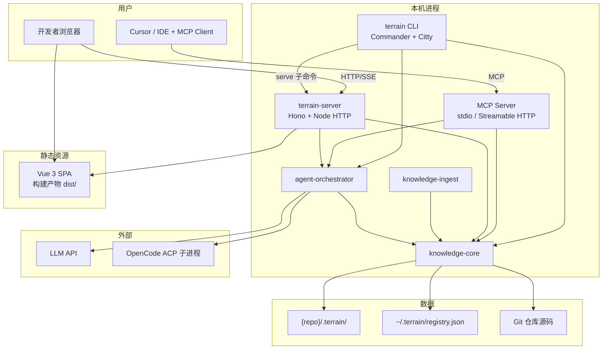
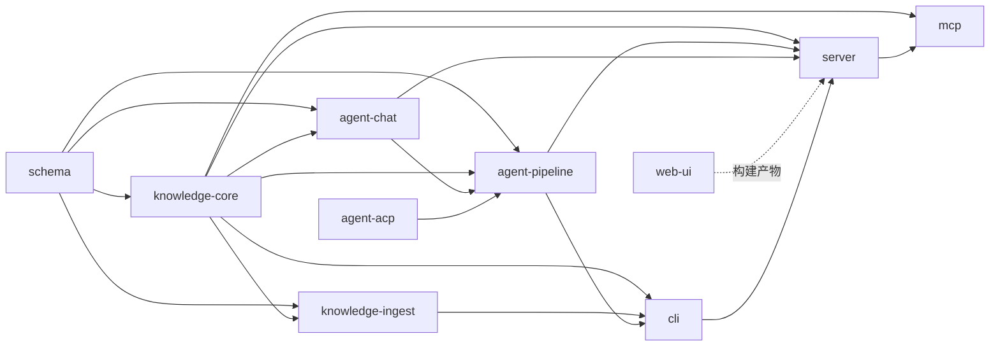
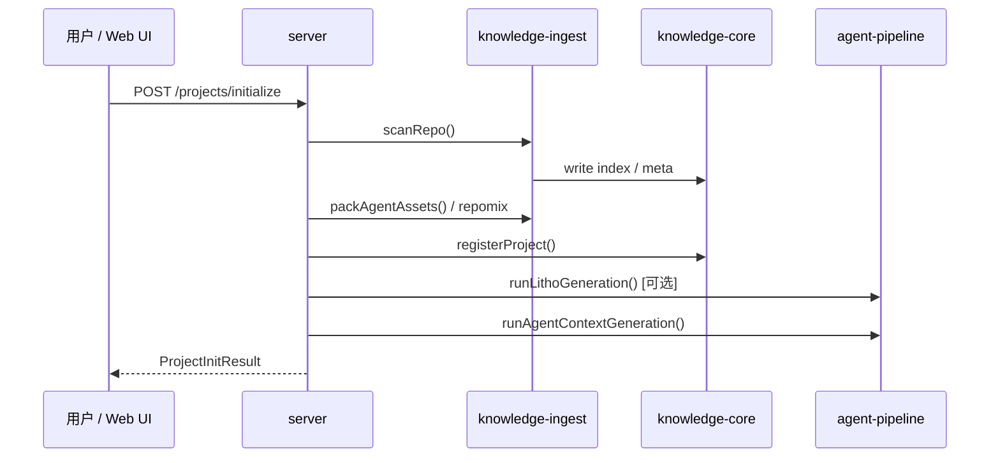
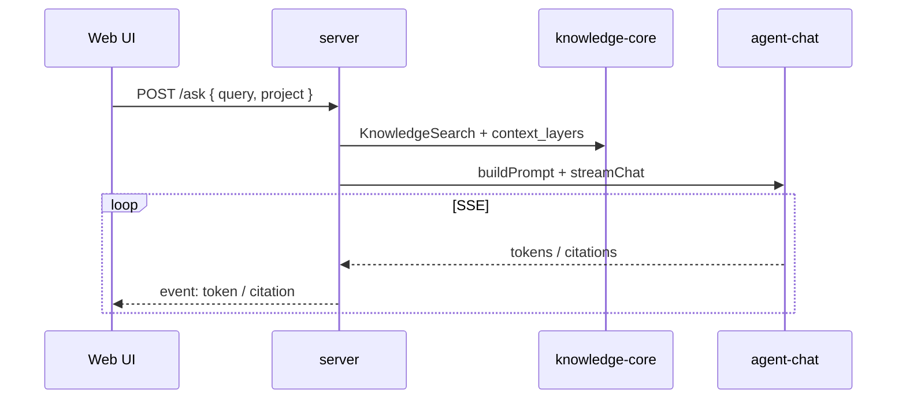

# Terrain 团队版技术方案

> **文档版本**：1.0  
> **日期**：2026-06-25  
> **状态**：草案（供评审）  
> **定位**：基于个人试验项目 Terrain 的产品理念，面向 Web（JS/TS）团队落地的工程环境管理平台  
> **技术栈**：Node.js / Bun · Vue 3 · TypeScript · MCP · 本地 Web 服务（浏览器 UI，无桌面客户端）

---

## 目录

1. [背景与目标](#1-背景与目标)
2. [产品原则与范围](#2-产品原则与范围)
3. [总体架构](#3-总体架构)
4. [技术选型](#4-技术选型)
5. [仓库与模块拆分](#5-仓库与模块拆分)
6. [CLI 与本地 Web 服务](#6-cli-与本地-web-服务)
7. [MCP 服务设计](#7-mcp-服务设计)
8. [HTTP API 与实时通道](#8-http-api-与实时通道)
9. [前端（Vue）设计](#9-前端vue设计)
10. [数据模型与存储](#10-数据模型与存储)
11. [核心业务流程](#11-核心业务流程)
12. [AI 集成](#12-ai-集成)
13. [环境集成（Skills / AGENTS.md）](#13-环境集成skills--agentsmd)
14. [分发与安装](#14-分发与安装)
15. [安全与权限](#15-安全与权限)
16. [团队协作与里程碑](#16-团队协作与里程碑)
17. [与试验版 Terrain 的对照](#17-与试验版-terrain-的对照)
18. [风险与决策记录](#18-风险与决策记录)
19. [附录](#19-附录)

---

## 1. 背景与目标

### 1.1 背景

试验版 Terrain 验证了「AI 编码助手工程环境管理平台」的可行性：扫描 Git 仓库、生成双轨知识资产（人类文档 + Agent 上下文）、提供基于知识库的问答与工作流编排。现需由以 **Web（JS/TS）** 为主的团队落地类似方案。

### 1.2 目标

| 目标 | 说明 |
|------|------|
| **零 JVM 依赖** | 开发与运行均基于 Node/Bun，Web 同学无需安装 Java |
| **浏览器即 UI** | 不提供 Electron/Tauri 桌面客户端；`terrain serve` 启动本地 Web 服务，自动打开浏览器 |
| **双消费通道** | 人类通过 Web UI；外部 AI 助手通过 **MCP** 与 **CLI tools** 访问知识 |
| **知识原位** | 知识资产存放在各仓库 `{repo}/.terrain/`，随 Git 协作 |
| **离线优先** | 扫描、打包、搜索不依赖 LLM；LLM 仅用于生成与问答 |
| **可协作开发** | Monorepo + 清晰模块边界 + OpenAPI 契约 |

### 1.3 非目标（第一期不做）

- 中心化 SaaS 多租户后台
- 修改用户业务源码（除 SDD 编码阶段经外部 Agent 外）
- 替代 Git / IDE
- 桌面原生客户端

---

## 2. 产品原则与范围

### 2.1 核心原则（继承自试验版）

1. **知识原位**：`{repo}/.terrain/` 为项目知识根；`~/.terrain/registry.json` 仅做 slug → 路径映射。
2. **双轨文档**：
   - `human/`：叙述性文档 + Mermaid，供人阅读；
   - `agent/`：`context.md`（架构上下文）+ `repomix.md`（源码打包），供 Agent 程序化读取。
3. **可恢复流水线**：Litho / SDD 中间产物落盘，支持断点续跑。
4. **分层依赖**：`knowledge-core` 不依赖任何 LLM / Agent 模块。

### 2.2 功能范围

| 能力域 | 功能 | 优先级 |
|--------|------|--------|
| 项目注册与扫描 | Git 仓库扫描、技术栈检测、注册表 | P0 |
| 知识打包 | Repomix 源码索引、`agent/context.md` 生成 | P0 |
| 全文搜索 | `human/`、`agent/`、`knowledge/` 检索 | P0 |
| Ask（DeepWiki） | 基于知识库的流式问答 + 源码引用 | P1 |
| Litho 文档生成 | C4 人类文档流水线（可恢复） | P1 |
| SDD 工作流 | 需求→设计→编码→审查四阶段 | P2 |
| 环境集成 | Skills、AGENTS.md、工具链模板 | P1 |
| 新鲜度检测 | 对比 git HEAD 与知识基线 | P1 |
| MCP 服务 | 供 Cursor 等 IDE 接入 | P0 |
| Web UI | 项目概览、文档浏览、Ask、工作流面板 | P1 |

---

## 3. 总体架构

### 3.1 架构图



### 3.2 关键设计决策

| 决策 | 选择 | 理由 |
|------|------|------|
| UI 载体 | 本地 HTTP + 浏览器 | Web 团队零桌面壳维护成本；热更新友好 |
| 进程模型 | 单进程：`CLI serve` = HTTP + MCP（可选） | 简化端口与生命周期管理 |
| 前后端通信 | REST + SSE | Ask 流式输出；比 WebSocket 实现简单 |
| Agent 接入 | MCP 为主，CLI `tools` 为辅 | MCP 为 IDE 标准；CLI JSON 兼容脚本/CI |
| 运行时 | Bun（开发 + 可选 compile）/ Node 20+（生产兼容） | 团队统一；Bun 启动快 |

### 3.3 与桌面客户端方案的差异

| 项 | 试验版（Tauri） | 团队版 |
|----|----------------|--------|
| UI 通道 | Tauri IPC invoke | HTTP REST + SSE |
| 启动方式 | 桌面应用 | `terrain serve` → 打开 `http://127.0.0.1:PORT` |
| 系统集成 | 原生对话框、剪贴板 | 浏览器 File API + 可选 `open` 命令 |
| 分发 | 平台安装包 | npm 全局 CLI + 内嵌静态 UI |

---

## 4. 技术选型

### 4.1 技术栈总表

| 层级 | 技术 | 版本建议 | 用途 |
|------|------|----------|------|
| 运行时 | **Bun** | ≥ 1.2 | 开发、测试、可选单文件编译 |
| 运行时（兼容） | **Node.js** | ≥ 20 LTS | CI、不支持 Bun 的环境 |
| 语言 | **TypeScript** | ≥ 5.8 | 全栈 strict |
| 包管理 | **pnpm** | ≥ 9 | Monorepo workspace |
| CLI 框架 | **citty** + **commander** | 最新 | 子命令解析；`serve`/`tools` 分离 |
| HTTP 服务 | **Hono** | ≥ 4 | 轻量、TS 友好、易挂 MCP |
| 校验 | **Zod** | ≥ 3 | 运行时 schema；与 OpenAPI 对齐 |
| 前端框架 | **Vue 3** | ≥ 3.5 | Composition API + `<script setup>` |
| 构建 | **Vite** | ≥ 6 | Vue SPA |
| 样式 | **Tailwind CSS** | v4 | 与试验版一致的原子化 CSS |
| Markdown | **markdown-it** + **highlight.js** | - | 文档渲染 |
| 图表 | **mermaid** | ≥ 11 | 架构图 |
| 状态 | **Pinia** | ≥ 2 | 项目/会话状态 |
| 路由 | **Vue Router** | ≥ 4 | SPA 路由 |
| Git | **simple-git** 或 `git` 子进程 | - | 扫描、HEAD、diff |
| 源码打包 | **repomix** (npm) | ≥ 2 | 生成 `agent/repomix.md` |
| 全文搜索 | **minisearch** 或 **flexsearch** | - | 本地索引；可选 ripgrep 后备 |
| LLM | **Vercel AI SDK** (`ai`) | ≥ 4 | 流式、多 Provider |
| MCP | **@modelcontextprotocol/sdk** | v1.x（生产） | stdio + Streamable HTTP |
| OpenAPI | **@hono/zod-openapi** | - | 契约生成与校验 |
| 测试 | **Vitest** | ≥ 3 | 单元 + 集成 |
| 代码质量 | **ESLint** + **Prettier** | - | 统一风格 |

> **MCP SDK 版本说明**：截至 2026 年中，生产环境建议使用 `@modelcontextprotocol/sdk` v1.x；v2 拆分多包后可在稳定版发布后再迁移。

### 4.2 选型理由摘要

- **Node/Bun + Vue**：与团队技能完全匹配；无第二运行时。
- **Hono 而非 Express**：更轻、TS 推断更好；与 `@modelcontextprotocol/hono` 集成顺畅。
- **浏览器 UI**：避免 Electron 双栈；`terrain serve` 一条命令即可演示。
- **MCP + CLI tools 双通道**：IDE 走 MCP；CI/脚本继续用 JSON CLI（与试验版 `terrain tools` 语义对齐）。

---

## 5. 仓库与模块拆分

### 5.1 Monorepo 目录结构

```text
terrain-platform/
├── package.json                 # pnpm workspace 根
├── pnpm-workspace.yaml
├── tsconfig.base.json
├── contracts/
│   └── openapi.yaml             # HTTP API 唯一契约
├── assets/
│   ├── env-catalog/             # 环境集成模板（从试验版迁移）
│   └── preset-skills/           # Litho/Ask/SDD prompt 技能
├── packages/
│   ├── schema/                  # Zod schema + 导出类型
│   ├── knowledge-core/          # 路径、注册表、文档、搜索、新鲜度
│   ├── knowledge-ingest/        # 扫描、repomix、meta 采集
│   ├── agent-chat/              # LLM 会话、流式、引用
│   ├── agent-pipeline/          # Litho、SDD、context 编排
│   ├── agent-acp/               # OpenCode ACP 子进程客户端
│   ├── server/                  # Hono HTTP + SSE + 静态 UI
│   ├── mcp/                     # MCP Server 实现
│   └── cli/                     # terrain 命令行入口
├── apps/
│   └── web-ui/                  # Vue 3 SPA 源码
├── npm/
│   ├── packages/cli/            # npm bin shim
│   └── packages/cli-darwin-arm64/  # 可选：预编译平台包
├── tools/
│   └── integration-tests/       # 金样例回归
└── docs/
    └── team-platform-technical-design.md
```

### 5.2 模块职责与依赖



| 包名 | npm 名（建议） | 职责 | 禁止依赖 |
|------|----------------|------|----------|
| `schema` | `@terrain/schema` | 全部 DTO、`DocFrontmatter`、`LithoPlan` 等 Zod 定义 | 业务逻辑 |
| `knowledge-core` | `@terrain/knowledge-core` | `KnowledgePaths`、registry、doc 解析、search、freshness | `agent-*`、LLM |
| `knowledge-ingest` | `@terrain/knowledge-ingest` | `ProjectScanner`、repomix 打包、openapi 导入 | LLM |
| `agent-chat` | `@terrain/agent-chat` | Ask、流式、`SourceCitation` | UI |
| `agent-pipeline` | `@terrain/agent-pipeline` | Litho/SDD/context 编排、断点续跑 | UI |
| `agent-acp` | `@terrain/agent-acp` | ACP 配置、子进程、可用性检测 | UI |
| `server` | `@terrain/server` | HTTP API、SSE、静态资源、CORS | - |
| `mcp` | `@terrain/mcp` | MCP tools/resources 注册 | UI |
| `cli` | `@terrain/cli` | 命令行、进程编排、`serve` 启动 | Vue |
| `web-ui` | `@terrain/web-ui` | Vue SPA | 后端实现细节 |

### 5.3 团队分工建议（6–8 人）

| 小组 | 包 | 人数 |
|------|-----|------|
| 平台组 | `schema`、`knowledge-core`、`knowledge-ingest` | 2 |
| Agent 组 | `agent-chat`、`agent-pipeline`、`agent-acp` | 2 |
| 平台组 | `server`、`mcp`、`cli` | 1–2 |
| 前端组 | `apps/web-ui` | 2–3 |

**协作规则**：

- API 变更必须先改 `contracts/openapi.yaml` 与 `packages/schema`。
- 每个 PR 尽量只触及一个 `packages/*`。
- `assets/preset-skills` 变更由 Agent 组评审。

---

## 6. CLI 与本地 Web 服务

### 6.1 CLI 命令树（对齐试验版）

```text
terrain
├── list                          # 列出已注册项目
├── scan [repo_path] [--slug]     # 扫描仓库
├── search <query> [--project] [--limit]
├── read <path>                   # 读取知识文档
├── serve [options]               # ★ 启动本地 Web + 可选 MCP
├── tools                         # JSON 输出，供脚本/ACP 兼容
│   ├── list-projects
│   ├── pack-meta
│   ├── grep-pack
│   ├── read-pack-file
│   ├── read-context
│   ├── search
│   └── read-doc
├── assets
│   ├── register
│   ├── pack-agent
│   ├── plan-litho
│   ├── run-litho
│   ├── agent-context
│   ├── list-human
│   ├── plan
│   └── repair-context
└── env
    ├── status
    ├── plan
    └── apply
```

### 6.2 `terrain serve` 行为（核心）

```bash
terrain serve \
  --host 127.0.0.1 \
  --port 4321 \
  --open \                        # 默认 true：自动打开浏览器
  --mcp stdio \                   # 可选：同时以 stdio 暴露 MCP（供 IDE 子进程拉起）
  --mcp-port 4322 \               # 可选：Streamable HTTP MCP 端口
  --project /path/to/repo         # 默认 workspace 项目
```

**启动流程**：

1. 解析 workspace（`TERRAIN_REPO_PATH` 或当前 Git 根）。
2. 加载 `packages/server`，挂载：
   - `GET /` → Vue 构建产物（`apps/web-ui/dist`）
   - `GET /api/*` → REST
   - `GET /api/events/*` → SSE（Ask 流式）
   - `GET /health` → 健康检查
3. 若 `--open`：调用 `open` / `xdg-open` / `start` 打开 `http://127.0.0.1:4321`。
4. 若 `--mcp stdio`：在同一进程或子进程注册 MCP Server（见 §7）。
5. 打印就绪日志与 PID 文件（`~/.terrain/serve.pid`），便于 `terrain stop`。

**停止**：

```bash
terrain stop          # 读 pid 文件优雅关闭
# 或 Ctrl+C
```

### 6.3 开发模式

```bash
# 终端 1：后端热重载
pnpm --filter @terrain/server dev

# 终端 2：前端 Vite HMR
pnpm --filter @terrain/web-ui dev   # 代理 /api → localhost:4321

# 或一体化
pnpm dev                            # turbo/concurrently 并行
```

Web 同学日常 **不需要** 单独跑 CLI 编译；`pnpm dev` 即可。

### 6.4 CLI 输出约定

| 命令组 | stdout 格式 | 用途 |
|--------|-------------|------|
| `tools *` | **JSON**（单行或多行 NDJSON） | 机器解析 |
| `list` / `scan` / `search` | 人类可读表格或 JSON（`--json`） | 终端用户 |
| 错误 | stderr + exit code ≠ 0 | 统一 `TerrainError` code |

---

## 7. MCP 服务设计

### 7.1 定位

MCP Server 将 Terrain 知识能力暴露给 **Cursor、Claude Desktop、自定义 Agent** 等客户端，是 IDE 集成的**主通道**；CLI `tools` 作为无 MCP 场景的兼容层。

### 7.2 传输方式

| 模式 | 场景 | 实现 |
|------|------|------|
| **stdio** | IDE 以子进程拉起 `terrain mcp` | `@modelcontextprotocol/sdk` StdioServerTransport |
| **Streamable HTTP** | 远程或已有 HTTP 服务 | Hono + `@modelcontextprotocol/hono`；路径 `/mcp` |
| 不推荐 SSE legacy | - | v2 SDK 已弃用服务端 SSE |

**推荐默认**：文档与 Cursor 配置使用 stdio：

```json
{
  "mcpServers": {
    "terrain": {
      "command": "terrain",
      "args": ["mcp", "--stdio"],
      "env": {
        "TERRAIN_REPO_PATH": "${workspaceFolder}"
      }
    }
  }
}
```

`terrain serve --mcp stdio` 适用于「同时开 Web UI + MCP」；纯 IDE 场景用 `terrain mcp` 更轻。

### 7.3 MCP Tools 清单

与试验版 `terrain tools` **语义一一对应**：

| MCP Tool 名 | 对应 CLI | 说明 |
|-------------|----------|------|
| `terrain_list_projects` | `tools list-projects` | 返回已注册项目 slug 与路径 |
| `terrain_pack_meta` | `tools pack-meta` | repomix 元数据（行数、文件数、baseline） |
| `terrain_grep_pack` | `tools grep-pack` | 在 `agent/repomix.md` 中 grep |
| `terrain_read_pack_file` | `tools read-pack-file` | 按路径读 repomix 内文件片段 |
| `terrain_read_context` | `tools read-context` | 读 `agent/context.md`，可选 section |
| `terrain_search` | `tools search` | 全文搜索知识库 |
| `terrain_read_doc` | `tools read-doc` | 读 `human/` 或 `agent/` 下单篇文档 |
| `terrain_freshness` | （新增） | 返回 `freshness.json` 摘要 |
| `terrain_scan` | `scan` | 触发扫描（写操作，需确认） |

**写操作工具**（`scan`、`assets pack-agent` 等）默认 **disabled** 或通过 `TERRAIN_MCP_ALLOW_WRITE=1` 开启，避免 Agent 误改仓库。

### 7.4 MCP Resources（可选，P1）

| Resource URI 模板 | 内容 |
|-------------------|------|
| `terrain://{project}/agent/context.md` | Agent 架构上下文 |
| `terrain://{project}/human/{path}` | 人类文档 |
| `terrain://{project}/freshness` | 新鲜度 JSON |

Resources 适合客户端「预加载上下文」；Tools 适合按需检索。

### 7.5 MCP Prompts（可选，P2）

| Prompt 名 | 用途 |
|---------|------|
| `terrain_ask` | 带知识库宏层的问答模板 |
| `terrain_architecture_summary` | 从 `context.md` 抽取架构摘要 |

### 7.6 实现结构

```text
packages/mcp/
├── src/
│   ├── server.ts           # createMcpServer()
│   ├── transports/
│   │   ├── stdio.ts
│   │   └── http.ts
│   ├── tools/
│   │   ├── list-projects.ts
│   │   ├── grep-pack.ts
│   │   └── ...
│   └── resources/
│       └── docs.ts
└── package.json
```

**原则**：每个 tool 的实现 **调用 `knowledge-core` 的同一函数** 作为 CLI `tools` 子命令，避免双份逻辑。

```typescript
// 伪代码：共享核心
export async function grepPack(input: GrepPackInput): Promise<GrepPackResult> {
  // knowledge-core 实现
}

// CLI
// terrain tools grep-pack → console.log(JSON.stringify(await grepPack(...)))

// MCP
// server.tool('terrain_grep_pack', ..., async (args) => grepPack(args))
```

---

## 8. HTTP API 与实时通道

### 8.1 基础约定

| 项 | 约定 |
|----|------|
| Base URL | `http://127.0.0.1:{port}/api/v1` |
| 认证 | 本地仅绑定 `127.0.0.1`；无鉴权（见 §15） |
| 请求/响应 | `application/json` |
| 错误体 | `{ "error": { "code": "...", "message": "..." } }` |
| 流式 | `GET /api/v1/ask/stream?sessionId=` → `text/event-stream` |

### 8.2 REST 端点（对照试验版 Tauri commands）

| 方法 | 路径 | 说明 | 试验版 invoke |
|------|------|------|---------------|
| GET | `/projects` | 项目列表 | `list_projects` |
| GET | `/projects/stale` | 过期项目 | `list_stale_projects_cmd` |
| POST | `/projects/initialize` | 完整初始化流水线 | `initialize_project_cmd` |
| POST | `/projects/scan` | 扫描 | `scan_project` |
| POST | `/projects/pack` | Repomix 打包 | `pack_agent_assets_cmd` |
| GET | `/projects/{slug}/overview` | 项目概览 | `get_project_overview` |
| GET | `/projects/{slug}/freshness` | 新鲜度 | `get_freshness_cmd` |
| GET | `/projects/{slug}/human-docs` | 人类文档树 | `list_human_docs_cmd` |
| GET | `/projects/{slug}/docs` | 读文档 | `read_human_doc_cmd` |
| GET | `/search` | 全文搜索 | `search_knowledge_cmd` |
| POST | `/ask` | 发起问答（返回 sessionId） | `ask_knowledge_cmd` |
| GET | `/ask/stream` | SSE 流式回答 | 事件通道 |
| GET | `/litho/plan` | Litho 计划 | `plan_litho_cmd` |
| POST | `/litho/run` | 运行 Litho | `run_litho_generation_cmd` |
| GET | `/sdd/status` | SDD 状态 | `get_sdd_status_cmd` |
| POST | `/sdd/run-phase` | 运行 SDD 阶段 | `run_sdd_phase_cmd` |
| GET | `/settings/model` | 模型配置 | `get_model_settings` |
| PUT | `/settings/model` | 保存模型配置 | `save_model_settings_cmd` |
| GET | `/env/status` | 环境集成状态 | `get_env_status_cmd` |
| POST | `/env/apply` | 应用环境集成 | `apply_env_integration_cmd` |

完整字段以 `contracts/openapi.yaml` 为准；上表用于模块拆分与任务认领。

### 8.3 SSE 事件格式（Ask）

```text
event: token
data: {"text":"根据"}

event: citation
data: {"kind":"source","path":"src/lib/api.ts","startLine":10,"endLine":25}

event: tool_call
data: {"name":"grep_pack","status":"completed"}

event: done
data: {"usage":{"promptTokens":1200,"completionTokens":340}}
```

### 8.4 静态资源

| 路径 | 来源 |
|------|------|
| `/` | `apps/web-ui/dist/index.html` |
| `/assets/*` | Vite 构建产物 |
| `/*`（SPA fallback） | `index.html` |

生产构建：`pnpm build` 先构建 `web-ui`，再复制到 `packages/server/public/` 或由 `server` 直接引用 workspace 路径。

---

## 9. 前端（Vue）设计

### 9.1 技术栈

- Vue 3 + TypeScript + `<script setup>`
- Vue Router 4（history 模式，base `/`）
- Pinia（`useProjectStore`、`useAskStore`、`useSettingsStore`）
- Tailwind CSS v4
- `@vueuse/core`（`useFetch`、SSE 封装）

### 9.2 页面与路由

| 路由 | 组件 | 功能 |
|------|------|------|
| `/` | `ProjectSelector.vue` | 项目选择 / 注册 |
| `/p/:slug` | `ProjectLayout.vue` | 项目壳 |
| `/p/:slug/overview` | `ProjectOverviewPanel.vue` | 概览、初始化、新鲜度 |
| `/p/:slug/docs` | `HumanDocTree.vue` + `MarkdownViewer.vue` | 人类文档浏览 |
| `/p/:slug/ask` | `AskPanel.vue` | DeepWiki 问答 |
| `/p/:slug/litho` | `LithoPanel.vue` | Litho 生成进度 |
| `/p/:slug/sdd` | `SddWorkflowPanel.vue` | SDD 四阶段 |
| `/p/:slug/env` | `EnvIntegratePanel.vue` | 环境集成 |
| `/settings` | `SettingsPanel.vue` | LLM Provider 配置 |

组件命名与试验版 Svelte 面板 **一一对应**，降低产品迁移与评审成本。

### 9.3 API 客户端

```typescript
// apps/web-ui/src/lib/api.ts
const base = '/api/v1';

export const listProjects = () =>
  fetch(`${base}/projects`).then(r => r.json());

export function askStream(sessionId: string, onEvent: (e: AskEvent) => void) {
  const es = new EventSource(`${base}/ask/stream?sessionId=${sessionId}`);
  // ...
}
```

类型从 `@terrain/schema` 或 `openapi-typescript` 生成，**禁止**手写与后端重复的 DTO。

### 9.4 开发代理

```typescript
// apps/web-ui/vite.config.ts
export default defineConfig({
  server: {
    proxy: {
      '/api': 'http://127.0.0.1:4321',
    },
  },
});
```

---

## 10. 数据模型与存储

### 10.1 目录布局（与试验版兼容）

```text
{repo}/
└── .terrain/
    ├── agent/
    │   ├── context.md
    │   ├── repomix.md          # 建议 .gitignore
    │   ├── meta.json
    │   └── meta-inputs.md
    ├── human/
    │   ├── 1.概述.md
    │   ├── 2.架构.md
    │   └── ...
    ├── knowledge/              # 团队私域知识（可选）
    ├── env/
    │   └── agent-tools.json    # 本地工具路径（不入库）
    ├── .meta/
    │   └── freshness.json
    └── .litho-agent/           # Litho 中间产物（可 .gitignore）

~/.terrain/
├── registry.json
├── settings.json               # 全局模型配置
├── serve.pid
└── sdd/                        # SDD 会话（可选）
```

### 10.2 核心 Schema（`packages/schema`）

| 类型 | 说明 |
|------|------|
| `DocType` | `human` / `agent` / `knowledge` / ... |
| `DocFrontmatter` | YAML frontmatter |
| `ProjectSummary` | slug、repoPath、indexedAt |
| `ScanReport` | 扫描结果 |
| `AgentPackMeta` | repomix 元数据 |
| `FreshnessSummary` | 新鲜度打分 |
| `LithoPlan` / `LithoGenerationJob` | Litho 流水线 |
| `SddPhase` / `SddStatus` | SDD 四阶段 |
| `AskKnowledgeReply` | 问答结果 |
| `SourceCitation` | 源码引用 |
| `ModelSettings` | LLM Provider 配置 |
| `EnvPlan` / `EnvStatus` | 环境集成 |

全部用 **Zod** 定义，并导出 `z.infer<typeof T>` 作为 TS 类型。

### 10.3 registry.json

```json
{
  "version": 1,
  "projects": {
    "terrain": {
      "repoPath": "/abs/path/to/repo",
      "slug": "terrain",
      "registeredAt": "2026-06-25T00:00:00.000Z"
    }
  }
}
```

---

## 11. 核心业务流程

### 11.1 项目初始化



### 11.2 Ask（DeepWiki）



**分层策略**（继承试验版）：

- **Macro**：预载 `agent/context.md` 摘要（受 `freshness_score` 约束）
- **Meso**：`human/` 检索命中
- **Micro**：按需 `grep_pack` / `read_pack_file`

### 11.3 Litho（可恢复）

| 阶段 | 产物目录 | 续跑检测 |
|------|----------|----------|
| 预处理 | `.litho-agent/preprocess/` | 目录存在则跳过 |
| C4 研究 | `.litho-agent/research/*.md` | 6 份报告齐全则跳过 |
| 编排 | `human/*.md` | 按章节增量 |

### 11.4 SDD 四阶段

| 阶段 | 枚举 | 说明 |
|------|------|------|
| 需求 | `requirements` | 澄清需求文档 |
| 设计 | `design` | 技术方案 |
| 编码 | `codegen` | 经 ACP Agent 执行 |
| 审查 | `review` | Code Review 报告 |

---

## 12. AI 集成

### 12.1 Provider 支持（第一期）

| Provider | 库 | 用途 |
|----------|-----|------|
| OpenAI 兼容 | `ai` + `@ai-sdk/openai` | 云端 API |
| Ollama | `@ai-sdk/ollama` 或自定义 | 本地模型 |
| LM Studio | OpenAI 兼容 baseURL | 本地 |

配置存 `~/.terrain/settings.json`，通过 Web UI 设置页编辑。

### 12.2 双执行路径（继承试验版）

| 任务类型 | 执行路径 | 模块 |
|----------|----------|------|
| Ask、Agent 上下文 | **Native LLM**（HTTP 直调） | `agent-chat` |
| Litho 研究、SDD 编码 | **ACP 子进程**（OpenCode） | `agent-acp` + `agent-pipeline` |

环境变量：

```bash
TERRAIN_ACP_BINARY=opencode
TERRAIN_ACP_ARGS="--acp"
TERRAIN_REPO_PATH=/path/to/repo
```

### 12.3 限流与重试

- `agent-chat/throttle.ts`：并发限制、指数退避
- 超时默认 120s（可配置）
- Litho/SDD 失败写 `.terrain/.meta/last-error.json` 供 UI 展示

---

## 13. 环境集成（Skills / AGENTS.md）

### 13.1 来源

从试验版迁移 `assets/env-catalog/`：

- `terrain-knowledge-skill`
- `repomix-context-skill`
- `codegraph-skill`
- `rtk-skill`
- `AGENTS.md` 片段注入

### 13.2 命令

```bash
terrain env status    # 检测 .agents/skills、AGENTS.md、工具链
terrain env plan      # 预览将写入的文件
terrain env apply     # 写入目标仓库
```

### 13.3 MCP 与 env-catalog 关系

`env apply` 可在目标仓库生成 **Cursor MCP 配置片段**，指向：

```json
{
  "mcpServers": {
    "terrain": {
      "command": "terrain",
      "args": ["mcp", "--stdio"]
    }
  }
}
```

团队版将 MCP 列为**一等公民**，`env-catalog` 增加 `mcp-config` 集成项（P1）。

---

## 14. 分发与安装

### 14.1 用户安装

```bash
# 推荐：全局 CLI
npm install -g @terrain/cli
# 或
bun install -g @terrain/cli

# 使用
terrain serve
terrain scan .
terrain mcp --stdio   # 供 Cursor 配置
```

### 14.2 平台包（可选）

与试验版相同模式：

```text
npm/packages/
├── cli/                    # bin: terrain → 下载/调用平台 binary
├── cli-darwin-arm64/
├── cli-linux-x64/
└── cli-win32-x64/
```

CI 使用 `bun build --compile` 打出各平台可执行文件，发布到 optionalDependencies。

### 14.3 版本策略

- SemVer
- CLI 与 server/mcp **同版本发布**
- `web-ui` 静态资源 **内嵌在 server 包**，不单独发布

### 14.4 系统要求

| 项 | 要求 |
|----|------|
| Node.js | ≥ 20（若不用 Bun 运行时） |
| Bun | ≥ 1.2（推荐） |
| Git | 命令行可用 |
| 浏览器 | Chromium / Firefox / Safari 最新两版 |

---

## 15. 安全与权限

### 15.1 威胁模型

本地开发工具，攻击面主要是 **本机其他进程** 与 **误操作的 Agent**。

### 15.2 控制措施

| 措施 | 说明 |
|------|------|
| 绑定地址 | 默认 `127.0.0.1`，禁止 `0.0.0.0` 除非 `--allow-lan` |
| 无远程鉴权 | 不暴露公网；若 `--allow-lan` 则启用 token（`TERRAIN_SERVE_TOKEN`） |
| MCP 写操作 | 默认关闭；`TERRAIN_MCP_ALLOW_WRITE=1` 显式开启 |
| 路径穿越 | `read-doc` / `read-pack-file` 规范化路径，禁止逃出 `.terrain/` 或 repomix 根 |
| API Key | 仅存 `~/.terrain/settings.json`，权限 `0600` |
| CORS | 仅允许 `localhost` 来源 |

### 15.3 日志

- 默认 info；`--verbose` 开启 debug
- 不记录 LLM API Key 与完整 prompt（可配置采样 debug）

---

## 16. 团队协作与里程碑

### 16.1 分支策略

- `main`：可发布
- `feat/<package>-<desc>`：功能分支
- API 破坏性变更：先 PR `contracts/openapi.yaml`

### 16.2 测试策略

| 层级 | 工具 | 范围 |
|------|------|------|
| 单元 | Vitest | `knowledge-core`、`schema` |
| 集成 | Vitest + 临时目录 | scan → pack → search |
| 金样例 | 试验版 `terrain` 仓库 `.terrain/` | 输出结构 diff |
| E2E | Playwright | Web UI 关键路径 |
| MCP | SDK 官方 test utils | tools 与 CLI 输出一致 |

### 16.3 里程碑

#### M1：基础设施（4–5 周）

- [ ] `schema`、`knowledge-core`、`knowledge-ingest`
- [ ] CLI：`list`、`scan`、`search`、`tools *`
- [ ] MCP：stdio + 全部 read-only tools
- [ ] `terrain serve` 最小静态页

**验收**：对试验版仓库执行 scan + pack，MCP `terrain_read_context` 可返回内容。

#### M2：Web UI + Ask（4–5 周）

- [ ] Vue 项目选择、文档浏览、设置页
- [ ] `agent-chat` + SSE Ask
- [ ] 新鲜度展示
- [ ] OpenAPI 契约冻结 v1

**验收**：浏览器完成 Ask 流式问答并展示引用。

#### M3：流水线 + 环境（4–6 周）

- [ ] Litho 可恢复流水线
- [ ] Agent 上下文生成
- [ ] `env apply` + MCP 配置模板
- [ ] SDD 最小路径（至少 requirements + design）

**验收**：对新仓库一键 initialize，产出 `human/` 与 `agent/context.md`。

#### M4：产品化（持续）

- [ ] npm 平台包发布
- [ ] 文档站、团队 onboarding
- [ ] 性能优化（大仓库增量索引）

---

## 17. 与试验版 Terrain 的对照

| 试验版 | 团队版 | 迁移说明 |
|--------|--------|----------|
| `terrain-core` (Rust) | `@terrain/knowledge-core` (TS) | 逻辑移植；`.terrain/` 格式保持 |
| `terrain-agent` (Rust) | `@terrain/agent-*` (TS) | adk-rust → Vercel AI SDK |
| `terrain-cli` (clap) | `@terrain/cli` (citty) | 命令名对齐 |
| Tauri IPC | HTTP + SSE | 前端改 fetch/EventSource |
| Svelte 5 UI | Vue 3 UI | 组件对照迁移 |
| ts-rs 类型 | Zod + openapi-typescript | 单一契约 |
| `terrain tools` (JSON) | 保留 + MCP tools | 共享实现函数 |
| DeepWiki MCP（外部） | 保留为可选外部 MCP | 与本地 terrain MCP 并存 |
| repomix-core (Rust) | repomix (npm) | 输出格式兼容 |

---

## 18. 风险与决策记录

| ID | 风险 | 缓解 |
|----|------|------|
| R1 | 大仓库 scan/pack 性能 | 增量索引、缓存 manifest、worker_threads |
| R2 | Bun compile 跨平台 | 以 npm 平台包为主，compile 为辅 |
| R3 | MCP SDK v2 迁移 | 锁定 v1.x，抽象 transport 适配层 |
| R4 | LLM 成本 | 宏观层缓存、freshness 降级、微层按需 |
| R5 | ACP 依赖 OpenCode | 抽象 `AgentExecutor` 接口，可换 Cursor Agent CLI |
| R6 | 双通道逻辑漂移（CLI vs MCP） | 强制共用 `knowledge-core` 函数单元测试 |

### 已决事项（ADR 摘要）

| 决策 | 结论 | 日期 |
|------|------|------|
| ADR-001 运行时 | Node/Bun，不用 JVM | 2026-06-25 |
| ADR-002 UI | 浏览器 + 本地 HTTP，无桌面客户端 | 2026-06-25 |
| ADR-003 前端框架 | Vue 3 | 2026-06-25 |
| ADR-004 IDE 集成 | MCP 为主，CLI tools 为辅 | 2026-06-25 |
| ADR-005 知识格式 | 兼容试验版 `.terrain/` | 2026-06-25 |

---

## 19. 附录

### 19.1 环境变量

| 变量 | 说明 | 默认 |
|------|------|------|
| `TERRAIN_REPO_PATH` | 当前工作仓库 | 自动检测 Git 根 |
| `TERRAIN_PROJECT_SLUG` | 项目 slug | 从路径推导 |
| `TERRAIN_KNOWLEDGE_ROOT` | 知识根 | `{repo}/.terrain` |
| `TERRAIN_SERVE_HOST` | 绑定主机 | `127.0.0.1` |
| `TERRAIN_SERVE_PORT` | HTTP 端口 | `4321` |
| `TERRAIN_MCP_ALLOW_WRITE` | MCP 写工具 | `0` |
| `TERRAIN_ACP_BINARY` | ACP 可执行文件 | `opencode` |
| `TERRAIN_OPENAI_API_KEY` | OpenAI Key | 来自 settings.json |

### 19.2 本地开发快速开始（目标态）

```bash
git clone <terrain-platform>
cd terrain-platform
pnpm install
pnpm dev                    # server + web-ui
# 浏览器访问 http://localhost:5173（Vite 代理 API）

# 或生产模式预览
pnpm build
terrain serve --open
```

### 19.3 参考文档

- 试验版架构：`.terrain/human/2.架构.md`
- 试验版 CLI 接口：`.terrain/human/5.边界接口.md`
- MCP TypeScript SDK：https://github.com/modelcontextprotocol/typescript-sdk
- Repomix：https://github.com/yamadashy/repomix

### 19.4 文档修订记录

| 版本 | 日期 | 作者 | 说明 |
|------|------|------|------|
| 1.0 | 2026-06-25 | - | 初稿 |

---

*本文档描述的是团队落地版「Terrain Platform」的技术方案，与仓库内 Rust 试验实现并行存在；实现时以 `contracts/openapi.yaml` 与 `packages/schema` 为最终契约来源。*
